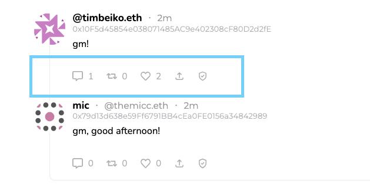

# Composability
Composability in the blockchain world is akin to building with LEGO bricks. Each piece, or in this case, each attestation, can stand alone, but when combined, they form a more complex and intricate structure. Let's dive into how this works with attestations.

## What is Composability?
Composability is the art and science of assembling smaller components to create a more complex system. In the context of blockchain and attestations, it's about ensuring that individual attestations, or data points, can be seamlessly combined or referenced to form a cohesive narrative or dataset. This modular approach not only enhances the flexibility of data structures but also ensures that data remains interconnected, traceable, and verifiable.

## Referenced Attestations: The Key
The `refUID` (referenced attestation unique identifier) feature in attestations is the core building block of composability. It allows an attestation to reference another, weaving a tapestry of interconnected attestations. This interconnectedness ensures that each attestation can either add depth, context, or validation to another.

## Example: Decentralized Social Media
Imagine a decentralized social media platform. You post a message, and that action creates an attestation. When someone comments or likes your post, they're not just interacting with a UI; they're creating a new attestation that references your original one via its `UID`. 

Here's an example social media post on Sepolia from `timbeiko.eth` saying "GM!". Notice that there are two likes and a reply?

:::info These are just attestations! 
:::

Each post, each reply, and each like are just attestations referencing each other. Here is that same post on Sepolia with the onchain attestation record. Notice the `uid` of the Onchain attestation record? That is being used as a reference for the additional attestations made for liking and replying. At the bottom of the image you will see a new schema being used for `Like an Entity` and the same schema of `Post` being used.

[**See this Attestation on Sepolia**](https://sepolia.easscan.org/attestation/view/0x36e12bac4f9de35e831757dcdfbbd7301cbedd521eb11b83332cb439ed4da31b)

## Building with Composability in Mind
- **Think Modular:** Design each schema to be self-contained but ready to connect with others.
- **Use refUID Effectively:** It's a simple tool, but it's the bridge between attestations.
- **Keep Users Informed:** Make sure users understand how their data is being used and connected.

## Wrapping Up
Composability is about seeing the potential in simple components and understanding how they can come together to create something more significant. With attestations, this means a more flexible, modular, scalable, and transparent system.