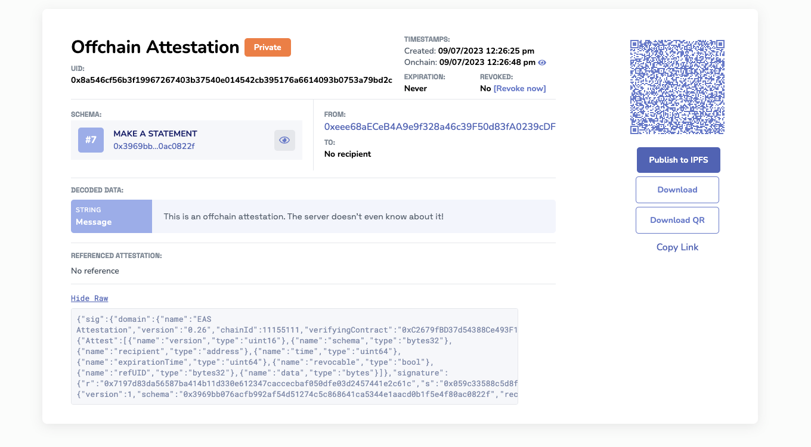

# Privacy

In the age of digital transformation, privacy is paramount. When building with attestations, it's essential to prioritize privacy to protect users and maintain trust. This page delves into how to think about and implement privacy-first solutions using attestations.

## A Privacy-First Mindset
The blockchain's defining feature of immutability is a double-edged sword. While it ensures data integrity, it also means that once data is onchain, it's permanent. This permanence underscores the importance of handling personal or sensitive data with extreme caution.

## Strategies for Privacy-First Attestations
Below are a few concepts to consider when building with privacy in mind.

### Private Data Attestations
Private Data Attestations are a way to attest to nearly an infinite amount of arbitrary data, generate a merkle tree of that data, and then only attest to the merkle root onchain or offchain. The data can then be provided to specific individuals and allow them to selectively disclose or verify the data against the merkle root. 

For example, a university could attest to a student's entire transcript by creating a merkle tree of the courses and grades, and then only attesting to the root onchain. The student can then provide specific courses to employers without revealing their entire transcript.

**📘 Read More:** [**Private Data Attestations**](/docs/tutorials/private-data-attestations.md)

### Offchain Attestations
Create attestations completely offchain, allowing for selective disclosure on a need-to-know basis while still benefiting from the authenticity of the digital signature. Below is an example of an offchain attestation. It's completely private, the easscan.org server doesn't even know it exists. The data is completely encoded in the URI fragment of the URL and can be passed peer-to-peer through the browser or stored anywhere the creator would like.

**Link to the Example Offchain Attestation on Sepolia:**
[https://sepolia.easscan.org/offchain/url/#attestation=eNqlUUluHDEM%2FEufB4a4k0fPjOcTQQ5aqAcECeDnh93xBwLzUKBYVFEs%2FTjaG%2BpxAwCRgtvRPh%2BoFvv%2BJFvC5P5IDnrB825C2J5ImuAgeZzNBmHLaXVRcRudgQfAImqpgMQ2%2B5w5R99N2trZaCGLMUPiVJiXSJOYROI%2BZfnW3BO7V7JcNmxjcVzWVcB1dszsnEQ7JqyxEdyOG9qpk5nq%2FeORd36PjE3onXVSvGq2035vSDGfr2uodyluiw7aEKFWa3OjQSbcsgEL4xwUAqZdFbgFjVYedIux8N%2FLKTRGVbXPPSKwb%2BElgMZTpqsrw%2BxCzAm9z9UGbEne3vpsjrhPkXJfgwHYXG7tKvz%2B9ScvY74V%2BL3rjcuJWiGsvv0LQbNw6xlUXL38qoCxsYpRYeVVrW%2FEYi4FwWZULJqeWP1cfHVXjxnXWU7mUhqaus2uWViZXHwUwv9vcJSf8PMv1OWspA%3D%3D](https://sepolia.easscan.org/offchain/url/#attestation=eNqlUUluHDEM%2FEufB4a4k0fPjOcTQQ5aqAcECeDnh93xBwLzUKBYVFEs%2FTjaG%2BpxAwCRgtvRPh%2BoFvv%2BJFvC5P5IDnrB825C2J5ImuAgeZzNBmHLaXVRcRudgQfAImqpgMQ2%2B5w5R99N2trZaCGLMUPiVJiXSJOYROI%2BZfnW3BO7V7JcNmxjcVzWVcB1dszsnEQ7JqyxEdyOG9qpk5nq%2FeORd36PjE3onXVSvGq2035vSDGfr2uodyluiw7aEKFWa3OjQSbcsgEL4xwUAqZdFbgFjVYedIux8N%2FLKTRGVbXPPSKwb%2BElgMZTpqsrw%2BxCzAm9z9UGbEne3vpsjrhPkXJfgwHYXG7tKvz%2B9ScvY74V%2BL3rjcuJWiGsvv0LQbNw6xlUXL38qoCxsYpRYeVVrW%2FEYi4FwWZULJqeWP1cfHVXjxnXWU7mUhqaus2uWViZXHwUwv9vcJSf8PMv1OWspA%3D%3D)

**📘 Read More:** [**Offchain Attestations**](/docs/tutorials/private-data-attestations.md)

### Offchain Computations
Perform computations offchain and attest to the results onchain. This method ensures that raw data remains private, but the computation's outcome can still be verified. For example, a platform could verify a user's age offchain and then only attest to whether the user is over 18 on-chain, without revealing the exact birthdate, or even that the verification had to do with a birthdate.

### Encryption & Hashing
Always encrypt sensitive data, even if it's offchain. When attesting to encrypted data, ensure that only authorized parties have the decryption keys. For example, if you're storing a user's educational credentials, encrypt the attestation data offchain. When a third party needs to verify it, they can be given a decryption key to access the specific data they need. 

### Zero Knowledge Proofs (ZKPs)
ZKPs allow one party to prove to another that a statement is true without revealing any specific information about the statement itself. It's a powerful tool for privacy-preserving attestations. For example, you can generate an attestation onchain or offchain and then allow the recipient or issuer of the attestation generate a ZKP from the attestation data. Which then can be selectively shared with those who need to know without disclosing the addresses or data involved.

## Best Practices

1. **Avoid Onchain Personal Data:** Never attest to personal or private data directly on-chain. Always use hashes or other privacy-preserving methods.
2. **Educate Users:** Ensure users understand what data is being attested to and how it will be used.
3. **Regularly Review Privacy Practices:** As technology evolves, so do privacy concerns. Regularly review and update your practices to stay ahead.

## Wrapping Up

Privacy isn't just a feature; it's a right. As builders, it's our responsibility to ensure that we're not only leveraging the power of blockchain and attestations but doing so in a way that respects and prioritizes user privacy. With a privacy-first mindset, we can create solutions that are both powerful and trustworthy.

