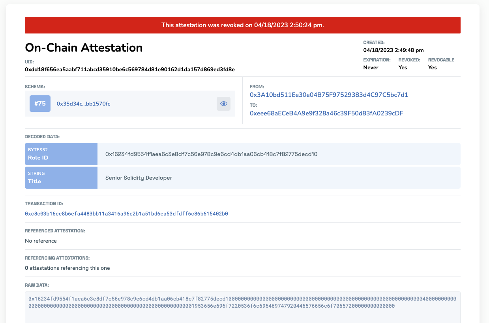

# Revocation
Attestations on EAS can be revoked when they are no longer valid or accurate. This can be done **both onchain and offchain**. Revoking an attestation will mark it as invalid. This can be useful in situations where an attestation was made in error, or if the data it represents has changed or become outdated. 

## Concept
Revoking an attestation involves changing its state from "valid" to "revoked". This is achieved by updating the attestation's `revoked` field to `true`. It allows for more control and flexibility over the attestations' lifecycle. 

An attestation may need to be revoked for various reasons, such as:

- The attestation is no longer valid or relevant.
- The attestation was issued in error or based on incorrect information.
- The underlying condition or requirement for the attestation has changed.

What if you don't want an attestation to be revocable? This can be controlled at the schema level which defines if attestations made of that schema type can be revoked. If you want more control over who can revoke, you can also consider setting a [resolver contract](/docs/core--concepts/resolver-contracts.md).

## Practical Application
Consider an attestation that certifies someone's role in an organization. If that role changes:

The original attestation is revoked, marking it as invalid.
A new attestation is made, possibly referencing the `UID` of the revoked attestation.
This ensures a clear history of the individual's roles over time, providing both transparency and accuracy.

Below is an example attestation where a DAO member's role was revoked.

## How Revocation Differs from Existing Mental Models
### Revocation vs. Token Burning
- **Revocation:** Marks an attestation as invalid but retains its history on the blockchain.
- **Burning:** Permanently removes a token from circulation, erasing its existence.

### Revocation vs. Replacement
While both concepts address the need to handle changes:
- **Revocation:** Marks the original attestation as invalid but doesn't alter or remove it. It provides a way to handle changes without erasing history.
- **Replacement:** Would imply completely removing the old attestation and creating a new one, which isn't how EAS operates due to the immutability of blockchain records.
