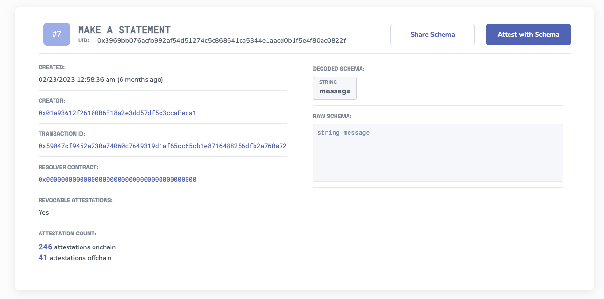

# Schemas
:::info What are schemas?
Schemas define the structure and type of data that can be included in an attestation. They act as a blueprint for the information being attested to, ensuring consistency and clarity.
:::

## Understanding Schemas
At its core, a schema is a structured framework that outlines the format of the data. In the context of EAS, schemas are essential because they ensure that attestations are consistent, readable, and verifiable. They dictate what kind of information can be attested to and how that information should be presented.

*Example Schema for "Making a Statement". It's simply just a `message string` schema. Notice that each schema has a UID 




**Each schema record has the following fields:**
- `Schema #` - this is an incremental number automatically assigned to the Schema. It is not a unique identifier.
- `UID` - this is the unique universal identifier assigned to the schema.
- `Creator` - the wallet address that created the schema.
- `Transaction ID` - the Ethereum transaction registering the schema on EAS.
- `Resolver Contract` - An optional contract assigned to the Schema for more complex use cases.
- `Attestation Count` - The amount of attestations that have been made with attestations on/off chain.
- `Schema` - The ABI encoded schema field types.

### How Schemas Are Made
The [SchemaRegistry.sol](https://github.com/ethereum-attestation-service/eas-contracts/blob/master/contracts/SchemaRegistry.sol) contract is how schemas are made and registered. 

```javascript 
/// @notice A struct representing a record for a submitted schema.
struct SchemaRecord {
    bytes32 uid; // The unique identifier of the schema.
    ISchemaResolver resolver; // Optional schema resolver.
    bool revocable; // Whether the schema allows revocations explicitly.
    string schema; // Custom specification of the schema (e.g., an ABI).
}
```

**🎓 Tutorial:** [**Make a Schema**](/docs/tutorials/create-a-schema.md)

## Building Efficient Schemas
When designing a schema, it's crucial to strike a balance between specificity and flexibility. Here are some guidelines:

- **Keep it Simple:** A schema should be concise. Avoid unnecessary complexity.
- **Be Descriptive:** Each field should have a clear purpose and name.
- **Avoid Redundancy:** Ensure each piece of information is captured once.
- **Plan for the Future:** Design your schema to be extendable without breaking existing attestations.
- **Gas Efficiency:** Consider the Ethereum gas costs. Using the right data types and thinking modularly will help reduce costs.

**📘 Read More:** [**Gas Efficiency Tutorial**](/docs/tutorials/gas-efficiency.md)

## Composability and Modularity
One of the strengths of EAS is its ability to create composable attestations. This principle can be applied to schemas as well:

- **Think Modular:** Instead of creating a monolithic schema that tries to capture everything, build smaller, modular schemas that can be combined as needed.
- **Reuse and Recombine:** Generalized schemas can be reused across different attestations. For instance, an `isTrue bool` schema can be applied in numerous contexts.

### Modular Schema Example: Event Attendance
Imagine you want to attest to someone attending an event:

- **Event Registration Schema:** This schema registers the event itself. It might include the event name, date, and venue.
- **Attendance Schema:** This schema attests to a person's attendance. Instead of repeating all the event details, it simply references the UID of the event from the Event Registration Schema.

This approach avoids data repetition and keeps the attestations lean and efficient.

## Collaborative Schema Development
While EAS provides the tools to create custom schemas tailored to specific needs, it also encourages collaboration. If you believe your schema has broader applicability beyond just your brand or project, it's beneficial to get input from the wider community. This collaborative approach ensures:

- **Standardization:** Common use cases can have standardized schemas, ensuring consistency across different projects.
- **Composability:** Schemas that are designed with input from various stakeholders are more likely to be composable, meaning they can be easily combined or used alongside other schemas.
- **Wider Adoption:** A schema that has been discussed and refined with community input is more likely to see wider adoption.

## Generalized vs. Complex Schemas
- **Generalized Schemas:** These are broad and can be applied in many situations. An example is the `isTrue` schema, which simply verifies the truth of a statement. Such schemas are versatile and can be used for a myriad of use cases.

- **Complex Schemas:** These are tailored for specific needs and are often built by communities or groups with shared interests. For instance, a schema for verifying art authenticity might include fields for the artist's name, artwork medium, creation date, and provenance.

:::tip Start a discussion
Coordination around schemas is crucial. If you have a more complex schema in mind for a particular use case, start a discussion on our forum.
:::

## Naming and Contextualizing Schemas
With EAS, you can use attestations to add more depth to your schemas:

- **Naming a Schema:** Instead of hardcoding a name within the schema, you can create an attestation that links a name to a schema's UID. This approach is more flexible and allows for names to evolve without altering the schema itself.

- **Add a Description:** Descriptions help others understand the purpose of your schema. You can easily set a description by making a referenced attestation to the schema `UID`. Simply use the "Schema Description" on any chain.

- **Providing Context:** Similarly, you can attest to the context or intended use of a schema. Simply reference the schema's UID, you can provide additional information or examples of how the schema should be used, without bloating the schema itself.

**🎓 Tutorial:** [**Naming a Schema**](/docs/tutorials/naming-your-schema.md)

**🎓 Tutorial:** [**Adding a Description**](/docs/tutorials/schema-description.md)

**🎓 Tutorial:** [**Adding Context to a Schema**](/docs/tutorials/naming-your-schema.md)

## Conclusion
Schemas are foundational to the EAS ecosystem. They ensure that attestations are consistent, verifiable, and meaningful. Builders that think modularly, embrace composability, and leverage the power of attestations, can create powerful and flexible schemas that cater to a wide range of use cases.