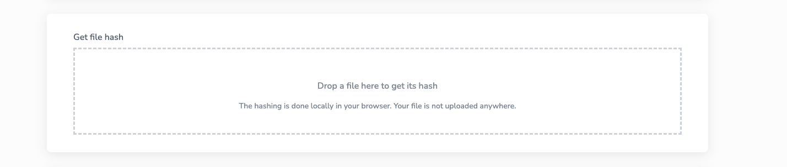
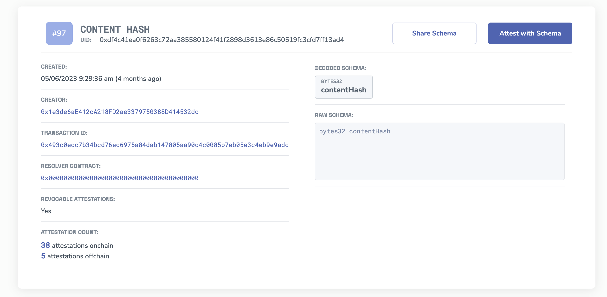
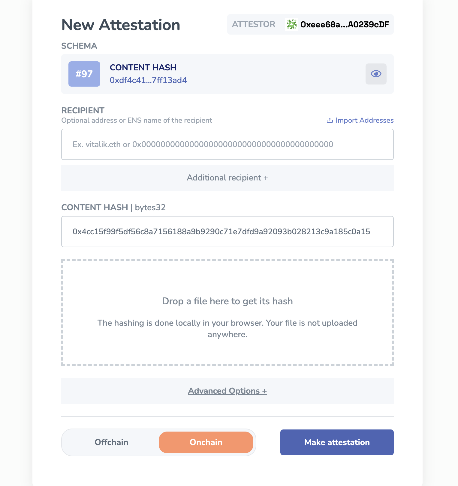
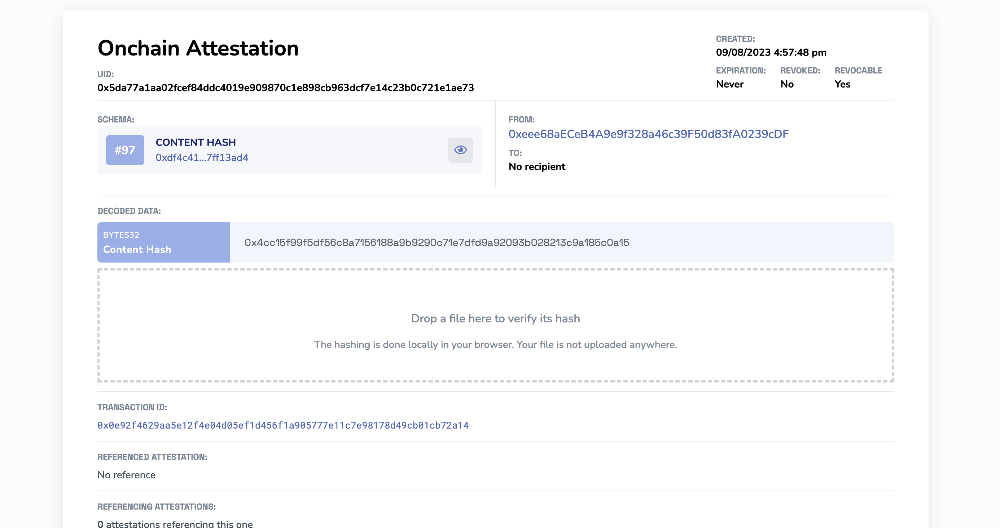
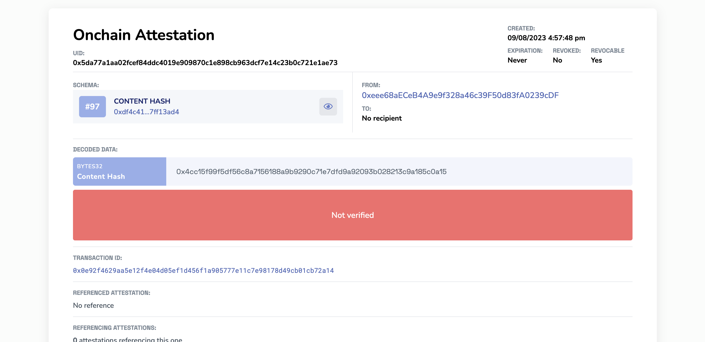
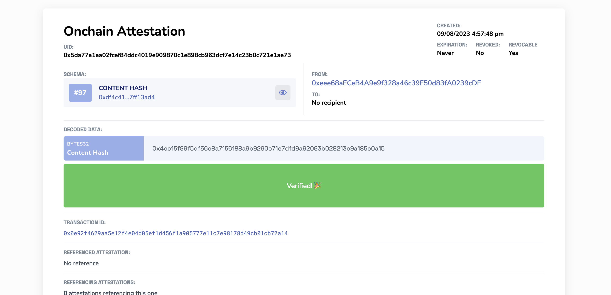

# Hash Any File
You can find a simple way to quickly generate a hash of any file in the [**Tools**](https://easscan.org/tools) section of the easscan.org website. Hashing a file doesn't upload or store the file anywhere, it simply generates a unique bytes32 hash of the document using SHA256. 

You can hash any local file:
- A software release
- Podcasts and video files
- Documents and PDFs
- Images
- Any type of file

## Understanding How Hash's Work
A hash function like `SHA256` takes an input (or 'message') and returns a fixed-size string of bytes. The output, typically a 'digest', is unique to each unique input. Even a minor change, like a single letter or single pixel of the file changes, it will produce a vastly different output, this is also known as the `avalanche effect`. This makes hashing a powerful tool for verifying data integrity. 

SHA-256, which stands for Secure Hash Algorithm 256-bit, is one of the cryptographic hash functions in the SHA-2 family. It's widely used in the world of cryptography and is integral to the functioning of modern technologies, including blockchain systems.

:::info Irreversible
You cannot deduce the original input from its hash, you can only generate the same hash by having the same input.
:::

## The Value of Hashing & Attesting
Once you've hashed a file, you can attest to that hash. This creates an immutable record of the file's hash at that specific moment. If anyone wishes to confirm the file's authenticity in the future, they can refer to your attestation, upload the same file, and check if the hashes align.

As more and more deep fakes and misinformation is spread by the rise of generative AI, we need a way to combat the provenance and authenticity of files and information. Attestations are a great way to combat this. Here are some things you can consider hashing:
- Prove the origin of content, such as podcast audio or videos.
- Track the provenance and evolution of images over time.
- Preserve historical data, ensuring its authenticity with a verifiable timestamp.

## Example: Hashing & Attesting a Document 
Let's take the [**Ethereum Whitepaper from 2014**](https://ethereum.org/669c9e2e2027310b6b3cdce6e1c52962/Ethereum_Whitepaper_-_Buterin_2014.pdf) as an example. You can follow along if you'd like!

1. **Generate the Hash:** Upload the whitepaper to the container on EASSCAN. You'll receive a hash like:
`0x4cc15f99f5df56c8a7156188a9b9290c71e7dfd9a92093b028213c9a185c0a15`

2. **Find a Suitable Schema:** Use a schema like `contentHash bytes32`. For instance, on Sepolia, you can find it [here](https://sepolia.easscan.org/schema/view/0xdf4c41ea0f6263c72aa385580124f41f2898d3613e86c50519fc3cfd7ff13ad4).

3. **Attest to the Hash:** With the generated hash, you can now create an attestation.

4. **Attestation Made:** Now you have an attestation that is attesting to the `bytes32` hash of the whitepaper.

5. **Verification:** Here's the onchain attestation record for the `Ethereum Whitepaper`. To validate its authenticity, upload the same PDF. If unchanged, it will produce the identical hash, confirming its authenticity. If there's a mismatch, it indicates alterations.
[**Example Attestation**](https://sepolia.easscan.org/attestation/view/0xb2fd51f0b6f71baa4fbca4f6761e5e8125fd48984de793b684192ccb20c7e09e).

- Here's an example of the **WRONG file** being uploaded, which generates the wrong hash.

- If we upload the **SAME PDF**, and nothing has been altered, then it will generate the same hash.

## Wrapping Up
Hashing and attesting files on EASSCAN provides a robust mechanism to ensure and verify file authenticity. Whether you're a content creator, historian, or just someone looking to preserve digital integrity, this tool is invaluable. Start attesting today and be part of a more transparent digital future.
