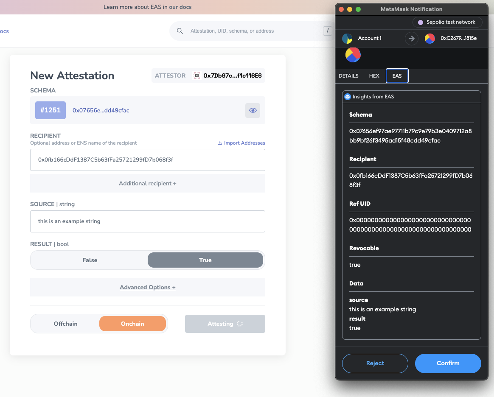

# EAS MetaMask Snap

The **EAS MetaMask Snap** enhances the transparency and security of EAS attestations signed with your MetaMask. It decodes attestation data, allowing users to clearly understand and verify the details before confirming a transaction.

## Why It Matters

When signing attestations with MetaMask, the data often appears in a hexadecimal format, which is not human-readable. The EAS Snap converts this data into a clear, readable format. This ensures you're fully aware of the attestation's details, mitigating the risk of unintentional or malicious signings.

## Key Features

- **Attestation Decoding:** Utilizes `SchemaEncoder` from the `@ethereum-attestation-service/eas-sdk` to decode attestation data, presenting it in a readable format.
- **Transaction Data Parsing:** The snap parses Ethereum transaction data to identify if it is related to an EAS attestation, using `ethers` library.
- **Dynamic Content Rendering:** It dynamically renders transaction details in the MetaMask UI, including schema, recipient, reference UID, expiration time, and revocability status, offering users a complete overview of the attestation they are about to sign.
- **Time Formatting:** Utilizes `dayjs` with extended formats to display expiration times in a user-friendly manner.
- **GraphQL Integration:** Communicates with EAS's GraphQL endpoint to fetch and display the schema associated with the attestation.
- **Data Decoding and Display:** Decodes and displays each piece of attestation data using the fetched schema, allowing users to understand the specifics of what they are attesting.

## Demo Video

This is a short demo video showing how the Snap works. Notice the hex value of the data first, then how the data is more readable when the 'EAS' snap is clicked.

<iframe width="560" height="315" src="https://www.youtube.com/embed/FdgzNyY10Fc" frameborder="0" allow="accelerometer; autoplay; clipboard-write; encrypted-media; gyroscope; picture-in-picture" allowfullscreen></iframe>

## Example

### Before Snap:

Signing an attestation in MetaMask shows data in hexadecimal format, leaving you unsure of what you're agreeing to.

### After Snap:

The same data is displayed clearly, with details like recipient, revocability, and schema easily understandable.

