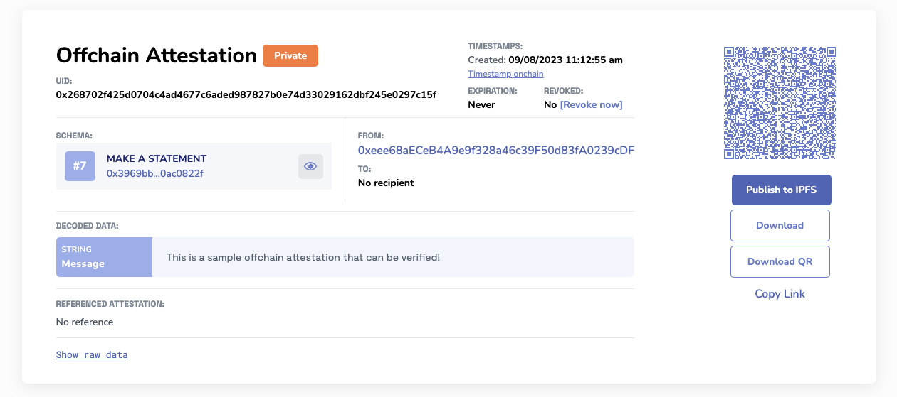
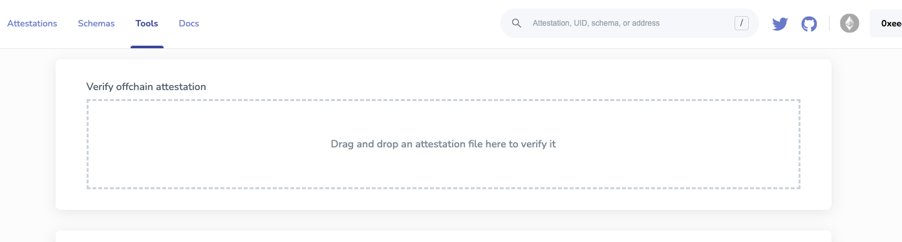

# Verify Offchain Attestation

There are a few ways you can verify an offchain attestation. A simple route to quickly verify an offchain attestation is using the https://easscan.org explorer on the chain.


## Using the Attestation Explorer Tools
For this example, we'll use a completely offchain attestation made on Sepolia. This attestation is not stored anywhere and can be passed peer-to-peer. The attestation data is completely encoded in the URI fragment of the URL:



If you have the raw data of the attestation in a file, you can upload the attestation and it will verify that it is a valid signature. If the the data is a valid attestation, the easscan web app will decode the attestation and display it for you.



### Example Attestation

```javascript
{"sig":{"domain":{"name":"EAS Attestation","version":"0.26","chainId":11155111,"verifyingContract":"0xC2679fBD37d54388Ce493F1DB75320D236e1815e"},"primaryType":"Attest","types":{"Attest":[{"name":"version","type":"uint16"},{"name":"schema","type":"bytes32"},{"name":"recipient","type":"address"},{"name":"time","type":"uint64"},{"name":"expirationTime","type":"uint64"},{"name":"revocable","type":"bool"},{"name":"refUID","type":"bytes32"},{"name":"data","type":"bytes"}]},"signature":{"r":"0x96148fae1b641d7c0750a46aa5775c1840433d69705ae6edfbd7740eff49cc55","s":"0x0e0283146242cdafb137b704b7ded3496b90241455b2ececc33c344515c364ce","v":28},"uid":"0x268702f425d0704c4ad4677c6aded987827b0e74d33029162dbf245e0297c15f","message":{"version":1,"schema":"0x3969bb076acfb992af54d51274c5c868641ca5344e1aacd0b1f5e4f80ac0822f","recipient":"0x0000000000000000000000000000000000000000","time":1694196775,"expirationTime":0,"refUID":"0x0000000000000000000000000000000000000000000000000000000000000000","revocable":true,"data":"0x0000000000000000000000000000000000000000000000000000000000000020000000000000000000000000000000000000000000000000000000000000003c5468697320697320612073616d706c65206f6666636861696e206174746573746174696f6e20746861742063616e206265207665726966696564212000000000","nonce":0}},"signer":"0xeee68aECeB4A9e9f328a46c39F50d83fA0239cDF"}
```

https://sepolia.easscan.org/offchain/url/#attestation=eNqlUUtqZDEMvMtbN0F%2FWct09%2FQlhlnYsn2AYQZy%2FOg9AjlADBa2KFeVyr8PeCM7boioWuV2wMeDzGPfn%2BxThVt7LAl%2B4fPuygRPYlvYUNdxgsNQ2u4LhwlOT3CFLta7umtiExDmaeGgfdmae0x3gbW3RKbqRQILqDGKkVDOvgeyDwcZPtdkCRsBJCiqg1auTOZkEUVNNslyQu3kWWtZ678e6y7vsWIztfKSHC%2BF2Xi%2FA3Hk83WJkjUH2kI6obRS%2BhRzT%2BslGs0b%2BYDlMpmBAo3m2CRaVsMTdV8kHBZjgFvPPSKob5WpSC6p2axVKNm1vC7sPScM3LpkN%2BgJjegiqfQtBKPE9QZX49%2Ff%2F%2BsK5keLfvYcOFVqhPD69q%2BKBM6GNh0sTauz7VxcuJrC1olxcTF1rlrn6u6z7ydX3QtxMpxIOhncCkuFstpqQvjt%2B6g88M8nmsefLg%3D%3D


## Verifying Offchain Attestations with the SDK
To verify an offchain attestation, you can use the verifyOffchainAttestationSignature function provided by the EAS SDK. 

**Read More:** [**EAS SDK Docs**](https://github.com/ethereum-attestation-service/eas-sdk)

Here's an example:
```javascript
import { OFFCHAIN_ATTESTATION_VERSION, Offchain, PartialTypedDataConfig } from "@ethereum-attestation-service/eas-sdk";

const attestation = {
  // your offchain attestation
  sig: {
    domain: {
      name: "EAS Attestation",
      version: "0.26",
      chainId: 1,
      verifyingContract: "0xA1207F3BBa224E2c9c3c6D5aF63D0eb1582Ce587",
    },
    primaryType: "Attest",
    types: {
      Attest: [],
    },
    signature: {
      r: "",
      s: "",
      v: 28,
    },
    uid: "0x5134f511e0533f997e569dac711952dde21daf14b316f3cce23835defc82c065",
    message: {
      version: 1,
      schema: "0x27d06e3659317e9a4f8154d1e849eb53d43d91fb4f219884d1684f86d797804a",
      refUID: "0x0000000000000000000000000000000000000000000000000000000000000000",
      time: 1671219600,
      expirationTime: 0,
      recipient: "0xFD50b031E778fAb33DfD2Fc3Ca66a1EeF0652165",
      attester: "0x1e3de6aE412cA218FD2ae3379750388D414532dc",
      revocable: true,
      data: "0x0000000000000000000000000000000000000000000000000000000000000000",
    },
  },
  signer: "0x1e3de6aE412cA218FD2ae3379750388D414532dc",
};

const EAS_CONFIG: PartialTypedDataConfig = {
  address: attestation.sig.domain.verifyingContract,
  version: attestation.sig.domain.version,
  chainId: attestation.sig.domain.chainId,
};
const offchain = new Offchain(EAS_CONFIG, OFFCHAIN_ATTESTATION_VERSION);
const isValidAttestation = offchain.verifyOffchainAttestationSignature(
  attestation.signer,
  attestation.sig
);

```