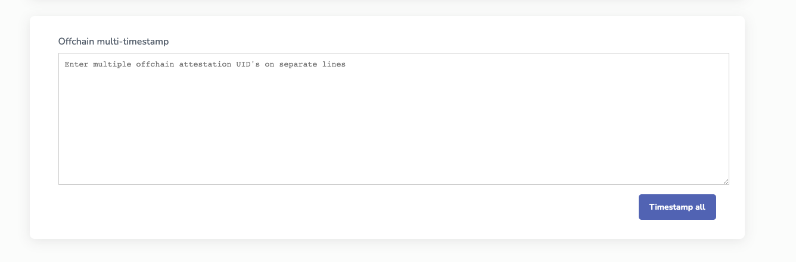
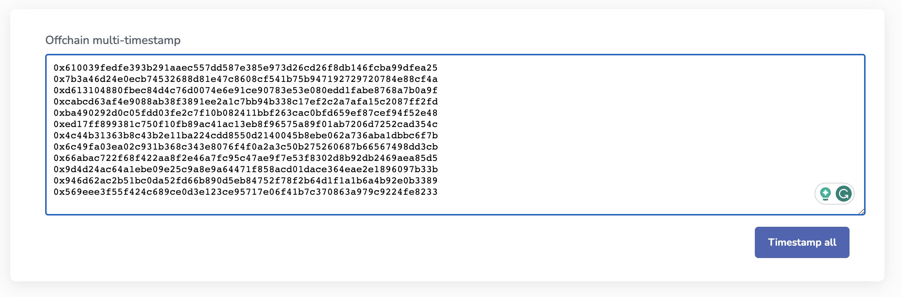
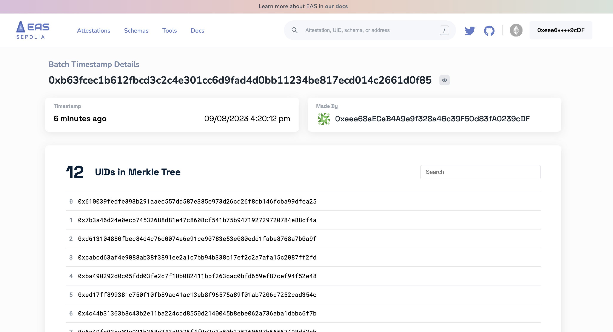
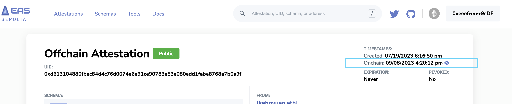
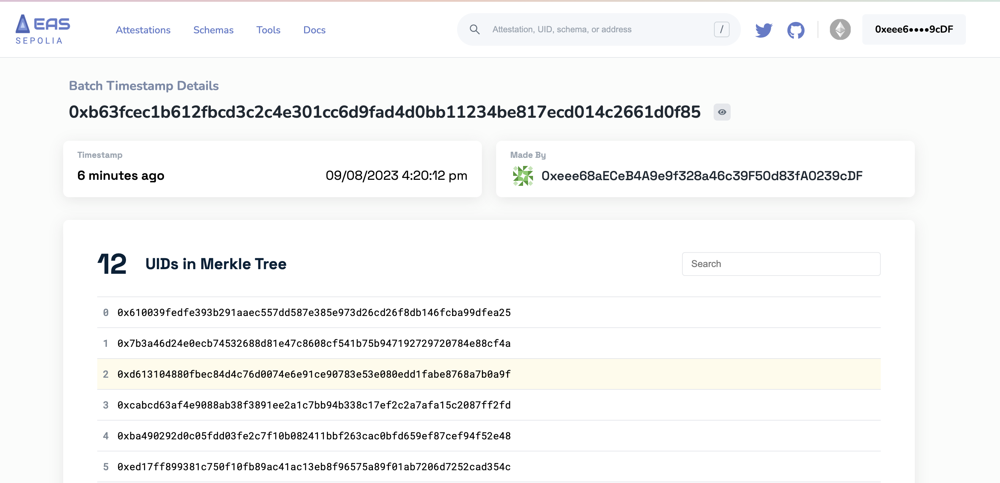

# Batch Timestamping
Timestamping is a crucial aspect of ensuring the authenticity and integrity of data. Timestamping provides a verifiable proof of existence for offchain attestations. This doc delves into the concept of Merkle Trees and how they can be used to efficiently timestamp multiple offchain attestations in a single transaction.

## Understanding Merkle Trees
A Merkle Tree is a binary tree where each leaf node represents a piece of data, and each non-leaf node is a hash of its child nodes. The topmost node, known as the Merkle Root, provides a single hash representation for all the data in the tree.

### Key Features:
- **Efficiency:** Allows for efficient and secure verification of large data sets.
- **Proof of Inclusion:** Any piece of data can be verified to be a part of the tree by providing a 'proof path', a sequence of hashes leading to the Merkle Root.
- **Immutability:** Any change in data, even at the leaf level, results in a change in the Merkle Root.

## Why Timestamp Offchain Attestations?
Offchain attestations, by their nature, lack an onchain consensus timestamp, making their exact time of creation unverifiable. Timestamping the UID of the offchain attestation onchain provides:

- **Proof of Existence:** It proves that the attestation existed at or before the timestamp.
- **Data Integrity:** The UID, being a unique hash of the entire valid attestation data, ensures that the attestation hasn't been altered post-timestamping.

## Batch Timestamping with Merkle Trees
While individual timestamping is straightforward, it may not be efficient for large volumes of attestations. This is where Merkle Trees shine:

- **Batch Multiple UIDs:** Instead of timestamping each UID individually, multiple UIDs are combined to form a Merkle Tree.
- **Generate the Merkle Root:** The Merkle Root, representing all the UIDs, is generated.
- **Single Onchain Transaction:** Only the Merkle Root is timestamped onchain, saving on transaction costs and gas.
- **Proof of Inclusion:** Any individual UID can later be verified against the timestamped Merkle Root.

## Using easscan.org for Batch Timestamping
EAS provides a simple container on the easscan.org site to facilitate this process:

- **Paste UIDs:** Users can easily paste multiple offchain attestation UIDs.
- **Timestamp All:** Upon clicking "Timestamp All", the site generates the Merkle Root for all the UIDs.
- **Onchain Timestamping:** The platform assists users in creating an onchain timestamp for the Merkle Root.
- **Results Page:** Post timestamping, users receive a results page listing all UIDs that are part of the timestamped Merkle Root.

## Example Flow
Here's an example batch timestamp flow on Sepolia.

1. First we go to the [Tools] page on Easscan. Scroll to the bottom and we'll see the `Offchain multi-timestamp` container. This allows you to paste attestation UIDs on seperate lines.

2. Paste the UID's you want to timestamp and click `Timestamp all`.

3. Nice! Now we can see the `Batch Timestamp Details` which generated a Merkle Tree of the **12** `UIDs`. You can see the onchain transaction ID of `0xb63fcec1b612fbcd3c2c4e301cc6d9fad4d0bb11234be817ecd014c2661d0f85`. You can see this example here: [https://sepolia.easscan.org/timestamp/0xb63fcec1b612fbcd3c2c4e301cc6d9fad4d0bb11234be817ecd014c2661d0f85](https://sepolia.easscan.org/timestamp/0xb63fcec1b612fbcd3c2c4e301cc6d9fad4d0bb11234be817ecd014c2661d0f85)

4. When you go to a public offchain attestation record that has been timestamped, you'll see there is an `onchain timestamp` in the top right hand side of the attestation record. You can click the eye and it will take you to the merkle tree record and highlight the `UID` is in fact a part of the batch timestamp record. 

5. This is showing that the `UID` of the offchain attestation was found in the merkle tree.

## Conclusion
Merkle Trees offer a powerful and efficient mechanism to timestamp large volumes of offchain attestations with a single onchain transaction. This ensures not only the proof of existence but also the integrity of the attestations, providing a robust and cost-effective solution for developers and users alike.
