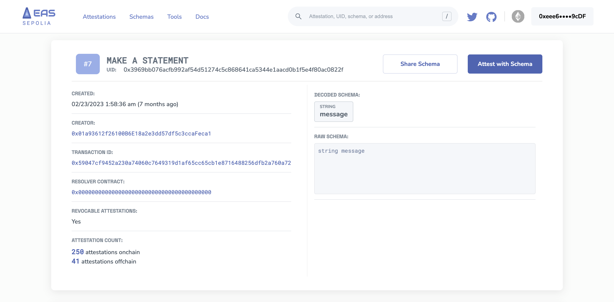
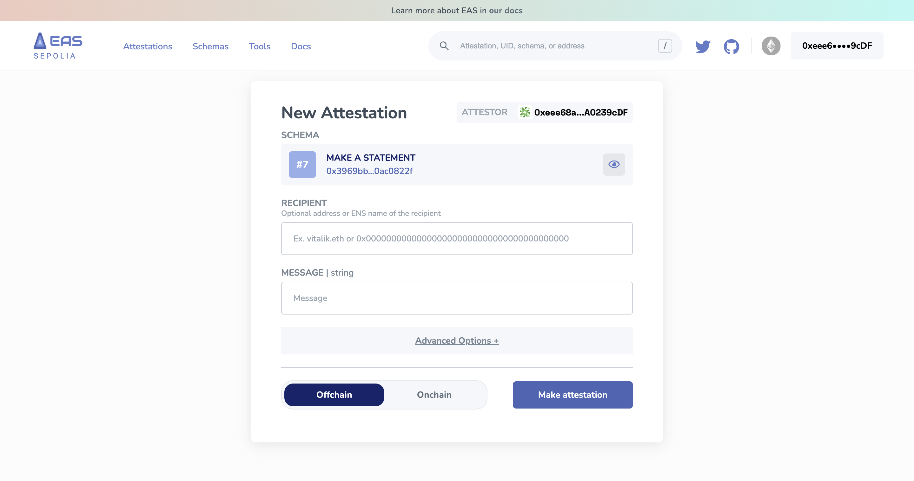
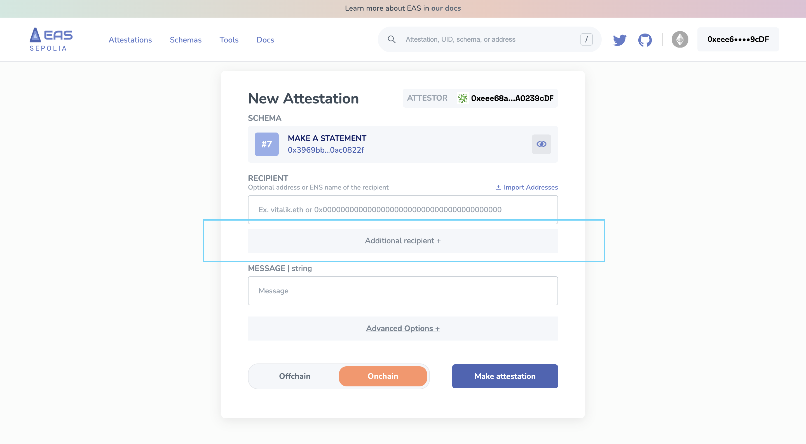
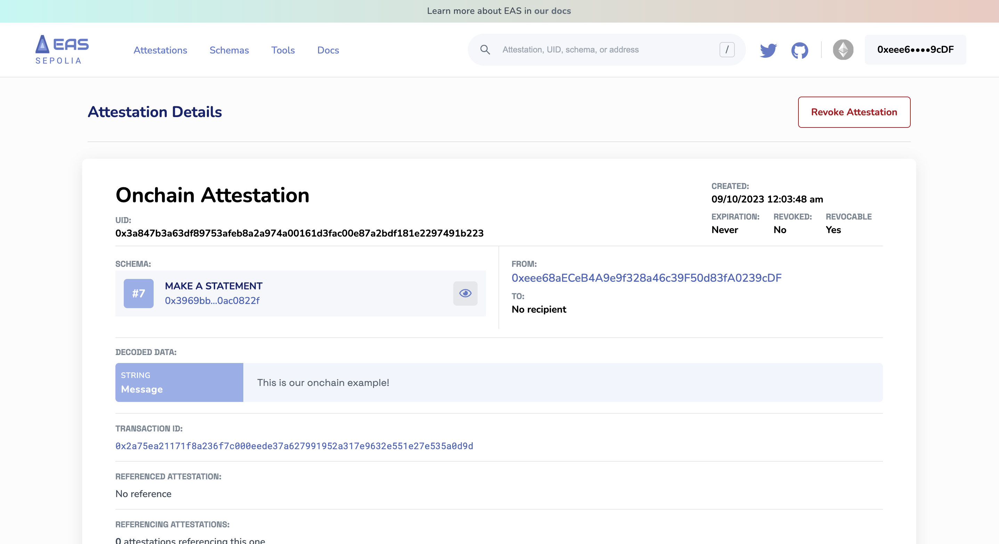

# No-Code Attestations
Want to make attestations without code? All you need is a wallet and some funds to pay for gas. Check out the steps below.

## How To Make An Attestation
Make sure you're on an explorer site of your choice. If you want to make a test attestation, we'd recommend using [**Sepolia**](https://sepolia.easscan.org/). 

1. Once you are on the Explorer, find the `Schema` you want to attest with. Want a quick option? Click on "Make Attestation" from the "Attestations" page. [**Here's a quick link for you on Sepolia**](https://sepolia.easscan.org/attestation/create).

2. Let's use the `Make a Statement` schema as our example.
- **Make a Schema:** [**https://sepolia.easscan.org/schema/view/0x3969bb076acfb992af54d51274c5c868641ca5344e1aacd0b1f5e4f80ac0822f**](https://sepolia.easscan.org/schema/view/0x3969bb076acfb992af54d51274c5c868641ca5344e1aacd0b1f5e4f80ac0822f)

3. **Now that you're on the "Schema Record" page.** Click 'Make Attestation'. This will allow you to make an attestation with that schema. Notice that it decodes the schema data. For example, our `Make a Statement` schema is simply just a `string`. So in this no-code attestation maker, we can see `Message | string` decoded and we're allowed to type in a `string`.

4. **Recipients are optional!** Not every attestation requires a recipient. Imagine posting something on social media, it's just a statement you're making. You don't need to reference someone or something even though you could.

:::tip Multiple Recipients
If you want to attest to multiple recipients, switch to onchain and it will allow you to add multiple recipients.
:::

5. **Additional Options:** This section will allow you to do a few special things:
 - Add an `expiration time`. Which sets a specific time when the attestation will expire.
 - Add a `Referenced Attestation UID`. This allows you to build [**modular and composable attestations**](/docs/core--concepts/composability.md).

 

6. Now it's time to "Make Attestation"! You can choose between `onchain` or `offchain`. Curious to know the differences? You can [**learn more about the differences here**](/docs/core--concepts/onchain-vs-offchain.md). 

7. **Great!** You should now have an attestation record with a UID. Here's our onchain example:
 - [https://sepolia.easscan.org/attestation/view/0x3a847b3a63df89753afeb8a2a974a00161d3fac00e87a2bdf181e2297491b223](https://sepolia.easscan.org/attestation/view/0x3a847b3a63df89753afeb8a2a974a00161d3fac00e87a2bdf181e2297491b223)

 

