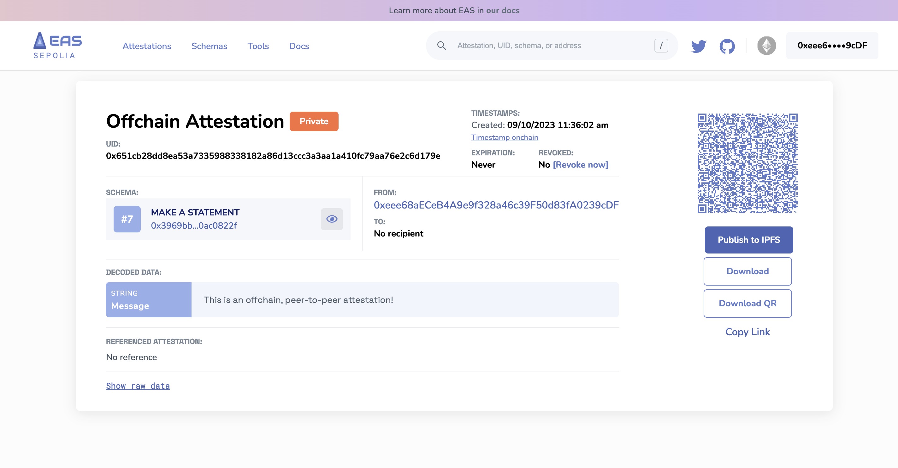
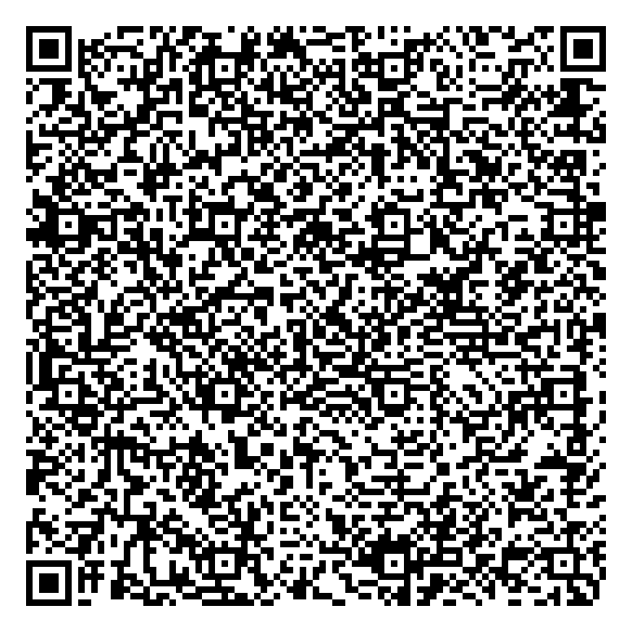

# Offchain Attestations
Offchain attestations offer a unique blend of privacy, efficiency, and flexibility. This tutorial will guide you through the process of creating peer-to-peer (P2P) offchain attestations using EASSCAN.org, and how to leverage them for various use cases.

## Creating an Offchain Attestation
- **Initiate the Attestation:** Navigate to the attestation creation section on EASSCAN.org.
- **Fill in the Details:** Just like creating an onchain attestation, select the schema UID and fill in the required fields.
- **Choose Offchain:** Once you've filled in the details, click on 'offchain attestation'. 
- **Click Make Attestation**: Now you can click "Make Attestation". It will trigger an `EIP-712`typed signature transaction for you to sign. No gas is required.

:::info Gas-Free & Private
Creating an offchain attestation requires only a digital signature from your wallet. It doesn't consume any gas, and since it's generated in the browser, even the server remains unaware of its existence. This ensures utmost privacy.
:::

## Sharing Your Offchain Attestation
With your offchain attestation created, you can:

- **Download the Data:** Save the attestation data for future reference or sharing. Store it in your own servers.
- **Download the QR Image:** A scannable QR code containing the attestation data, including the signature.
- **Share the Link**: Share the URL link of your attestation and share it peer-to-peer.

## Timestamping Onchain: Why and How?
While offchain attestations offer privacy and efficiency, they lack a verifiable timestamp from the network. This means you can't conclusively prove the exact time of the attestation's creation. However the UI allows you to:

1. Click on `timestamp onchain` near the timestamp section of your offchain attestation.
    - This action generates an onchain transaction, which you'll need to sign. It's a small `bytes32` transaction of the attestation `UID`, ensuring minimal gas costs.
2. With the timestamp now onchain, the attestation UID is a hash of the entire attestation data—serves as proof of the attestation's existence before a certain time.

:::tip Making it Public: Publish to IPFS
If you wish to make your offchain attestation more accessible, you can opt to Publish to IPFS. This action pins the attestation to IPFS, and EASSCAN indexes it, making it publicly viewable on the explorer. If you retain the attestation's private status, it remains invisible on the explorer.
:::

## Verifying Your Offchain Attestation
To ensure the integrity of an offchain attestation:

- Navigate to the tools section on EASSCAN.org.
- Upload the raw attestation data.
- The UI will decode it, allowing you to verify its authenticity and contents.

## Example
Here's an offchain attestation example we made on Sepolia. It's using the `Make a Statement` schema.


### URL
Here is the URL of the offchain attestation. The attestation data is compeltely encoded in the URI hash of the URL so it can be passed peer-to-peer.

[**https://sepolia.easscan.org/offchain/url/#attestation=eNqlUUuuEzAMvEvXFfLf8fK1pZdALBzHOQACieOTvgd7pOfFKLYzE4%2Fz7QJfyC5XRFQ9cL3A7zuZx7492JcKj3FvCX7i4%2BbKBA9iaxyofXldVhZYDgGW7TZnokbgzOFaMWHLFhaOJdtVdlAt7%2FbCnIqLCN5FzKsHlgDUtL08o2UvBnfIrnFkapn0ngtnt5DgKqHWDmDIqMuVxkunu23k13vf5C06NtNIseJ4KqzB%2Bw2Iox7Pj0cVa9JYa3QqpzNrjME8cFAOW8hVxcmZmIJnBI9Mt6Y6PY8P%2BxwWc4Jb1p4RlFtlKZJLaQ0bJlhHXaQxsxZM3Hq8DciCQbRfImf7FsLGbnSF98LPH7%2F6JQ%2BfCoJP8o%2BZYyH8fPtfxOMfbNsr%2BPTO5K%2BNEDiYmjrRcrF98F9%2BOC6nps4Hz%2Fkw9uHg%2F0x3OfvA738AgcWhrQ%3D%3D**](https://sepolia.easscan.org/offchain/url/#attestation=eNqlUUuuEzAMvEvXFfLf8fK1pZdALBzHOQACieOTvgd7pOfFKLYzE4%2Fz7QJfyC5XRFQ9cL3A7zuZx7492JcKj3FvCX7i4%2BbKBA9iaxyofXldVhZYDgGW7TZnokbgzOFaMWHLFhaOJdtVdlAt7%2FbCnIqLCN5FzKsHlgDUtL08o2UvBnfIrnFkapn0ngtnt5DgKqHWDmDIqMuVxkunu23k13vf5C06NtNIseJ4KqzB%2Bw2Iox7Pj0cVa9JYa3QqpzNrjME8cFAOW8hVxcmZmIJnBI9Mt6Y6PY8P%2BxwWc4Jb1p4RlFtlKZJLaQ0bJlhHXaQxsxZM3Hq8DciCQbRfImf7FsLGbnSF98LPH7%2F6JQ%2BfCoJP8o%2BZYyH8fPtfxOMfbNsr%2BPTO5K%2BNEDiYmjrRcrF98F9%2BOC6nps4Hz%2Fkw9uHg%2F0x3OfvA738AgcWhrQ%3D%3D)

### QR Code
You can save the `QR Code` and use it wherever you'd like. It has the entire attestation data, including the signature, gzipped and compressed.



### Attestation Data
```javascript
{
   "sig":{
      "domain":{
         "name":"EAS Attestation",
         "version":"0.26",
         "chainId":11155111,
         "verifyingContract":"0xC2679fBD37d54388Ce493F1DB75320D236e1815e"
      },
      "primaryType":"Attest",
      "types":{
         "Attest":[
            {
               "name":"version",
               "type":"uint16"
            },
            {
               "name":"schema",
               "type":"bytes32"
            },
            {
               "name":"recipient",
               "type":"address"
            },
            {
               "name":"time",
               "type":"uint64"
            },
            {
               "name":"expirationTime",
               "type":"uint64"
            },
            {
               "name":"revocable",
               "type":"bool"
            },
            {
               "name":"refUID",
               "type":"bytes32"
            },
            {
               "name":"data",
               "type":"bytes"
            }
         ]
      },
      "signature":{
         "r":"0x5340d70906ae76bba15991ba875c9b0f4f43439d4f754f92cd7ee7c1ab51d220",
         "s":"0x67ce81c400cb6fd7a9e4fd30770aec8b0fcd64efbd1bee4241dc42e5e9030a9c",
         "v":28
      },
      "uid":"0x651cb28dd8ea53a7335988338182a86d13ccc3a3aa1a410fc79aa76e2c6d179e",
      "message":{
         "version":1,
         "schema":"0x3969bb076acfb992af54d51274c5c868641ca5344e1aacd0b1f5e4f80ac0822f",
         "recipient":"0x0000000000000000000000000000000000000000",
         "time":1694363762,
         "expirationTime":0,
         "refUID":"0x0000000000000000000000000000000000000000000000000000000000000000",
         "revocable":true,
         "data":"0x0000000000000000000000000000000000000000000000000000000000000020000000000000000000000000000000000000000000000000000000000000002f5468697320697320616e206f6666636861696e2c20706565722d746f2d70656572206174746573746174696f6e21200000000000000000000000000000000000",
         "nonce":0
      }
   },
   "signer":"0xeee68aECeB4A9e9f328a46c39F50d83fA0239cDF"
}

```

## Wrapping Up
Offchain attestations on EASSCAN.org offer a powerful blend of privacy, efficiency, and flexibility. Whether you're looking to keep data private, share it selectively, or timestamp it for verifiability, the platform provides all the tools you need to control how you want to selectively share your attestation data.