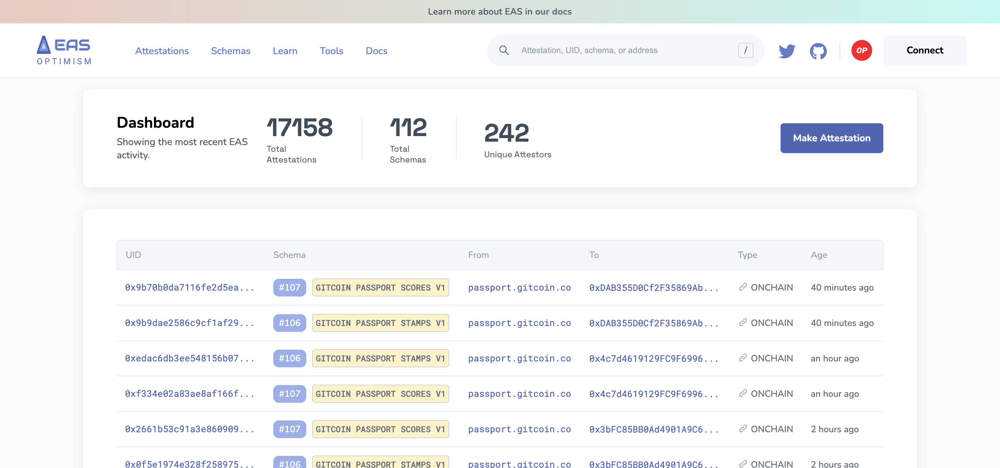

# Easscan Overview
Welcome to the definitive guide for [EASSCAN.org](https://easscan.org), the explorer for the Attestation Ecosystem. Easscan.org is like the *"etherscan for attestation"*. It's your central hub and way for you to explore, discover, make, and verify schemas and attestations. 

As a public good, our intention is to be as accessible to non-technical developers as we are to technical builders. Enjoy an experience that exceptional compared to traditional explorers and let us know ways you'd like to see it improved!

:::info It's not an end-user tool
While we aim for the best DevEx, the easscan.org site is not intended to be an end user site for consuming or issuing attestation data. We encourage all builders to create amazing experiences on top of the attestation contracts for your own use cases.
:::

## Available Chains

| **Chain Type** | **Chain Name**      | **URL**                          |
|----------------|---------------------|----------------------------------|
| **Mainnets**   | Ethereum             | [https://easscan.org](https://easscan.org)             |
|                | Optimism            | [https://optimism.easscan.org](https://optimism.easscan.org)   |
|                | Base                | [https://base.easscan.org](https://base.easscan.org)         |
|                | Arbitrum One           | [https://arbitrum.easscan.org](https://arbitrum.easscan.org)   |
|                | Arbitrum Nova            | [https://arbitrum-nova.easscan.org](https://arbitrum-nova.easscan.org)   |
|                | Polygon          | [https://polygon.easscan.org](https://arbitrum-nova.easscan.org)   |
|                | Scroll          | [https://scroll.easscan.org](https://scroll.easscan.org)   |
|                | Linea          | [https://linea.easscan.org](https://linea.easscan.org)   |
| **Testnets**   | Sepolia             | [https://sepolia.easscan.org](https://sepolia.easscan.org)     |
|                | Optimism Sepolia     | [https://optimism-sepolia.easscan.org/](https://optimism-sepolia.easscan.org)   |
|                | Optimism Goerli     | [https://optimism-goerli.easscan.org/](https://optimism-goerli.easscan.org)   |
|                | Base Sepolia         | [https://base-sepolia.easscan.org](https://base-sepolia.easscan.org) |
|                | Base Goerli         | [https://base-goerli.easscan.org](https://base-goerli.easscan.org) |
|                | Polygon Mumbai         | [https://polygon-mumbai.easscan.org/](https://polygon-mumbai.easscan.org/) |
|                | Scroll Sepolia         | [https://scroll-sepolia.easscan.org/](https://scroll-sepolia.easscan.org/) |

## What You Can Do
There are several main things you can do with the explorer site. You are able to:
- **Explore schemas** that have been made on that chain and their activity
- **Inspect any attestation** made to an address or that an address has made
- Make schemas and attestations in a **no-code way** using our UI tools
- **Revoke** attestations you have made
- Make **batch attestations** to multiple recipients
- **Name schemas**, add **descriptions** and/or **context**
- Publish **offchain attestation to IPFS**
- **Timestamp offchain** attestations onchain
- **Verify** offchain attestations
- Make **private data attestations** allowing users to selectively disclose data
- And more!

## Community Collaboration
EASSCAN.org thrives on the insights and feedback of its users. As we continue to refine and expand our platform, we invite you to be an active participant in its evolution.

- **Feedback Loop:** Found a bug? Have a feature request? Or just general feedback? We're all ears. Your insights drive our improvements.
- **Open Discussions:** Join our community channels to discuss ideas, share your experiences, and collaborate with fellow innovators.
- **Stay Updated:** We're constantly rolling out updates. Stay in the loop and be the first to test out new features.

Remember, EASSCAN.org is more than just a tool; it's a community-driven platform aiming to redefine the attestation landscape. Your voice matters, and together, we can shape the future of the attestation ecosystem.

## Ready to get started?
Learn more about the explorer in the following pages.

