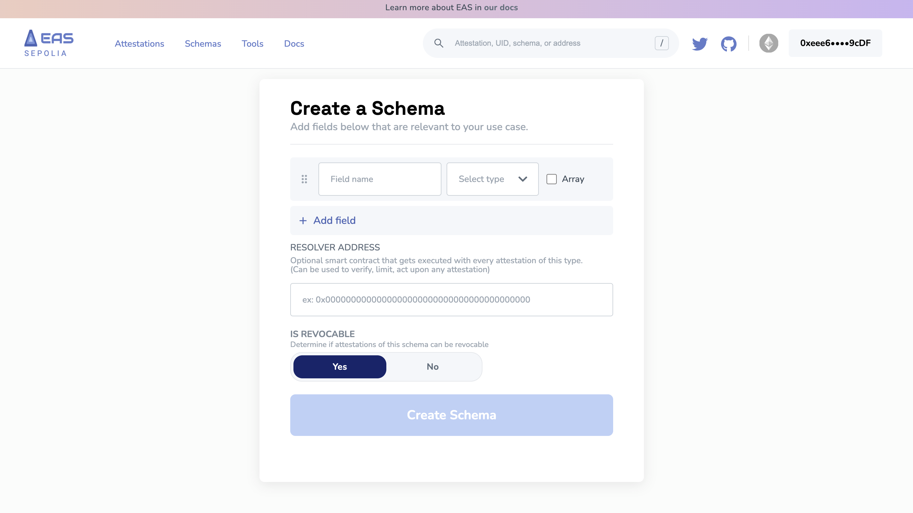

# No-Code Schema Building
Creating schemas doesn't require a deep dive into code. With EASSCAN's intuitive UI, you can craft your own schema **without writing a single line**. This guide will walk you through the process, ensuring you can harness the power of attestations, even if you're not a developer.

## Getting Started
1. **Access the Schema Builder:** Navigate to https://sepolia.easscan.org/schema/create on your desired chain (change our sepolia for your chain name where easscan is deployed)

2. **Craft Your Schema:** The no-code schema builder will present you with a user-friendly interface. Here, you can:
- Add schema fields.
- Select a type for each field.
- Organize fields in your preferred order.

:::tip Schema Tips
While building your schema, consider visiting the "schemas" page to deepen your understanding of schemas. For those looking to optimize, the "how to make gas efficient schemas" tutorial is a must-read.
:::
- **Read More:** [**Schemas**](/docs/core--concepts/schemas.md)
- **Read More:** [**Gas Efficient Schemas**](/docs/tutorials/gas-efficiency.md)

3. **Resolver Contract (Optional):** This option allows your schema to interact with specific smart contracts to resolve or verify data. Not sure what this means? Learn more about resolver contracts in the dedicated section.

4. **Revocability:** Decide if you want attestations to be revocable:
 - **Revocable:** Attestations made with this schema can be revoked by the entity that created them.
- **Non-Revocable:** Attestations are permanent and cannot be undone.

5. **Make the Schema:** Once you're ready with your schema, click `create schema`. This will trigger a transaction to register your schema and give you a `UID`, making it ready for attestations. You'll see it registered on the Schemas page of the explorer.

## Enhancing Your Schema
After registering your schema, you can add layers of context and relevance:

- **Name A Schema:** Give your schema a recognizable name. [**Learn how**](/docs/tutorials/naming-your-schema.md).
- **Schema Description:** Provide a detailed description to explain the purpose and use of your schema. [**Here's a tutorial**](/docs/tutorials/schema-description.md).
- **Schema Context:** Link your schema to standardized definitions, like those on schema.org, to provide universal clarity. [**Find out more**](/docs/tutorials/schema-context.md).

Each of these enhancements is achieved through [**referenced attestations**](/docs/core--concepts/composability.md) to the schema's UID, ensuring a modular and flexible approach.

## Wrapping Up
EASSCAN empowers both technical and non-technical builders to be a part of the attestation ecosystem. The no-code tools will allow anyone to create, enhance, and manage schemas with ease. Dive in, explore, and remember: every great product starts with a well-defined schema.

