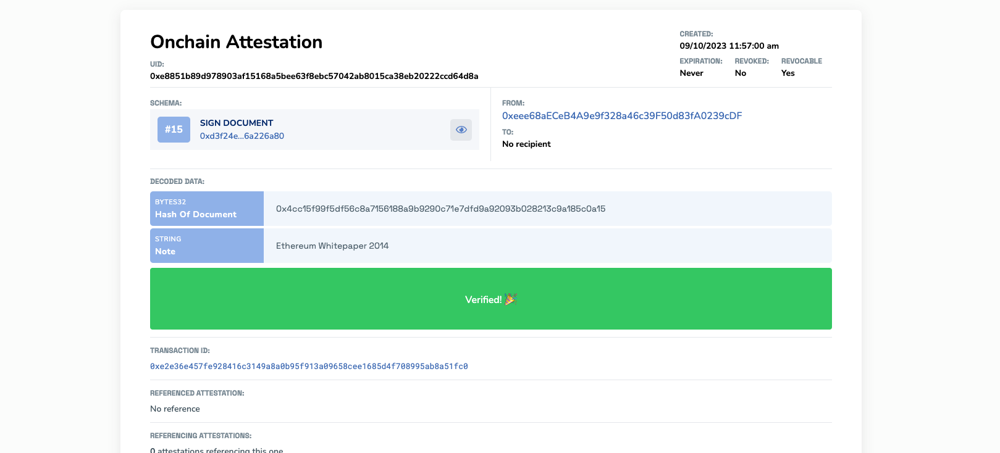
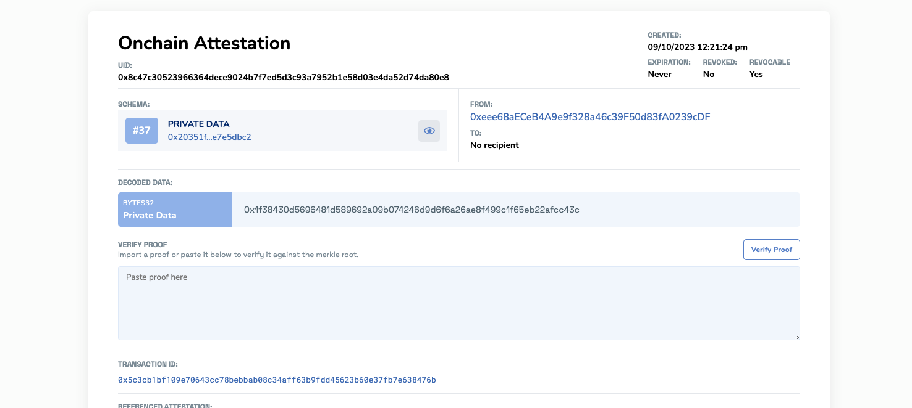
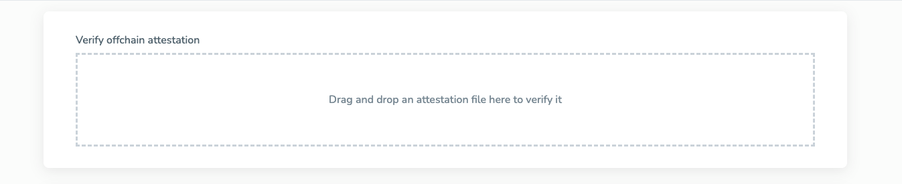
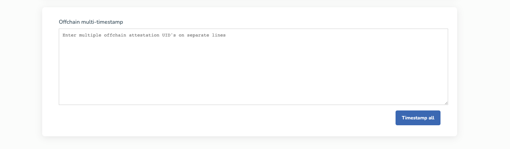
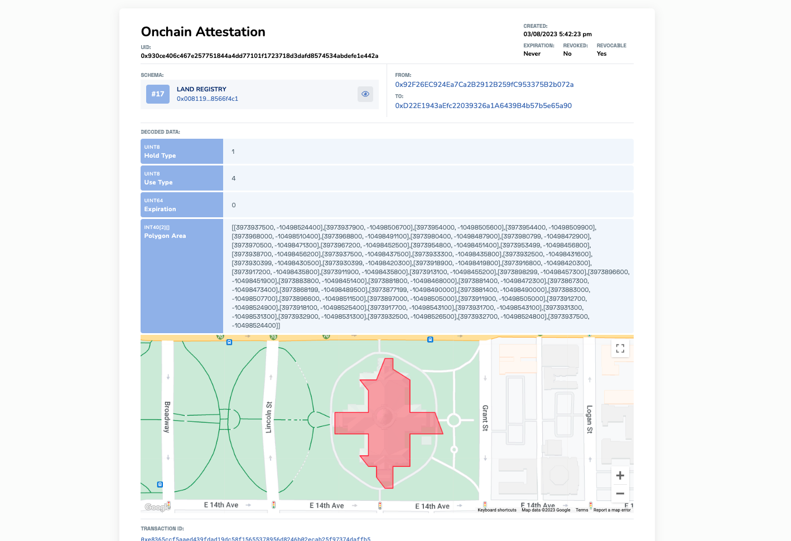
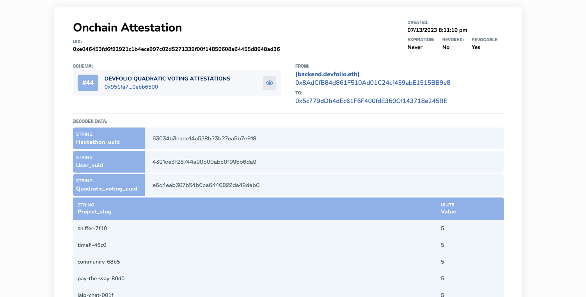

# Extended Utilities
You can do so much with your Schemas and Attestation Data. We've been building a few ways to extend the functionality of a few schemas within the EASSCAN UI.

:::tip Have a good idea?
Share it within our community channels, like [Telegram](https://t.me/+EcynOr0iFu03MTYx).
:::

## Unique Features & Extended UIs
Here's our growing list of unique features and UI's we've extended to improve the user experience.

### Content & Document Hashing
Easily hash any file and attest to it. There are two schemas you can use for this:
- **Content Hash**: Allows you to generate a hash of any file type and attest to it. [**Learn more about this feature**](/docs/developer-tools.md/hash-a-file.md).
    - **Example Schema:** [https://sepolia.easscan.org/schema/view/0xdf4c41ea0f6263c72aa385580124f41f2898d3613e86c50519fc3cfd7ff13ad4](https://sepolia.easscan.org/schema/view/0xdf4c41ea0f6263c72aa385580124f41f2898d3613e86c50519fc3cfd7ff13ad4)
- **Sign Document**: 
    - **Example Schema:** [https://sepolia.easscan.org/schema/view/0xd3f24e873e8df2d9bb9af6f08ea1ddf61f65754d023f3ea761081e3e6a226a80](https://sepolia.easscan.org/schema/view/0xd3f24e873e8df2d9bb9af6f08ea1ddf61f65754d023f3ea761081e3e6a226a80)
    - **Example Attestation:** Here's an example hash and signature attesting to the authenticity of the `Ethereum Whitepaper`. 
    
    

### Private Data Attestations
Attest to the merkle root of a bunch of private data. This can be useful for attesting to an `allowlist` of users, selective information or private info. The `merkle root` is attested to onchain and then you can selectively share each of the individual merkle tree leaves, effectively selectively disclosing the information, and allowing others to verify that that piece of data was in deed a part of the merkle tree. The value comes from the entity that attested to the private data merkle root, and then allowing others to verify the data.

**Tutorial:** [Private Data Attestations](/docs/tutorials/private-data-attestations.md)



:::info Want to read more?
Check out our [**Mirror Article**](https://mirror.xyz/0xeee68aECeB4A9e9f328a46c39F50d83fA0239cDF/BiFUEFJKo6ZsIvPwsP9WPC2UZX0-x_9BdtrvmQo1FwY) on `Private Data Attestations Using Merkle Trees`
:::

#### Example Private Data
**Attestation Record:** [https://sepolia.easscan.org/attestation/view/0x8c47c30523966364dece9024b7f7ed5d3c93a7952b1e58d03e4da52d74da80e8](https://sepolia.easscan.org/attestation/view/0x8c47c30523966364dece9024b7f7ed5d3c93a7952b1e58d03e4da52d74da80e8)

**Example Proof:** If you'd like to follow along, copy the proof below and verify it on the attestation record above.
```javascript
{"leaves":[{"type":"bool","name":"isOver21","value":true,"salt":"0x9a7e8887f01b35b2795464a7f3ddc325c9a913f92505f92338cde24edf866d4e"}],"proof":["0x8a38a3864c340eb958f180f43124748ceb65f6b663af40f771d2a99fd15ae323"],"proofFlags":[false]}
```

### Verifying Offchain Attestations
Upload any offchain attestation raw data into this tool so you can easily see if it's a valid offchain attestation.

**Tutorial:** [Verify Offchain Attestations](/docs/developer-tools/verify-attestation)



### Timestamping Offchain Attestations
Offchain attestations do not have a verifiable timestamp. If you want to timestamp multiple `UID`s of the offchain attestation, it will generate a merkle root and timestamp just that root. Then you can verify any of the individual UIDs.

**Tutorial:** [Timestamping Offchain](/docs/developer-tools/verify-timestamp)



### Land Registry
This was a fun project we built to show how different UIs can be extended on the schema record. For example, this schema takes an array of polygon points and allows you to attest to the parcel of land. This obviously would be an important attestation if it came from a land registrar. Once attested, you can see how the attestation data is displayed in a unique way.

Here's an example of the Capitol Building in Colorado, USA.



### Devfolios Quadratic Voting System
Kudos to the [**Devfolio**](https://devfolio.co/discover) team! They built a unique `Quadratic Voting System` for their hackathon. It allowed the community to cast their votes on the projects they believe deserve the prize pool. Each attestation was a record of the users votes to ensure transparency. 

**Read More:**:[**Introooducing Quadratic Voting:**](https://devfolio.co/blog/introooducing-quadratic-voting-on-devfolio/)

Example attestation on Arbitrum: [https://arbitrum.easscan.org/attestation/view/0xe046453fd6f92921c1b4ece997c02d5271339f00f14850608a64455d8648ad36](https://arbitrum.easscan.org/attestation/view/0xe046453fd6f92921c1b4ece997c02d5271339f00f14850608a64455d8648ad36)


