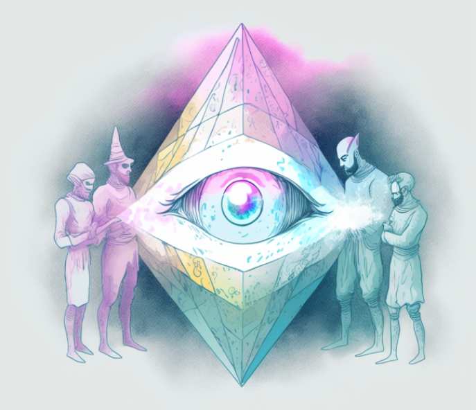

# Types of Attestations in Web3
Attestations, DIDs, verifiable credentials, claims, badges, and proofs are all terms that you may have heard used in the context of the Ethereum ecosystem. While these terms are related and often overlap in their meanings and uses, it can be helpful to understand the specific differences between them.

### Attestations
At their most basic level, attestations are statements made or pieces of evidence provided by anyone about anything. They can be used to verify the identity, credentials, or other information of individuals, organizations, and other entities. Attestations provide a way to establish trust and credibility in the digital world by providing a third-party endorsement and cryptographically signed proof of the validity of a piece of information.

### Common Terms When Compared to Verifiable Credentials
- **Decentralized Identifiers (DIDs)** - Decentralized Identifiers (DIDs) are digital identifiers that are decentralized and self-sovereign. This means that they are not controlled by any single entity and can be owned and managed by the individual or organization that holds them. DIDs are often used in conjunction with attestations to provide a way to identify the issuer or subject of an attestation.
- **Verifiable Credentials** - Verifiable Credentials are digital credentials that can be cryptographically verified as authentic. They are often used to represent educational or professional qualifications, as well as other types of identity information. Verifiable Credentials are built on top of DIDs and can be used in conjunction with or replaced by attestations to provide a more robust and secure way of verifying credentials.
- **Claims** - Claims are statements made by an individual or organization that are meant to be proven or supported by evidence. Claims can be made about any topic and can be used in a variety of contexts, such as legal proceedings, marketing, or social media. Claims are a form of attestation, but they may not be cryptographically signed like an attestation on EAS.
- **Proofs** - A proof is a piece of evidence or statement that is used to establish the truth or validity of something. In the context of the Ethereum ecosystem, a proof might be used to verify the authenticity or correctness of a piece of information, such as the ownership of a piece of digital art, the authenticity of a digital certificate, or the correctness of a computation.
- **Badges** - Badges are digital symbols that can be used to represent achievements, qualifications, or membership in a particular group or organization. In the context of Ethereum, badges can be issued and verified using verifiable credentials or as NFTs. However, badges are not tamper-proof and are often transferrable.

## Wrapping things up
Attestations, DIDs, and other concepts such as verifiable credentials, claims, badges, and proofs can all be considered types of attestations in the sense that they are used to provide information about an individual or organization in a secure and verifiable way. However, they each have their own specific definitions and uses, and they can be used for different purposes depending on the specific needs of an application.

Incorporating attestations into Ethereum projects can provide a secure and decentralized way for entities to authenticate themselves, actions, and information. This can be especially useful in applications where trust and transparency are critical, such as supply chain management, reputation systems, decentralized communities, and identity verification.

By using EAS, developers can easily integrate attestations into their projects and benefit from the interoperability and composability of the attestation layer. Whether you're new to the Ethereum ecosystem or an experienced developer, EAS provides a flexible and easy-to-use platform for building and verifying attestations in your applications.