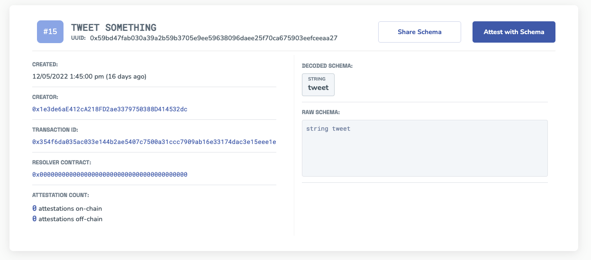

# What are Schemas
:::info Schemas are
Predefined structures for creating and verifying attestations. It defines the data types, format, and composition of an attestation. EAS uses Solidity ABI types as acceptable fields for schemas.
::::
Ethereum Attestation Service (EAS) enables anyone to create and register unique attestation schemas that can be used to verify and attest to the authenticity of information. These schemas are the building blocks of attestations, and they define the structure and rules for creating attestations.

## Here's an example
Here's an example of a schema that can be used to create an attestation for a tweet. You can see the unique identifier for the schema, the date and creator of the schema, the transaction record on Ethereum, and the schema structure. In this example, the schema accepts a single field: a string containing the content of the tweet.

By using this schema to create an attestation, users can confidently verify that the attestation relates to a tweet. If you wanted to include additional details in the attestation, such as the tweet's ID or other information, you could simply create a new schema with the relevant fields for your use case. Over time, the most widely adopted schemas will likely become the standard.

## Why are Schemas important?
Schemas can be constructed in any way you want. Schemas are important because they provide a structure for creating and verifying attestations. Without a defined schema, it would be difficult to know what data to include in an attestation and how to verify its authenticity. By using a predefined schema, parties can easily understand and agree upon the format and structure of an attestation, enabling them to trust and rely on the information contained within it.

In addition, schemas allow for greater interoperability and composability between different attestation protocols and solutions. By using a common format and structure, attestations created with different schemas can be easily composed and verified together, enabling the creation of more complex and sophisticated attestation solutions.

## Use existing schemas or create your own
EAS allows anyone to create custom schemas for any use case, enabling the creation of attestation solutions that are tailored to specific needs and communities. 

The registry includes schemas that people have created. You can use these schemas to attest to different things, like a statement you make or a review you write about a restaurant. You can also create your own schemas to attest to whatever you want. The use-cases are endless. You can even compose schemas together like lego blocks to make more robust schemas. 

Visit the registry of schemas at => [https://easscan.com/schemas](https://easscan.com/schemas).

## Getting started with Schemas
Using schemas in EAS is easy and intuitive. Here's how to get started:

1. Browse the EAS registry of schemas and choose the one that best fits your use case.
2. Customize the schema to fit your needs, such as adding or removing attributes or changing the data types.
3. Register the schema on the Ethereum blockchain using EAS.
4. Create an attestation using the registered schema and provide the necessary information.
5. Verify the attestation using EAS or a third-party application.
