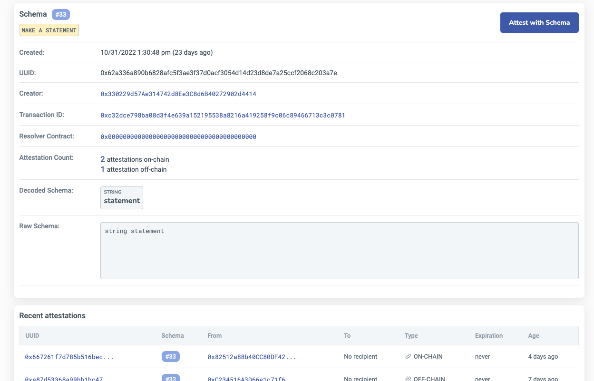

# Schemas
Ethereum Attestation Service (EAS) enables anyone to create and register unique attestation schemas that can be used to verify and attest to the authenticity of information. These schemas are the building blocks of attestations, and they define the structure and rules for creating attestations.

EAS allows anyone to create and register their own schemas for any use case. This enables interoperability and composability between different attestation protocols and solutions, allowing the attestation layer to grow and change over time.

## What are Schemas?
A schema is a predefined structure for creating and verifying attestations. It defines the data types, format, and composition of an attestation. EAS uses Solidity ABI types as acceptable fields for schemas.

Think of schemas as blueprints for attestations. They provide a common format and structure for attestation data on and off-chain, making it easy to create and verify attestations for any use case.

## Why are Schemas important?
Schemas are crucial for creating and using attestations on EAS because they provide a common format and structure for attestation data. This allows different attestations to be composed and verified in a trustless manner, enabling interoperability and composability between different attestation protocols and solutions.

In addition, schemas enable users to easily create and verify attestations for any use case, such as verifying a person's identity or proving ownership of an asset. This flexibility and simplicity make EAS a powerful tool for entrepreneurs and developers to build and use attestations for a wide range of applications.

## Use Cases
By using EAS, developers can create custom schemas and use them to create attestations for any purpose. This makes it possible to create attestation solutions that are tailored to specific use cases and communities.

Here are a few examples of how schemas can be used:
:::caution Remeber! The value of an attestation does not come from the schema. It comes from the Attestor using the schema.
:::

- **Verifying Identity**: A schema for verifying a person's identity might include fields for the person's name, date of birth, government ID number, and a photo. This schema could be used to create and verify attestations for identity verification, such as for access to secure buildings or online services.
- **Proving Ownership**: A schema for proving ownership of an asset might include fields for the asset's description, serial number, owner's name, and a photo of the asset. This schema could be used to create and verify attestations for proving ownership of assets, such as for transferring ownership or proving insurance coverage.
- **Verifying Credentials**: A schema for verifying credentials, such as a degree or certification, might include fields for the credential's name, issuing institution, date of issuance, and a photo of the credential. This schema could be used to create and verify attestations for verifying credentials, such as for job applications or professional licensing.

Let's use Schema [#33 - Make A Statement](https://easscan.com/schema/view/0x62a336a890b6828afc5f3ae3f37d0acf3054d14d23d8de7a25ccf2068c203a7e) as an example. This schema allows anyone to add a statement that they can attest to. You could use this schema to attest to a statement you make or to one that someone else makes!

## A few example schemas on EAS
The registry includes schemas that people have created. You can use these schemas to attest to different things, like a statement you make or a review you write about a restaurant. You can also create your own schemas to attest to whatever you want. The use-cases are endless. You can even compose schemas together like lego blocks to make more robust schemas. 

- [#33 - Make A Statement](https://easscan.com/schema/view/0x62a336a890b6828afc5f3ae3f37d0acf3054d14d23d8de7a25ccf2068c203a7e) Allows anyone to add a statement that they can attest to. You could use this schema to attest to a statement you make or one that someone else makes!
- [#34 - Tweet Something](https://easscan.com/schema/view/0x35a726ec7d0d25a966ead1ec068099879734083223c58b20f398ebc59602a983) Use this schema to attest to tweets you or someone else makes by passing the tweet content as a string.
- [#35 - Review Restaurant](https://easscan.com/schema/view/0xae74d9b2a7c74cce610f452624591ebeb22fcd5663b991cc0033f0c4411c38c1) Write a review about a restaurant and rate it. This schema will allow anyone to attest to a review about a restaurant and a rating.
- [#9 - Has Phone Number](https://easscan.com/schema/view/0x35a726ec7d0d25a966ead1ec068099879734083223c58b20f398ebc59602a983) This schema captures a true false if the user has a phone number and provides hash of the phone.

## Getting started with Schemas
Using schemas in EAS is easy and intuitive. Here's how to get started:

1. Browse the EAS registry of schemas and choose the one that best fits your use case.
2. Customize the schema to fit your needs, such as adding or removing attributes or changing the data types.
3. Register the schema on the Ethereum blockchain using EAS.
4. Create an attestation using the registered schema and provide the necessary information.
5. Verify the attestation using EAS or a third-party application.
