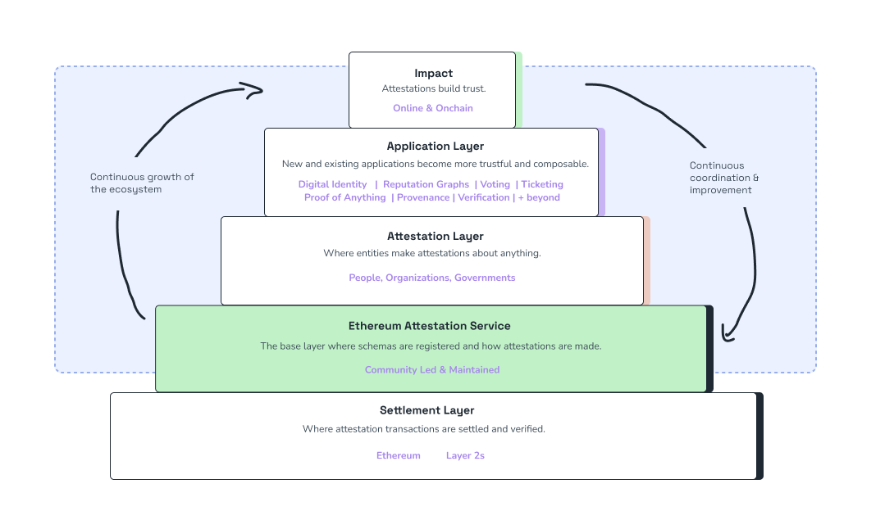

# Attestation Ecosystem
:::info What makes an ecosystem thrive?
:::
Picture a vibrant city, alive with energy, where every street, bridge, and alleyway pulses with activity. What's the secret to its rhythm? It's the infrastructure that invisibly weaves and binds everything together, allowing everyone in it to thrive.

In the attestation ecosystem, we've long felt **the absence of such a foundational infrastructure**. Efforts to establish trust, verify identities, and ensure authenticity have often been siloed, leading to a fragmented landscape. Many have tried to build solutions, but they've often started at the top or **building one layer too high**. This approach, while well-intentioned, has only added to the fragmentation, creating a patchwork of solutions that don't always speak the same language.

Worse still, past infrastructure **attempts have been encumbered by centralization, permissioned systems, and biases that presuppose too much**. Such systems, while offering a semblance of structure, are inherently flawed. They limit growth, deter widespread adoption, and, most critically, place too much power in the hands of a few at the expense of others.

## Growth Pyramid
EAS is designed to be that foundational infrastructure for the attestation ecosystem. Neutral, open, and built for the community, without presupposing too much or building too high in the stack.

## The Attestation Growth Loop
At the heart of the Attestation Ecosystem is the Ethereum Attestation Service (EAS). It's the foundational infrastructure that sets a powerful growth cycle into motion:

- **Infrastructure:** EAS provides a robust and neutral infrastructure. This foundational layer ensures that every attestation, regardless of its origin or purpose, speaks the same technical language.
- **Coordination:** With a standardized infrastructure in place, stakeholders come together to coordinate around schemas and improvements to the infrastructure. They discuss, deliberate, and decide on the best practices, ensuring that the ecosystem evolves cohesively.
- **Structured Attestations:** Guided by the coordinated efforts, entities make clear and standardized attestations. These attestations are free from biases and are made without presupposing the structure at the infrastructure layer.
- **Insightful Analysis:** The structured attestations are then analyzed, leading to the extraction of valuable insights. These insights paint a comprehensive picture of trust and knowledge within the ecosystem.
- **Application Development:** Armed with these insights, developers create applications centered on trust. These applications cater to a wider audience, enhancing user experiences and solving real-world problems and add back to the insights.
- **Feedback and Growth:** The interactions within these applications generate more data, leading to richer insights and more attestations. This feedback loop requires continuous coordination, leading to improvements in the infrastructure. The cycle continues, driving growth in the ecosystem and reinforcing online trust.

EAS is the bedrock upon which the Attestation Ecosystem thrives. It ensures that the ecosystem remains open, decentralized, and ever-evolving, all while fostering a cycle of trust, collaboration, and progress.
