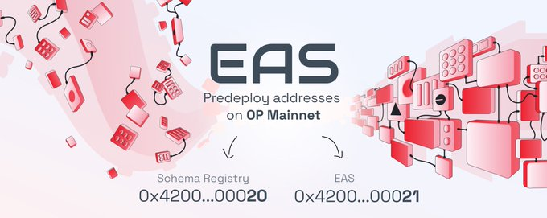

# EAS Contracts

Deployments
Please note that you can also import and use the addresses directly in your code using the @ethereum-attestation-service/eas-contracts/deployments deployment artifacts corresponding to your desired network.

## 🛳️ Deployments
:::tip We have deployed on the following chains:
- **Testnets**: Sepolia, Base Goerli, Optimism Goerli, Arbitrum Goerli, Linea Goerli, Polygon Mumbai, Scroll Sepolia
- **Mainnets**: Ethereum Mainnet, Arbitrum, Optimism, Base, Linea
:::

## Mainnets

### Ethereum 
Version `v0.26`

:::info EAS
- **Contract Address:** [0xA1207F3BBa224E2c9c3c6D5aF63D0eb1582Ce587](https://etherscan.io/address/0xA1207F3BBa224E2c9c3c6D5aF63D0eb1582Ce587)
- **Deployment and ABI:** [EAS.json](https://github.com/ethereum-attestation-service/eas-contracts/blob/master/deployments/mainnet/EAS.json)
:::

:::info SchemaRegistry
- **Contract Address:** [0xA7b39296258348C78294F95B872b282326A97BDF](https://etherscan.io/address/0xA7b39296258348C78294F95B872b282326A97BDF)
- **Deployment and ABI:** [SchemaRegistry.json](https://github.com/ethereum-attestation-service/eas-contracts/blob/master/deployments/mainnet/SchemaRegistry.json)
:::

### Optimism
EAS is natively integrated as two predeploy addresses on the OP Stack. Any future OP Stack chains deployed will automatically include the EAS contracts at Genesis.



Version `v1.0.1`:

:::info EAS
- **Contract Address:** [0x4200000000000000000000000000000000000021](https://optimistic.etherscan.io/address/0x4200000000000000000000000000000000000021)
- **Deployment and ABI:** [EAS.json](https://github.com/ethereum-attestation-service/eas-contracts/blob/master/deployments/optimism/EAS.json)
:::

:::info SchemaRegistry
- **Contract Address:** [0x4200000000000000000000000000000000000020](https://optimistic.etherscan.io/address/0x4200000000000000000000000000000000000020)
- **Deployment and ABI:** [SchemaRegistry.json](https://github.com/ethereum-attestation-service/eas-contracts/blob/master/deployments/optimism/SchemaRegistry.json)
:::

Version `v1.2.1`:

:::info EIP712Proxy
- **Contract Address:** [0xE132c2E90274B44FfD8090b58399D04ddc060AE1](https://optimistic.etherscan.io/address/0xE132c2E90274B44FfD8090b58399D04ddc060AE1)
- **Deployment and ABI:** [EIP712Proxy.json](https://github.com/ethereum-attestation-service/eas-contracts/blob/master/deployments/optimism/EIP712Proxy.json)
:::

:::info Indexer
- **Contract Address:** [0x6dd0CB3C3711c8B5d03b3790e5339Bbc2Bbcf934](https://optimistic.etherscan.io/address/0x6dd0CB3C3711c8B5d03b3790e5339Bbc2Bbcf934)
- **Deployment and ABI:** [Indexer.json](https://github.com/ethereum-attestation-service/eas-contracts/blob/master/deployments/optimism/Indexer.json)
:::

### Base
Version `v1.0.1`:

:::info EAS
- **Contract Address:** [0x4200000000000000000000000000000000000021](https://basescan.org/address/0x4200000000000000000000000000000000000021)
- **Deployment and ABI:** [EAS.json](https://github.com/ethereum-attestation-service/eas-contracts/blob/master/deployments/optimism/SchemaRegistry.json)
:::

:::info SchemaRegistry
- **Contract Address:** [0x4200000000000000000000000000000000000020](https://basescan.org/address/0x4200000000000000000000000000000000000020)
- **Deployment and ABI:** [SchemaRegistry.json](https://github.com/ethereum-attestation-service/eas-contracts/blob/master/deployments/arbitrum-one/SchemaRegistry.json)
:::

Version `v1.2.0`:

:::info EIP712Proxy
- **Contract Address:** [0xF095fE4b23958b08D38e52d5d5674bBF0C03cbF6](https://basescan.org/address/0xF095fE4b23958b08D38e52d5d5674bBF0C03cbF6)
- **Deployment and ABI:** [EIP712Proxy.json](https://github.com/ethereum-attestation-service/eas-contracts/blob/master/deployments/base/EIP712Proxy.json)
:::

:::info Indexer
- **Contract Address:** [0x37AC6006646f2e687B7fB379F549Dc7634dF5b84](https://basescan.org/address/0x37AC6006646f2e687B7fB379F549Dc7634dF5b84)
- **Deployment and ABI:** [Indexer.json](https://github.com/ethereum-attestation-service/eas-contracts/blob/master/deployments/base/Indexer.json)
:::

### Arbitrum One
Version `v0.26`:

:::info EAS
- **Contract Address:** [0xbD75f629A22Dc1ceD33dDA0b68c546A1c035c458](https://arbiscan.io/address/0xbD75f629A22Dc1ceD33dDA0b68c546A1c035c458)
- **Deployment and ABI:** [EAS.json](https://github.com/ethereum-attestation-service/eas-contracts/blob/master/deployments/arbitrum-one/EAS.json)
:::

:::info SchemaRegistry
- **Contract Address:** [0xA310da9c5B885E7fb3fbA9D66E9Ba6Df512b78eB](https://arbiscan.io/address/0xA310da9c5B885E7fb3fbA9D66E9Ba6Df512b78eB)
- **Deployment and ABI:** [SchemaRegistry.json](https://github.com/ethereum-attestation-service/eas-contracts/blob/master/deployments/arbitrum-one/SchemaRegistry.json)
:::

### Linea
Version `v1.2.0`:

:::info EAS
- **Contract Address:** [0xaEF4103A04090071165F78D45D83A0C0782c2B2a](https://lineascan.build/address/0xaEF4103A04090071165F78D45D83A0C0782c2B2a)
- **Deployment and ABI:** [EAS.json](https://github.com/ethereum-attestation-service/eas-contracts/blob/master/deployments/linea/EAS.json)
:::

:::info SchemaRegistry
- **Contract Address:** [0x55D26f9ae0203EF95494AE4C170eD35f4Cf77797](https://lineascan.build/address/0x55D26f9ae0203EF95494AE4C170eD35f4Cf77797)
- **Deployment and ABI:** [SchemaRegistry.json](https://github.com/ethereum-attestation-service/eas-contracts/blob/master/deployments/linea/SchemaRegistry.json)
:::


## Testnets

### Sepolia
Version `v0.26`:

:::info EAS
- **Contract Address:** [0xC2679fBD37d54388Ce493F1DB75320D236e1815e](https://sepolia.etherscan.io/address/0xC2679fBD37d54388Ce493F1DB75320D236e1815e)
- **Deployment and ABI:** [EAS.json](https://github.com/ethereum-attestation-service/eas-contracts/blob/master/deployments/sepolia/EAS.json)
:::

:::info SchemaRegistry
- **Contract Address:** [0x0a7E2Ff54e76B8E6659aedc9103FB21c038050D0](https://sepolia.etherscan.io/address/0x0a7E2Ff54e76B8E6659aedc9103FB21c038050D0)
- **Deployment and ABI:** [SchemaRegistry.json](https://github.com/ethereum-attestation-service/eas-contracts/blob/master/deployments/sepolia/SchemaRegistry.json)
:::

Version `v1.2.0`:

:::info EIP712Proxy
- **Contract Address:** [0x9C9d17bEE150E4eCDf3b99baFA62c08Cb30E82BC](https://sepolia.etherscan.io/address/0x9C9d17bEE150E4eCDf3b99baFA62c08Cb30E82BC)
- **Deployment and ABI:** [EIP712Proxy.json](https://github.com/ethereum-attestation-service/eas-contracts/blob/master/deployments/sepolia/EIP712Proxy.json)
:::

:::info Indexer
- **Contract Address:** [0xaEF4103A04090071165F78D45D83A0C0782c2B2a](https://sepolia.etherscan.io/address/0xaEF4103A04090071165F78D45D83A0C0782c2B2a)
- **Deployment and ABI:** [Indexer.json](https://github.com/ethereum-attestation-service/eas-contracts/blob/master/deployments/sepolia/Indexer.json)
:::


### Optimism Goerli
Version `v1.0.1`:

:::info EAS
- **Contract Address:** [0x4200000000000000000000000000000000000021](https://goerli-optimism.etherscan.io/address/0x4200000000000000000000000000000000000021)
- **Deployment and ABI:** [EAS.json](https://github.com/ethereum-attestation-service/eas-contracts/blob/master/deployments/optimism-goerli/EAS.json)
:::

:::info SchemaRegistry
- **Contract Address:** [0x4200000000000000000000000000000000000020](https://goerli-optimism.etherscan.io/address/0x4200000000000000000000000000000000000020)
- **Deployment and ABI:** [SchemaRegistry.json](https://github.com/ethereum-attestation-service/eas-contracts/blob/master/deployments/optimism-goerli/SchemaRegistry.json)
:::

Version `v1.2.0`:

:::info EIP712Proxy
- **Contract Address:** [0x88D1bd62AC014424b987CE5ABf311BD7749e426B](https://goerli-optimism.etherscan.io/address/0x88D1bd62AC014424b987CE5ABf311BD7749e426B)
- **Deployment and ABI:** [EIP712Proxy.json](https://github.com/ethereum-attestation-service/eas-contracts/blob/master/deployments/optimism-goerli/EIP712Proxy.json)
:::

:::info Indexer
- **Contract Address:** [0xa42428D1bf904d762adD02b27ADac26d53643782](https://goerli-optimism.etherscan.io/address/0xa42428D1bf904d762adD02b27ADac26d53643782)
- **Deployment and ABI:** [Indexer.json](https://github.com/ethereum-attestation-service/eas-contracts/blob/master/deployments/optimism-goerli/Indexer.json)
:::


### Base Goerli
Version `v1.0.1`:

:::info EAS
- **Contract Address:** [0x4200000000000000000000000000000000000021](https://goerli.basescan.org/address/0x4200000000000000000000000000000000000021)
- **Deployment and ABI:** [EAS.json](https://github.com/ethereum-attestation-service/eas-contracts/blob/master/deployments/base-goerli/EAS.json)
:::

:::info SchemaRegistry
- **Contract Address:** [0x4200000000000000000000000000000000000020](https://goerli.basescan.org/address/0x4200000000000000000000000000000000000020)
- **Deployment and ABI:** [SchemaRegistry.json](https://github.com/ethereum-attestation-service/eas-contracts/blob/master/deployments/base-goerli/SchemaRegistry.json)
:::

Version `v1.2.0`:

:::info EIP712Proxy
- **Contract Address:** [0x37AC6006646f2e687B7fB379F549Dc7634dF5b84](https://goerli.basescan.org/address/0x37AC6006646f2e687B7fB379F549Dc7634dF5b84)
- **Deployment and ABI:** [EIP712Proxy.json](https://github.com/ethereum-attestation-service/eas-contracts/blob/master/deployments/base-goerli/EIP712Proxy.json)
:::

:::info Indexer
- **Contract Address:** [0xE0893F47009776D6aEC3De8455Cb0ed325Eea74a](https://goerli.basescan.org/address/0xE0893F47009776D6aEC3De8455Cb0ed325Eea74a)
- **Deployment and ABI:** [Indexer.json](https://github.com/ethereum-attestation-service/eas-contracts/blob/master/deployments/base-goerli/Indexer.json)
:::


### Arbitrum Goerli
Version `v1.1.0`:

:::info EAS
- **Contract Address:** [0xaEF4103A04090071165F78D45D83A0C0782c2B2a](https://github.com/goerli.arbiscan.io/address/0xaEF4103A04090071165F78D45D83A0C0782c2B2a)
- **Deployment and ABI:** [EAS.json](https://github.com/ethereum-attestation-service/eas-contracts/blob/master/deployments/arbitrum-goerli/EAS.json)
:::

:::info SchemaRegistry
- **Contract Address:** [0x55D26f9ae0203EF95494AE4C170eD35f4Cf77797](https://github.com/goerli.arbiscan.io/address/0x55D26f9ae0203EF95494AE4C170eD35f4Cf77797)
- **Deployment and ABI:** [SchemaRegistry.json](https://github.com/ethereum-attestation-service/eas-contracts/blob/master/deployments/arbitrum-goerli/SchemaRegistry.json)
:::


### Polygon Mumbai
Version `v1.1.0`:

:::info EAS
- **Contract Address:** [0xaEF4103A04090071165F78D45D83A0C0782c2B2a](https://mumbai.polygonscan.com/address/0xaEF4103A04090071165F78D45D83A0C0782c2B2a)
- **Deployment and ABI:** [EAS.json](https://github.com/ethereum-attestation-service/eas-contracts/blob/master/deployments/polygon-mumbai/EAS.json)
:::

:::info SchemaRegistry
- **Contract Address:** [0x55D26f9ae0203EF95494AE4C170eD35f4Cf77797](https://mumbai.polygonscan.com/address/0x55D26f9ae0203EF95494AE4C170eD35f4Cf77797)
- **Deployment and ABI:** [SchemaRegistry.json](https://github.com/ethereum-attestation-service/eas-contracts/blob/master/deployments/polygon-mumbai/SchemaRegistry.json)
:::


### Linea Goerli
Version `v1.2.0`:

:::info EAS
- **Contract Address:** [0xaEF4103A04090071165F78D45D83A0C0782c2B2a](https://goerli.lineascan.build/address/0xaEF4103A04090071165F78D45D83A0C0782c2B2a)
- **Deployment and ABI:** [EAS.json](https://github.com/ethereum-attestation-service/eas-contracts/blob/master/deployments/linea-goerli/EAS.json)
:::

:::info SchemaRegistry
- **Contract Address:** [0x55D26f9ae0203EF95494AE4C170eD35f4Cf77797](https://goerli.lineascan.build/address/0x55D26f9ae0203EF95494AE4C170eD35f4Cf77797)
- **Deployment and ABI:** [SchemaRegistry.json](https://github.com/ethereum-attestation-service/eas-contracts/blob/master/deployments/linea-goerli/SchemaRegistry.json)
:::


### Scroll Sepolia
Version `1.3.0`:

:::info EAS
  - **Contract Address:** [0xaEF4103A04090071165F78D45D83A0C0782c2B2a](https://sepolia.scrollscan.com/address/0xaEF4103A04090071165F78D45D83A0C0782c2B2a)
  - **Deployment and ABI:** [EAS.json](https://github.com/ethereum-attestation-service/eas-contracts/blob/master/deployments/scroll-sepolia/EAS.json)
:::

:::info SchemaRegistry
  - **Contract Address:** [0x55D26f9ae0203EF95494AE4C170eD35f4Cf77797](https://sepolia.scrollscan.com/address/0x55D26f9ae0203EF95494AE4C170eD35f4Cf77797)
  - **Deployment and ABI:** [SchemaRegistry.json](https://github.com/ethereum-attestation-service/eas-contracts/blob/master/deployments/scroll-sepolia/SchemaRegistry.json)
:::

:::info EIP712Proxy
  - **Contract Address:** [0xB3574f76b1720E61FdA98702c7016674CD6Eaa7b](https://sepolia.scrollscan.com/address/0xB3574f76b1720E61FdA98702c7016674CD6Eaa7b)
  - **Deployment and ABI:** [EIP712Proxy.json](https://github.com/ethereum-attestation-service/eas-contracts/blob/master/deployments/scroll-sepolia/EIP712Proxy.json)
:::

info:: Indexer
  - **Contract Address:** [0x7C2cb1eDC328491da52de2a0afc44D3B0Ae7ee17](https://sepolia.scrollscan.com/address/0x7C2cb1eDC328491da52de2a0afc44D3B0Ae7ee17)
  - **Deployment and ABI:** [Indexer.json](https://github.com/ethereum-attestation-service/eas-contracts/blob/master/deployments/scroll-sepolia/Indexer.json)
:::


## Installation
```bash
pnpm add @ethereum-attestation-service/eas-contracts
```

## Testing
Testing the protocol is possible via multiple approaches:

### Unit Tests
You can run the full test suite via:

```bash
pnpm test
```
### Test Coverage
Latest Test Coverage Report (2023-10-31)
- 100% Statements 350/350
- 100% Branches 172/172
- 100% Functions 120/120
- 100% Lines 491/491

| File                              | % Stmts | % Branch | % Funcs | % Lines | Uncovered Lines |
|-----------------------------------|---------|----------|---------|---------|-----------------|
| contracts/                        | 100     | 100      | 100     | 100     |                 |
|   Common.sol                      | 100     | 100      | 100     | 100     |                 |
|   EAS.sol                         | 100     | 100      | 100     | 100     |                 |
|   IEAS.sol                        | 100     | 100      | 100     | 100     |                 |
|   ISchemaRegistry.sol             | 100     | 100      | 100     | 100     |                 |
|   Indexer.sol                     | 100     | 100      | 100     | 100     |                 |
|   SchemaRegistry.sol              | 100     | 100      | 100     | 100     |                 |
|   Semver.sol                      | 100     | 100      | 100     | 100     |                 |
| contracts/eip1271/                | 100     | 100      | 100     | 100     |                 |
|   EIP1271Verifier.sol             | 100     | 100      | 100     | 100     |                 |
| contracts/eip712/proxy/           | 100     | 100      | 100     | 100     |                 |
|   EIP712Proxy.sol                 | 100     | 100      | 100     | 100     |                 |
| contracts/eip712/proxy/examples/  | 100     | 100      | 100     | 100     |                 |
|   PermissionedEIP712Proxy.sol     | 100     | 100      | 100     | 100     |                 |
| contracts/resolver/               | 100     | 100      | 100     | 100     |                 |
|   ISchemaResolver.sol             | 100     | 100      | 100     | 100     |                 |
|   SchemaResolver.sol              | 100     | 100      | 100     | 100     |                 |
| contracts/resolver/examples/     | 100     | 100      | 100     | 100     |                 |
|   AttestationResolver.sol         | 100     | 100      | 100     | 100     |                 |
|   AttesterResolver.sol            | 100     | 100      | 100     | 100     |                 |
|   DataResolver.sol                | 100     | 100      | 100     | 100     |                 |
|   ExpirationTimeResolver.sol      | 100     | 100      | 100     | 100     |                 |
|   PayingResolver.sol              | 100     | 100      | 100     | 100     |                 |
|   RecipientResolver.sol           | 100     | 100      | 100     | 100     |                 |
|   RevocationResolver.sol          | 100     | 100      | 100     | 100     |                 |
|   TokenResolver.sol               | 100     | 100      | 100     | 100     |                 |
|   ValueResolver.sol               | 100     | 100      | 100     | 100     |                 |
| All files                         | 100     | 100      | 100     | 100     |                 |


### Instructions
In order to audit the test coverage of the full test suite, run:

```bash 
pnpm test:coverage
```

### Profiling
You can profile the gas costs of all of the user-focused flows via:

```bash
pnpm test:profile
```

## Deploying
The contracts have built-in support for deployments on different chains and mainnet forks. You can deploy the project by:

```bash
pnpm deploy
```
There’s also a special deployment mode which deploys the protocol to a mainnet fork, with additional goodies. It can be run via:

```bash
pnpm deploy:fork
```
The framework was inspired and adopted from [Bancor V3](https://github.com/bancorprotocol/contracts-v3).

## License
EAS is open source and distributed under the MIT License (see [LICENSE](https://github.com/ethereum-attestation-service/eas-contracts/blob/master/LICENSE)).
