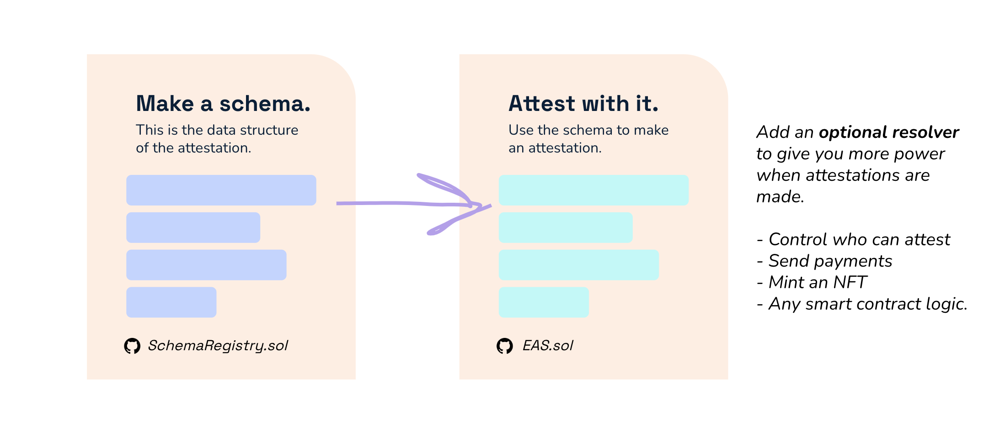
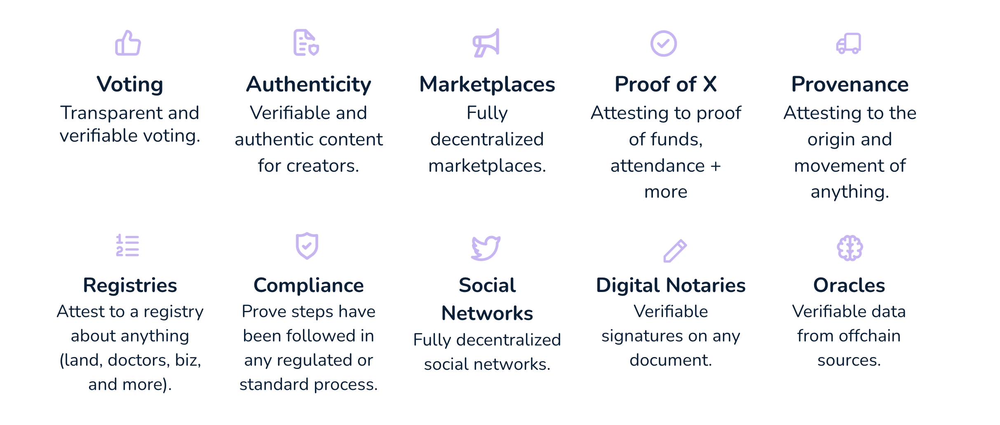
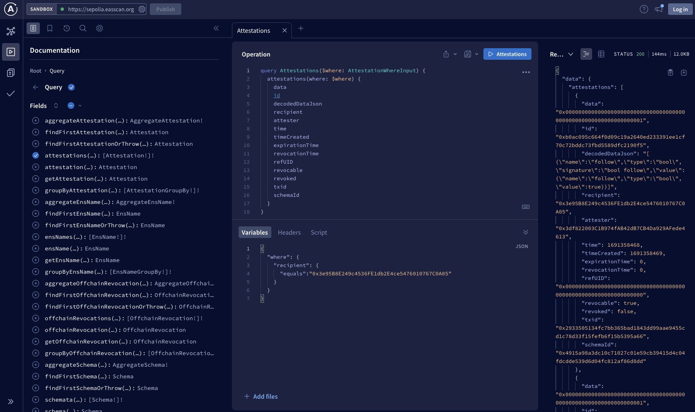
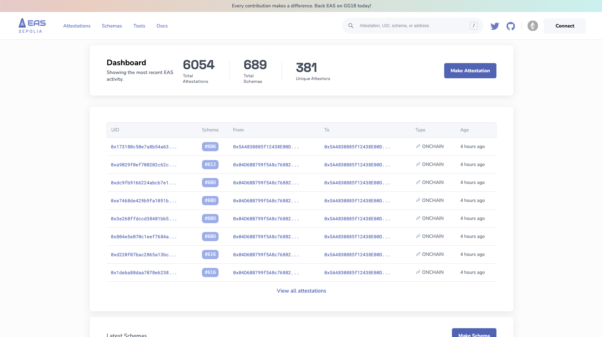

# Speedrun EAS
Welcome to the EAS Speedrun Guide! Whether you're a seasoned developer or a non-technical builder, this guide will provide you with the fastest path to understanding attestations and kickstarting your journey with EAS.

## Fundamentals
### 1. Understand Attestations
Before diving in, it's crucial to grasp the concept of attestations. Attestations are simply one entity saying something about something. Seems abstract right? That's because it is. Any time an entity is using its reputation to make a claim about something, they're attesting to it.  In a world full of digital interactions, they're the bridge to genuine trust.

:::info 
Attestations are not tokens or NFTs. They're simply digital signatures on structured data.
:::

📖 Read More: **[Learn Why EAS Exists]**

📖 Read More: **[What Are Attestations?]**


### 2. How EAS Works
EAS is elegantly simple. It runs on two smart contracts. 

- **SchemaRegistry.sol**: Defines the data structure of the attestation.
- **EAS.sol:** Allows for the creation of attestations using the registered schema.



📖 Read More: **[Get the Core Concepts Down]**

### 2. Get Inspired
Discover the myriad of use cases and applications made possible by EAS. From content verification to reputation systems, the possibilities are endless.

🔗 Explore: **See what's possible**



## Start Building
### 1. Know the Tools Available to You
These are the most frequently accessed tools to help make your builder experience better.

### Open-Source Code
EAS is transparent and community-driven. Dive into our open-source repositories to see the magic behind the scenes and even contribute.

- **[Contracts](https://github.com/ethereum-attestation-service/eas-contracts):** The contracts are elegantly simple. Check em' out.
- **[SDK](https://github.com/ethereum-attestation-service/eas-sdk):** See the latest version of the SDK Library.
- **[Indexing Service](https://github.com/ethereum-attestation-service/eas-indexing-service):** See how we index attestation data.
- **[Ponder Graph](https://github.com/ethereum-attestation-service/eas-ponder-graph):** See events that happen from attestation data.
- **[Docs Site](https://github.com/ethereum-attestation-service/eas-docs-site):** Contribute to the docs site of EAS.
- **[Contract Example](https://github.com/ethereum-attestation-service/eas-contracts-example):** An example project using the EAS contracts
- **[Met IRL](https://github.com/ethereum-attestation-service/met-irl):** A sample dapp to see how to use EAS


### SDK
Our [**Software Development Kit (SDK)**](/docs/developer-tools.md/eas-sdk.md) provides devs with tools and libraries to seamlessly integrate EAS into their projects. Use the SDK to easily:
- [**Get an attestation**](https://github.com/ethereum-attestation-service/eas-sdk#getting-an-attestation)
- [**Create Onchain Attestations**](https://github.com/ethereum-attestation-service/eas-sdk#creating-on-chain-attestations)
- [**Create Offchain Attestations**](https://github.com/ethereum-attestation-service/eas-sdk#creating-off-chain-attestations)
- [**Create Timestamps for a Single Piece of Data**](https://github.com/ethereum-attestation-service/eas-sdk#revoking-on-chain-attestations)
- [**Revoke Offchain Attestations**](https://github.com/ethereum-attestation-service/eas-sdk#revoking-on-chain-attestations)
- [**Verify Offchain Attestation**](https://github.com/ethereum-attestation-service/eas-sdk#verify-an-off-chain-attestation)
- [**Register a Schema**](https://github.com/ethereum-attestation-service/eas-sdk#registering-a-schema)
- [**Get Schema Information**](https://github.com/ethereum-attestation-service/eas-sdk#getting-schema-information)
and more. 

To install the EAS contracts, run the following command within your project directory

```bash
yarn add @ethereum-attestation-service/eas-sdk
```

OR
```bash
npm install @ethereum-attestation-service/eas-sdk
```

OR

```bash 
pnpm add @ethereum-attestation-service/eas-sdk
```

📖 Read More: [The SDK Docs](/docs/developer-tools.md/eas-sdk.md)

### GraphQL API
A flexible API that allows for querying and manipulating attestation data, making integration and data retrieval *eas*y. Each chain EAS is deployed on has a related GraphQL endpoint. Just type `/graphql` at the end of the explorer you are on. 

Example for Sepolia:
```bash jsx
https://sepolia.easscan.org/graphql
```




### The Indexer
This tool allows you to quickly spin up your own EAS indexer on any EVM chain that has EAS contracts deployed

```bash
docker-compose up
```

### The Explorer
Navigate the world of attestations with our dedicated explorer. It's like Etherscan, but tailored for schemas and attestations. It's also packed with a ton of no-code tools for non-technical builders.

**Testnets**
- [https://sepolia.easscan.org](https://sepolia.easscan.org)
- [https://optimism-goerli.easscan.org](https://optimism-goerli.easscan.org)
- [https://base-goerli.easscan.org](https://base-goerli.easscan.org)

**Mainnet**
- [https://easscan.org/](https://easscan.org/)

**Layer 2's**
- [https://arbitrum.easscan.org/](https://arbitrum.easscan.org/)
- [https://optimism.easscan.org/](https://optimism.easscan.org/)




### 2. Hands on Tutorials
There are several tutorials ranging from beginner tutorials, like how to make your first attestation, to more advanced topics like how to set a resolver contract on a schema for more functionality.

#### Beginner Topics
- Create a Schema
- Make an Attestation
- Fetching Data
- Naming a Schema

#### Intermediate Topics
- Referencing Attestations
- Revoking Attestations
- Storing Offchain Attestations
- Making Gas Efficient Schemas
- Timestamping Offchain Attestations

#### More Advanced Topics
- Delegating Attestations
- Private Data Attestations
- Resolver Contracts


## Get Involved
Join the EAS community. Share insights, ask questions, and shape the future of digital trust.

#### Community Channels
Engage with fellow enthusiasts, developers, and builders. Share insights, ask questions, and collaborate on projects.

- Telegram
- Forum

#### The Forum
Our dedicated forum is a hub for all things EAS. Whether you're coordinating around a new schema you want to use, looking for technical support, discussing use cases, or sharing a new idea, this is the place to be.
