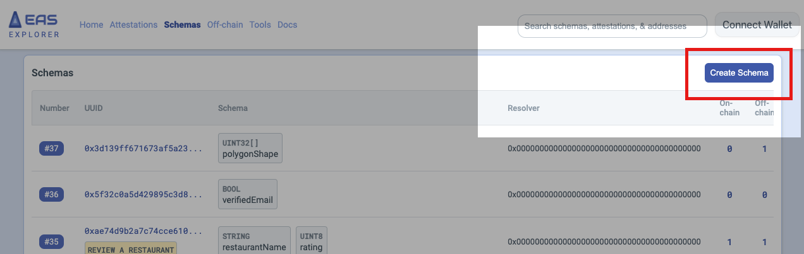
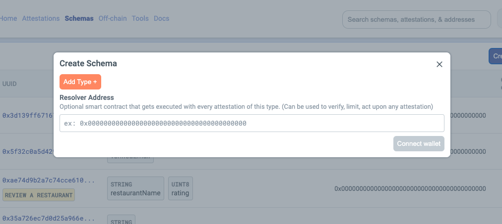
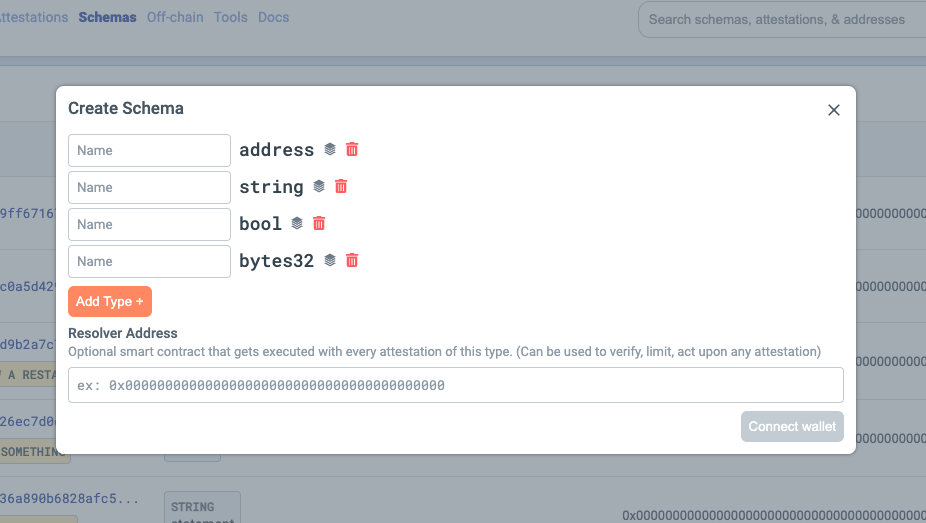
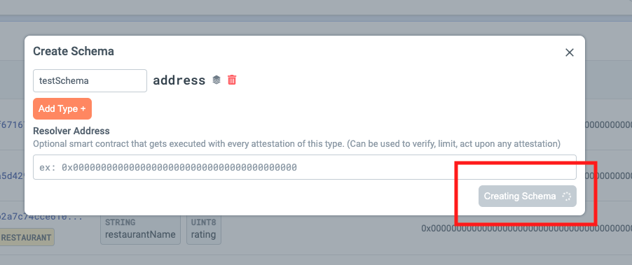
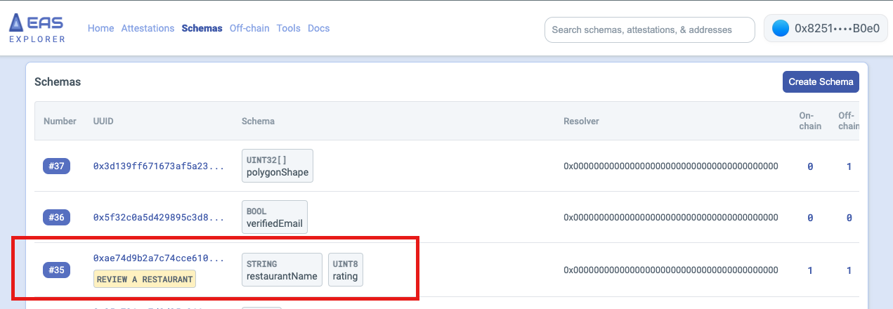
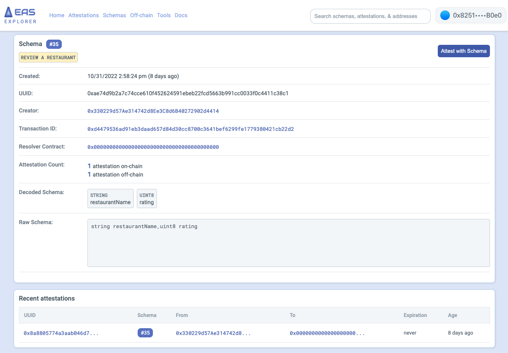

# Attest with a Schema
Attesting with a Schema allows you to verify the conditions are met on a Schema. 

## The Attestation Contract 📄

`Attest` with `Schemas` using the `EAS.SOL` contract. [View the entire contract on github](https://github.com/ethereum-attestation-service/eas-contracts/blob/master/contracts/SchemaRegistry.sol).

```jsx title="/contracts/SchemaRegistry.sol"

    function register(string calldata schema, ISchemaResolver resolver) external returns (bytes32) {
        SchemaRecord memory schemaRecord = SchemaRecord({ uuid: EMPTY_UUID, schema: schema, resolver: resolver });

        bytes32 uuid = _getUUID(schemaRecord);
        if (_registry[uuid].uuid != EMPTY_UUID) {
            revert AlreadyExists();
        }

        schemaRecord.uuid = uuid;
        _registry[uuid] = schemaRecord;

        emit Registered(uuid, msg.sender);

        return uuid;
    }
```

A new page is now available at [http://localhost:3000/my-react-page](http://localhost:3000/my-react-page).

## Create a Schema on the EAS Website 🧙

Go to => [https://easscan.com/schemas](https://easscan.com/schemas): 

:::tip Tip
Make sure you've connected your wallet to EAS.
:::

### `#1` Click on the `Create Schema` button 
Navigate to the Schema's page and click on `Create Schema`. This will trigger the modal wizard to start the process. 



### `#2` Add your Schema field types. 
Click on the `Add Type` button which will allow you to add your Schema fields. You can add as many fields as you need for your Schema use case.




### `#3` Name your Schema fields. 
It's best practice to use camelCase when labeling your Schema. 




### `#4` Click `Create Schema` and sign the transaction. 
Once you click `Create Schema` it will trigger an Ethereum transaction with your connected wallet. 
- Review the signature and sign.
- Once you sign, the transaction will start processing.



### `#5` Find your Schema in the Registry. 
The Schema will be automatically assigned an Schema ID#. Once it generates, feel free to click it and inspect the Schema Details.



### `#6` Open your schema. 
The Schema will be automatically assigned an Schema ID#. Once it generates, feel free to click it and inspect the Schema Details.


