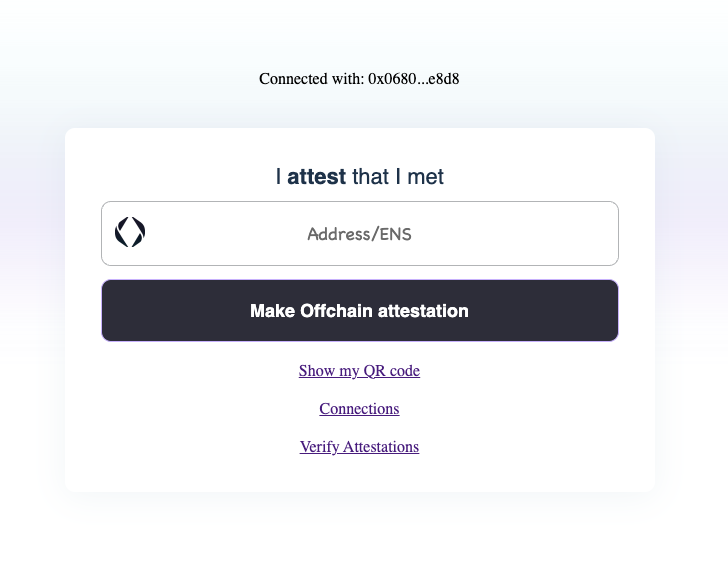
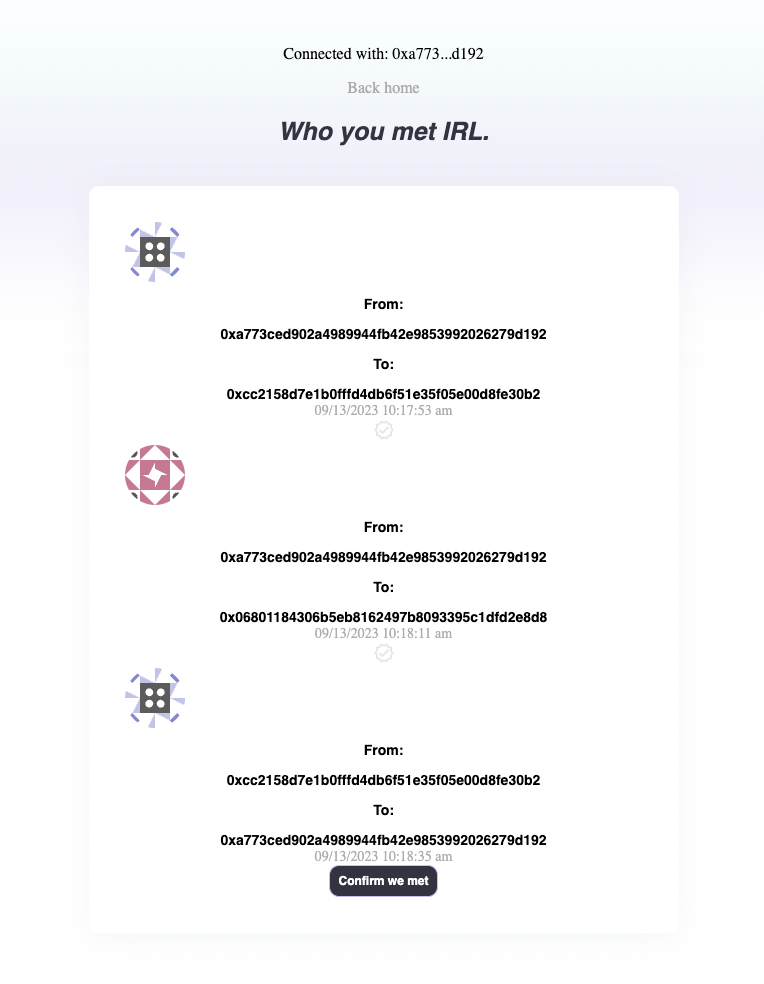
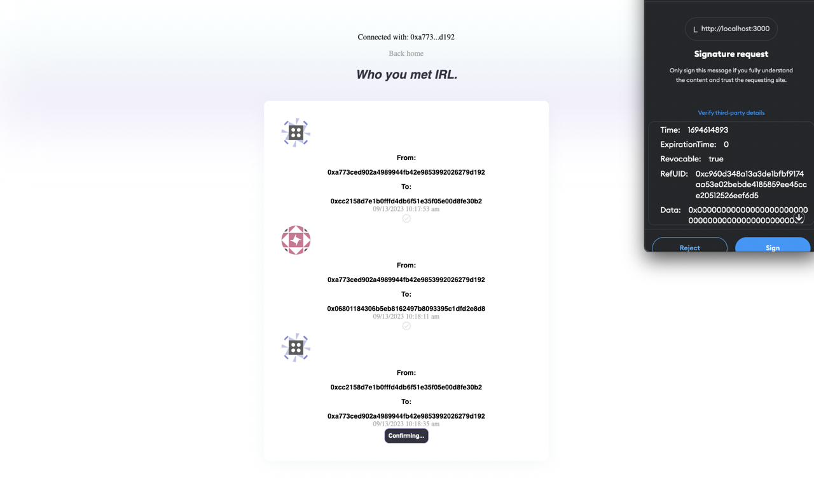
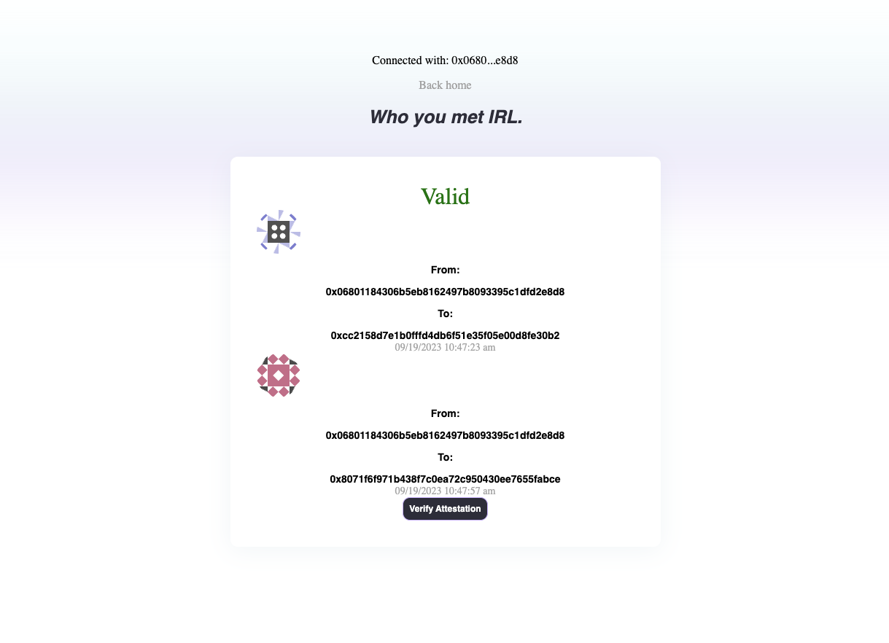

# Storing on Ceramic

In our [On-Chain vs Off-Chain](../../docs/core--concepts/onchain-vs-offchain.md) section we discussed how off-chain attestations can be integrated with other decentralized networks to make it easier for developers to access and query attestations relevant to their communities. When querying attestations at scale, some of these storage options enable faster and more efficient processing, offering a suitable choice for projects that require high throughput.

## Ceramic Network

One of these options is [Ceramic](https://ceramic.network/), a decentralized data network that leverages the provenance-related qualities you can expect from a blockchain, with the cost efficiency and querying capabilities you'd experience with a traditional database. Ceramic also empowers developers to leverage the interoperable data formats stored within the Network, enabling product teams to circumvent the "cold-start" data problem, while allowing individuals to take ownership of their digital presence. 

### How does it Work?

The Ceramic Protocol is built on decentralized event streams, where user accounts (enabled by decentralized identifiers, or [DIDs](https://developers.ceramic.network/protocol/accounts/decentralized-identifiers/)) cryptographically sign data events and submit them to the network. The events themselves are stored in the Interplanetary File System (IPFS) using the IPLD protocol, which are organized into readable streams. As such, streams are flexible enough to store many types of content such as user profiles, posts, relations to other entities, and (you guessed it) attestations. 

### Ceramic as a Data Ledger

Finally, it's important to note that Ceramic can be viewed as a "Data Ledger" middleground-of-sorts between on-chain activity and the off-chain realm. All Ceramic events are periodically rolled into a merkle tree and the root is published to the Ethereum blockchain, preserving consensus on the global ordering of Ceramic transactions.

For more information on how Ceramic works, visit [How it Works](https://ceramic.network/how-it-works).

### ComposeDB

ComposeDB is a graph database built on Ceramic that offers further composability and ease-of-querying to developers. ComposeDB comes with native support for GraphQL, and also automatically splits read/write load for additional performance. When running a Ceramic node with ComposeDB, developers can define their own [data models](https://composedb.js.org/docs/0.5.x/create-your-composite) using GraphQL, or choose to begin indexing on existing data models already defined by the community, or both! 

For the purpose of this tutorial, we will be using Ceramic with ComposeDB to illustrate how developers can generate, store, and query off-chain attestations.

### Viewing Attestations

You can view a list of the most recent attestations made on EAS by going to
the [Attestations page](https://easscan.org/attestations). If you know the UID of the attestation you want to view, you
can go directly to the attestation page by typing the UID into the search bar.

You can then view the details of the attestation, including the data that was attested to, the schema that was used, and
the address of the attester.

## Storing MetIRL Attestations on ComposeDB

This tutorial will use the `MetIRL` attestation as an example to show how to store off-chain attestations to the Ceramic Network using ComposeDB, and will reference this [example repository](https://github.com/ceramicstudio/ceramic-eas).

For this tutorial, you will need:

1. [MetaMask Chrome Extension](https://chrome.google.com/webstore/detail/metamask/nkbihfbeogaeaoehlefnkodbefgpgknn)
2. Node v16

### Initial Setup

First, clone the repository and install your dependencies:

```bash
git clone https://github.com/ceramicstudio/ceramic-eas && cd ceramic-eas
npm install
```

Open the repository in your editor of choice to continue following along. 

Next, you will need to create an .env file at the root of your project's directory:

```bash
touch .env
```

As you'll see in the .env.example, there are three environment variables you'll need to add to your new .env file. Since we will be using the Sepolia testnet for this tutorial, you can copy over the key-value pair for the `REACT_APP_CHAIN_ID` as-is.

In order to support the `getAddressForENS` resolver method (outlined [here](https://github.com/ceramicstudio/ceramic-eas/blob/main/utils/utils.ts)), you will need to create an [Alchemy](https://www.alchemy.com/) API Key. Since you can generate Ethereum Goerli API keys for free on Alchemy, this is what I recommend using (this is what the configuration options are set up to receive within the method definition).

Finally, since this tutorial assumes that the engineering team overseeing their Ceramic storage will be the controller of all attestation instances, a static 64-character alphanumeric seed phrase is needed for `AUTHOR_KEY` (for example, a dummy one here: "dfabafa4149279e29d326b5f3eedd64c0faddc69ff089f2381f81249e5369842").

(For more information on controlling Accounts and Documents, visit [ComposeDB Concepts](https://composedb.js.org/docs/0.5.x/core-concepts)).

### Generate Your Local Node Configuration

This tutorial shows developers how to run a local node with which they will deploy model definitions and publish/read transactions to the network.

In order to do this, a [server configuration](https://composedb.js.org/docs/0.5.x/guides/composedb-server/server-configurations) will have to be defined, as well as corresponding Ceramic node admin credentials.

We've done most of this work for you using [this script](https://github.com/ceramicstudio/ceramic-eas/blob/main/scripts/commands.mjs) we've provided. 

To generate your credentials, run the following in your terminal:

```bash
npm run generate
```

If you explore your `composedb.config.json` and `admin_seed.txt` files, you will now see a defined JSON ComposeDB server configuration and Ceramic admin seed, respectively.

For more information on server configurations, visit [Server Configurations](https://composedb.js.org/docs/0.5.x/guides/composedb-server/server-configurations) in the ComposeDB docs.

### Observe Your Schema Definitions

You can find pre-made graphql schema definitions within your /composites directory. While there are three files, these represent only two distinct models in total - `Attestation` and `Confirm`. As outlined in the [Referenced Attestations](./referenced-attestations.md) tutorial, some attestations optionally allow for corresponding attestations to be referenced within a given instance. Within this MetIRL example, individuals have the option to both attest to meeting others (leveraging the `Attestation` model), and recipients of MetIRL attestations can provide confirmation (using `Confirm`).

```graphql
# 00-attestation.graphql

type Attestation @createModel(
    accountRelation: LIST
    description: "A simple attestation record model"
  )
  @createIndex(fields: [{ path: ["attester"] }])
  @createIndex(fields: [{ path: ["recipient"] }])
{
  publisher: DID! @documentAccount 
  uid: String! @string(minLength: 66, maxLength: 66)
  schema: String! @string(minLength: 66, maxLength: 66)
  attester: String! @string(minLength: 42, maxLength: 42)
  verifyingContract: String! @string(minLength: 42, maxLength: 42)
  easVersion: String! @string(maxLength: 5)
  version: Int!
  chainId: Int! 
  r: String! @string(minLength: 66, maxLength: 66)
  s: String! @string(minLength: 66, maxLength: 66)
  v: Int! 
  types: [Types] @list(maxLength: 100)
  recipient: String @string(minLength: 42, maxLength: 42)
  expirationTime: DateTime
  revocationTime: DateTime
  refUID: String @string(minLength: 66, maxLength: 66)
  time: Int! 
  data: String! @string(maxLength: 1000000)
}

type Types {
  name: String! @string(maxLength: 20)
  type: String! @string(maxLength: 20)
}
```
```graphql
# 01-confirm.graphql

type Attestation @loadModel(id: "$ATTESTATION_ID") {
  id: ID!
}

type Confirm @createModel(
    accountRelation: LIST
    description: "A simple model to track attestation confirmations"
  )
  @createIndex(fields: [{ path: ["attester"] }])
  @createIndex(fields: [{ path: ["recipient"] }])
{
  publisher: DID! @documentAccount 
  uid: String! @string(minLength: 66, maxLength: 66)
  schema: String! @string(minLength: 66, maxLength: 66)
  attester: String! @string(minLength: 42, maxLength: 42)
  verifyingContract: String! @string(minLength: 42, maxLength: 42)
  easVersion: String! @string(maxLength: 5)
  version: Int!
  chainId: Int! 
  r: String! @string(minLength: 66, maxLength: 66)
  s: String! @string(minLength: 66, maxLength: 66)
  v: Int! 
  types: [Types] @list(maxLength: 100)
  recipient: String @string(minLength: 42, maxLength: 42)
  expirationTime: DateTime
  revocationTime: DateTime
  refUID: String @string(minLength: 66, maxLength: 66)
  time: Int!
  data: String! @string(maxLength: 1000000)
  attestationId: StreamID! @documentReference(model: "Attestation")
  attestation: Attestation! @relationDocument(property: "attestationId")
}

type Types {
  name: String! @string(maxLength: 20)
  type: String! @string(maxLength: 20)
}
```
```graphql
# 02-confirmConnect.graphql

type Confirm @loadModel(id: "$CONFIRM_ID") {
  id: ID!
}

type Attestation @loadModel(id: "$ATTESTATION_ID") {
  confirm: [Confirm] @relationFrom(model: "Confirm", property: "attestationId")
}
```

The confirmConnect.graphql file exists only to dynamically define a list of `Confirm` instances within the existing `Attestation` model definition, thus making it easier for developers to query and check if an instance exists.

Finally, while there are a variety of different ways to compile data models into a composite and deploy on a local node, this repository outlines one opinionated way, found in /scripts/composites.mjs. When you launch the application, this script compiles the models into a composite definition that will then be deployed on your local node, and write those definitions to the files located in `/src/__generated__`, which will later be used by the ComposeDB client library to read and write data.

### Run the Application in Developer Mode

To run the application, first make sure you're running node version 16, and then run the `dev` command:

```bash
nvm use 16
npm run dev
```
You can observe your local node's output logs within your terminal as the application starts up. 

Once your terminal reads `[NextJS] ready - started server on 0.0.0.0:3000, url: http://localhost:3000`, you can view the frontend in your browser by visiting http://localhost:3000.

### Generating Off-Chain Attestations

If you visit the URL above with no extension, you should see a form labeled "**I attest** that I met". Before you begin generating attestations, you will need to connect your MetaMask wallet. You will also be prompted to switch to Sepolia testnet if you are connected to a different network.

<div style={{textAlign: 'center'}}>



</div>

After switching to Sepolia, you will have the option to make an off-chain attestation. Copy-paste an Ethereum address (other than the one you're currently signed in with) into the `Address/ENS` field, and click "Make Offchain attestation" - you will be prompted in MetaMask to sign the typed data (see [EIP712](https://eips.ethereum.org/EIPS/eip-712) for more on typed structured data hashing and signing).

As outlined in the [Creating Offchain Attestations](https://github.com/ethereum-attestation-service/eas-sdk#creating-offchain-attestations) section of the eas-sdk README, this application mirrors this flow, found between lines 169-207 of /pages/index.tsx. You'll notice that the data you just signed was encoded - this corresponds back to line 178 of /pages/index.tsx --> the raw schema type only contains one boolean value and the name of the schema (see [MetIRL](https://easscan.org/schema/view/0xc59265615401143689cbfe73046a922c975c99d97e4c248070435b1104b2dea7) in easscan.org).

The resulting signed attestation itself is then available after signing - view it for yourself in your browser console (a console log coming from line 213 of /pages/index.tsx).

If you go back to /composites/attestation.graphql, however, you will see that this schema definition contains slightly fewer fields than the log you just observed. That's because this Attestation definition contains only the key components relevant to an attestation. Most importantly - who signed it, who the recipient is, and what data was signed.

Finally, back in /pages/index.tsx, you will see that an `/api/attest` endpoint is called to save the attestation to ComposeDB. The corresponding API definition can be found in /pages/api/attest.ts. Take note of how the AUTHOR_KEY environment variable is used to authorize the session (required for write transactions to establish a controlling account on the Ceramic Stream that will be produced). 

The GraphQL mutation query called after authenticating the session then uses the `Attestation` definition (imported at the top of the file from `../../src/__generated__/definition.js` and loaded into the `composeClient` class instance instantiation on line 28), as well as the attestation's values from the req.body. 

Back in your browser console, you can view the logged confirmation that a ComposeDB `Attestation` document was created from your API call.

### Viewing Attestations

Back in your browser window you'll have the option to visit the "Connections" page (/connections). On load, you will see any attestations you just generated appear. Additionally, if you are the recipient of any MetIRL attestation instances, you'll have the option to confirm.

<div style={{textAlign: 'center'}}>



</div>

This flow is tied to React lifecycle events outlined in /pages/connections.tsx. You'll notice how a useEffect hook is called to first check whether a wallet is connected, which then calls a `getAtts()` method. Similar to the previous page, this call hits another endpoint (`/api/all`), defined in /pages/api/all.ts.

Notice how the GraphQL `attestationIndex` call queries the attestationIndex using a filter for where the attester or recipient is the account. This is because we want to pull both into our frontend and allow the user to confirm any MetIRL attestations pointed to them. It's important to note that you can only use filters and ordering queries on fields you've created indexes on (see /composites/attestation.graphql on lines 5 and 6).

For more on creating indices, visit the [Schemas](https://composedb.js.org/docs/0.5.x/guides/data-modeling/schemas#directives-for-creating-indices) page in the ComposeDB docs.

### Confirming Attestations

If your MetaMask is set up with multiple accounts, create a MetIRL attestation from account "A" to account "B" and then sign into account "B". If you go to the /connections page while signed into account "B" you'll notice that your attestation from account "A" gives you the option to `Confirm we met`. 

<div style={{textAlign: 'center'}}>



</div>

Similar to the pattern outlined in /pages/index.tsx, you'll see the corresponding code for creating `Confirm` instances in /components/AttestationItem.tsx. One major difference to call out in this version is on line 92 - you will see that the `refUID` field now contains a dynamic input value which references the corresponding UID from the attestation loaded into that component. Line 75 also displays that a different schema is being used, this time with the name "Confirm".

Finally, note how the API endpoint used in this flow ("/api/confirmAttest") generates a `Confirm` instance within /pages/api/confirmAttest.ts. Given the Confirm + Attestation relation definition explained above (within /composites/confirmConnect.graphql), this confirmation will now automatically be able to be queried from the `Attestation` instance it points to using the "confirm" field.

Go ahead and press the `Confirm we met` button to try this out for yourself.

### Validating Attestations

As outlined in the [Verifying Offchain Attestations](https://github.com/ethereum-attestation-service/eas-sdk#verify-an-offchain-attestation) section of the eas-sdk README, developers also have the ability to validate these offchain instances by invoking the `verifyOffchainAttestationSignature` method within each `Offchain` class. Given that we're saving the full anatomy of each offchain attestation to Ceramic, all of the properties necessary to invoke this method are available on each ComposeDB `Attestation` and `Confirm` instance.

<div style={{textAlign: 'center'}}>



</div>

Navigate to the "Verify" page (/verify) and open the /pages/verify.tsx and /components/AttestToVerify.tsx files in your text editor to observe how this method is being invoked. More specifically, observe how we deconstruct the `data` props passed down to /components/AttestToVerify.tsx between lines 66-97 to form an "attestation" object, and how that object is eventually fed into the invocation of `verifyOffchainAttestationSignature` on line 109.

## Next Steps

While this tutorial was intentionally built for storing off-chain attestations using EAS, there are other patterns and examples developers will find useful to learn more about building on Ceramic.

- To migrate from local development to running ComposeDB in the cloud, visit [Running in the Cloud](https://composedb.js.org/docs/0.5.x/guides/composedb-server/running-in-the-cloud).
- To move from Ceramic Testnet to Mainnet, visit [Access Ceramic Mainnet](https://composedb.js.org/docs/0.5.x/guides/composedb-server/access-mainnet).
- To see how to authorize users using the `did:pkh` method and allow them to create their own documents on ComposeDB, visit this [Social App ComposeDB Starter](https://github.com/ceramicstudio/EthDenver2023Demo).
- To allow users to encrypt and decrypt data on ComposeDB, visit this [Blog Article](https://blog.ceramic.network/tutorial-encrypted-data-on-composedb/).
- Use the [ComposeDB API Sandbox](https://composedb.js.org/sandbox) to test example queries on a real dataset

### Looking for Support from the Ceramic Team?

Developers are encouraged to join the Ceramic community, engage with members from the Ceramic team, and ask for help along their development journey! Here are a few ways to get in touch:

- Join the [Forum](https://forum.ceramic.network/) to ask questions and receive support
- Join the [Discord](https://discord.com/invite/ceramic) to chat directly with both community members and the Ceramic team
- Follow the Ceramic Network on [Twitter](https://twitter.com/ceramicnetwork) for updates
- Browse technical tutorials and feature release announcements on the Ceramic [blog](https://blog.ceramic.network/)
- Check out the [YouTube Channel](https://www.youtube.com/channel/UCgCLq5dx7sX-yUrrEbtYqVw) for presentations and videos