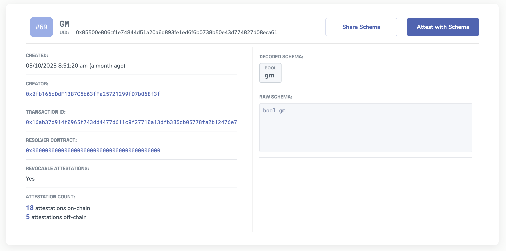
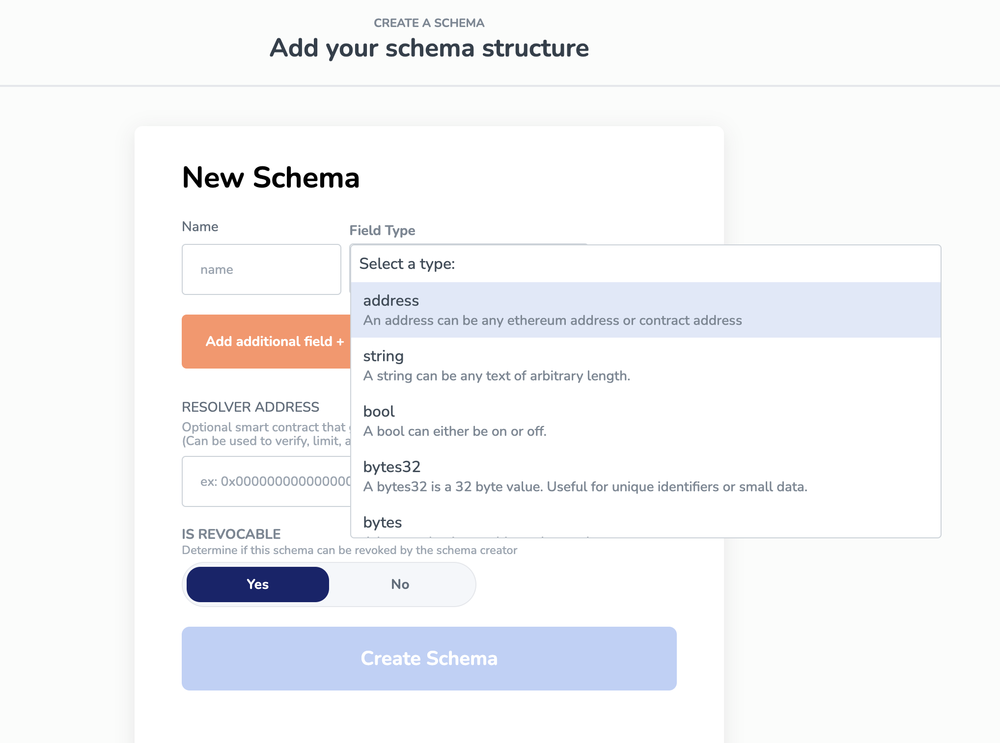

# Create a Schema

A schema defines the data structure for an attestation within the Ethereum Attestation Service (EAS). Schemas are customizable and can be created for any purpose, allowing users to leverage preexisting schemas or create new ones tailored to their specific needs.

:::tip Tip
Before creating a new schema, double-check the [Schemas](https://easscan.org/schemas) on the EAS Explorer to see if a suitable one already exists for your attestation requirements.
:::

## Schema Fields

Schemas follow the **Solidity ABI** for acceptable types. Below is a list of current elementary types:

- `address` An address can be any ethereum address or contract address.
- `string` A string can be any text of arbitrary length
- `bool` A bool can either be true or false.
- `bytes32` A bytes32 is a 32 byte value. Useful for unique identifiers or small data.
- `bytes` A bytes value is an arbitrary byte value.
- `uints` uint values can be from uint8 -> uint256.
- `<type>[]`  A variable-length array of elements of the given type (ex. address[]).

Have questions about acceptable types? Learn more
about [Solidity ABI types](https://docs.soliditylang.org/en/v0.8.16/abi-spec.html).

# The Schema Record
EAS uses Ethereum smart contracts to register and verify attestations. Each schema registered on EAS has a record that can be viewed on EASScan [https://easscan.com/schemas](https://easscan.com/schemas). 

## Understanding the EAS schema record
Learn how to read a schema record and understand if it's the proper structure for your use case.

**Each schema record has the following fields:**
- `Schema #` - this is an incremental number automatically assigned to the Schema. It is not a unique identifier.
- `UID` - this is the unique universal identifier assigned to the schema.
- `Creator` - the wallet address that created the schema.
- `Transaction ID` - the Ethereum transaction registering the schema on EAS.
- `Resolver Contract` - An optional contract assigned to the Schema for more complex use cases.
- `Attestation Count` - The amount of attestations that have been made with attestations on/off chain.
- `Schema` - The ABI encoded schema field types.

**Example Schema Record**

## Making Schemas 🧙

### No-Code Schema Builder
Use the no-code schema builder on any easscan explorer site, such as [https://easscan.org/schema/create](https://easscan.org/schema/create)

### Use the SDK
Easily make schemas directly with the SDK.

## Learn about the Schema Contract 📄
Schemas are registered through the `SchemaRegistry.sol` contract. [Explore the entire contract on GitHub.](https://github.com/ethereum-attestation-service/eas-contracts/blob/master/contracts/SchemaRegistry.sol)

The contract enables users to register a schema that specifies the data format for a particular type of attestation. Additionally, a schema resolver contract can be employed to verify the attestation data.