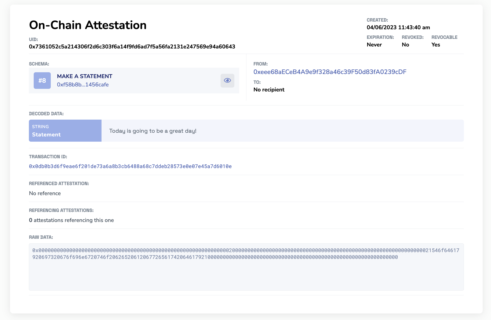
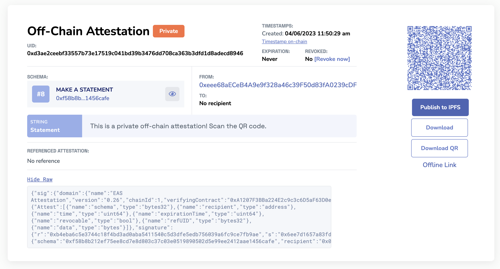

# Make an Attestation
Depending on your needs and technical expertise, there are several ways to make attestations with EAS.

## Ways to Make an Attestation with EAS
- **EAS SDK:** Ideal for developers building dapps or integrating attestations into their platforms.
- **Direct Contract Interaction:** For those who want the utmost flexibility and are comfortable interacting directly with Ethereum smart contracts.
- **EASScan Website:** The most user-friendly way to create attestations without any coding.

## The Attestation Record
Before we jump in to learning how to make attestations, let's understand what get's made first. 

A unique `attestation record` is created each time an attestation is made using EAS and can be verified on
the [EAS explorer](https://easscan.com). The attestation record contains important information about the attestation,
including the schema used, the attestor, the recipient (if specified), the expiration time (if specified), and more.

In this guide, we'll walk through how to read and understand an attestation record and transaction, including the
various fields and data included in an attestation.

## Understanding the Attestation Record

Each attestation record has the following fields:

- `UID` - this is a universal unique identification number for the attestation.
- `Schema` - the UID of the schema used to make the attestation.
- `Attestor` - the address that made the attestation.
- `Recipient` - an **optional** recipient of the attestation that was made.
- `Expiration Time` - an **optional** date that the attestation will expire if provided by the attestor.
- `Revocation Time` - the time at which the attestation was revoked (if any).
- `refUID` - An attestation that this attestation is referencing (if any).
- `data`- The ABI encoded data for the attestation.

### Example Onchain Attestation Record
This is an example onchain attestation record for "Making a Statement". The header contains information such as the UID, who made the attestation (attestor), recipient (if provided), the revocation status, and if the attestation is set to expire.


### Example Private Offchain Attestation Record
This is an example offchain attestation record for "Making a Statement". The difference between the onchain record and this offchain attestation is that this attestation is private. The server doesn't even know about it. You can easily share this attestation URL with others who can then decode the attestation data, publish it to IPFS, and more. If this attestation were to be published or pinned to IPFS, the status icon will change to "public".



You can access this example private offchain attestation by going to this:
- [Example Private offchain Attestation.](https://easscan.org/offchain/url/#attestation=eNqlkjmOHDEMAP%2FSccPgIV7hzM7OJwwHOqgHGDbg55vdcOB8FQiQVCyKlL4f8I30OPE84M8DCezNz2cnap80Y%2FLUl%2FS38gtyoDh9pLgdFzxajq5Tkq21ib7bWNwX9NGlIUqDKYvXTsk1TBQ4uu5ypu0RPW%2BJZtpCFevOezWMPjWURMxpOM4WkoFpHlvSIn3LIN3IXWAtgOMkuzyZqd4%2FP%2FLZHpGxmbw3nRzv4kr9AOKYr%2FedtK6ZNDPHZq5MwzjRBGNCw6ohBjfTtQx8dlYeVcTC5X3lXB5Nb8kWHz4IKbdJps9l6cuBJ9sETiihBwjQqhIikxpS74lNdPZ9l19tVwcHA4oT7o1fP3%2FnpYcvDfpaOFR7m7qGMcG%2F%2BfoaYFQrVbSmUntba9BSLhbr3fLirF2nVr%2Fi5qKorDaBVCuLKsYud8ULClUEF3H58v8bHCf8%2BAtyp6Fo)

## Make an Attestation Guide
### EAS SDK
Make sure you've successfully initialized the SDK in your project. You can [**learn more about the SDK here**](/docs/developer-tools/eas-sdk.md) if you have not done this step yet.

The `attest` function allows you to create an onchain attestation for a specific schema. This function takes an object with the following properties:
- **schema:** The UID of the schema for which the attestation is being created.
- **data:** An object containing the following properties:
- **recipient:** The Ethereum address of the recipient of the attestation.
- **expirationTime:** A Unix timestamp representing the expiration time of the attestation. Use 0 for no expiration.
- **revocable:** A boolean indicating whether the attestation is revocable or not.
- **refUID:** (Optional) The UID of a referenced attestation. Use ZERO_BYTES32 if there is no reference.
- **data:** The encoded data for the attestation, which should be generated using the SchemaEncoder class.

The function returns a Promise that resolves to the UID of the newly created attestation.

#### Example Onchain Attestation with the SDK
```javascript
import { EAS, SchemaEncoder } from "@ethereum-attestation-service/eas-sdk";

const eas = new EAS(EASContractAddress);
eas.connect(signer);

// Initialize SchemaEncoder with the schema string
const schemaEncoder = new SchemaEncoder("uint256 eventId, uint8 voteIndex");
const encodedData = schemaEncoder.encodeData([
  { name: "eventId", value: 1, type: "uint256" },
  { name: "voteIndex", value: 1, type: "uint8" },
]);

const schemaUID = "0xb16fa048b0d597f5a821747eba64efa4762ee5143e9a80600d0005386edfc995";

const tx = await eas.attest({
  schema: schemaUID,
  data: {
    recipient: "0xFD50b031E778fAb33DfD2Fc3Ca66a1EeF0652165",
    expirationTime: 0,
    revocable: true, // Be aware that if your schema is not revocable, this MUST be false
    data: encodedData,
  },
});

const newAttestationUID = await tx.wait();

console.log("New attestation UID:", newAttestationUID);
```

#### Example Offchain Attestation with the SDK
To create an offchain attestation, you can use the signOffchainAttestation function provided by the Offchain class in the EAS SDK. Here's an example:
```javascript
import { SchemaEncoder } from "@ethereum-attestation-service/eas-sdk";

const offchain = await eas.getOffchain();

// Initialize SchemaEncoder with the schema string
const schemaEncoder = new SchemaEncoder("uint256 eventId, uint8 voteIndex");
const encodedData = schemaEncoder.encodeData([
  { name: "eventId", value: 1, type: "uint256" },
  { name: "voteIndex", value: 1, type: "uint8" },
]);

// Signer is an ethers.js Signer instance
const signer = new ethers.Wallet(privateKey, provider);

const offchainAttestation = await offchain.signOffchainAttestation({
  recipient: '0xFD50b031E778fAb33DfD2Fc3Ca66a1EeF0652165',
  // Unix timestamp of when attestation expires. (0 for no expiration)
  expirationTime: 0,
  // Unix timestamp of current time
  time: 1671219636,
  revocable: true, // Be aware that if your schema is not revocable, this MUST be false
  version: 1,
  nonce: 0,
  schema: "0xb16fa048b0d597f5a821747eba64efa4762ee5143e9a80600d0005386edfc995",
  refUID: '0x0000000000000000000000000000000000000000000000000000000000000000',
  data: encodedData,
}, signer);
```
This function will return a signed offchain attestation object containing the UID, signature, and attestation data. You can then share this object with the intended recipient or store it for future use.

Since the offchain attestation protocol is being constantly evolved and improved, we've recently added versioning to help the applications to support both older and newer types of attestation. Starting from version `1`, we have added a `version` field to its typed data, which is seamlessly supported by both signOffchainAttestation and `verifyOffchainAttestationSignature` function.

Please note that using the `getOffchainUID` function for the previous legacy version, requires passing `{ version: 0 }` explicitly.


### Direct Contract Interaction
All the smart contract interactions you'd want to find when making an attestation will be found in the [**EAS.sol Contract on Github**](https://github.com/ethereum-attestation-service/eas-contracts/blob/master/contracts/EAS.sol#L397C2-L397C2)

#### Example Code Snippet for Making an Attestation
```javascript
pragma solidity 0.8.21;

import { IEAS, AttestationRequest, AttestationRequestData } from "@ethereum-attestation-service/eas-contracts/contracts/IEAS.sol";
import { NO_EXPIRATION_TIME, EMPTY_UID } from "@ethereum-attestation-service/eas-contracts/contracts/Common.sol";

/// @title ExampleAttester
/// @notice Ethereum Attestation Service - Example
contract ExampleAttester {
    error InvalidEAS();

    // The address of the global EAS contract.
    IEAS private immutable _eas;

    /// @notice Creates a new ExampleAttester instance.
    /// @param eas The address of the global EAS contract.
    constructor(IEAS eas) {
        if (address(eas) == address(0)) {
            revert InvalidEAS();
        }

        _eas = eas;
    }

    /// @notice Attests to a schema that receives a uint256 parameter.
    /// @param schema The schema UID to attest to.
    /// @param input The uint256 value to pass to to the resolver.
    /// @return The UID of the new attestation.
    function attestUint(bytes32 schema, uint256 input) external returns (bytes32) {
        return
            _eas.attest(
            AttestationRequest({
                schema: schema,
                data: AttestationRequestData({
                recipient: address(0), // No recipient
                expirationTime: NO_EXPIRATION_TIME, // No expiration time
                revocable: true,
                refUID: EMPTY_UID, // No references UI
                data: abi.encode(input), // Encode a single uint256 as a parameter to the schema
                value: 0 // No value/ETH
            })
            })
        );
    }
}
```


### No-Code Tools
For those who aren't developers but still want to harness the power of attestations, EAS offers no-code tools. These tools allow you to create attestations with simple drag-and-drop interfaces.

1. Simply go on to EASSCAN.ORG on the chain of your choice. For example, [**https://sepolia.easscan.org**](https://sepolia.easscan.org)
2. Click on any Schema. For example, the [**Make a Statement**](https://sepolia.easscan.org/schema/view/0x3969bb076acfb992af54d51274c5c868641ca5344e1aacd0b1f5e4f80ac0822f) schema.
3. Then click `Attest with Schema` on the top right of the schema record.
4. The Schema will decode and you can now fill in the data for the Schema. You do NOT need to have a recipient, as it's an optional field.
5. You have the option to click `Advanced Options+` which allows you to pick if you want to `set an expiration time`, `reference an attestation`, or determine if you want this attestation to be `revocable` (if enabled by the schema).
6. Now that you have all your data ready to go. You can choose between `onchain` or `offchain`. 
7. Click `Make Attestation`, sign the transaction, and then you're attestation record will be generated!


## Need more support?
Feel free to jump into our [**Telegram Channel**](https://t.me/+EcynOr0iFu03MTYx) for dev support. Or send us a direct message on [**Twitter(x)**](https://twitter.com/eas_eth).
