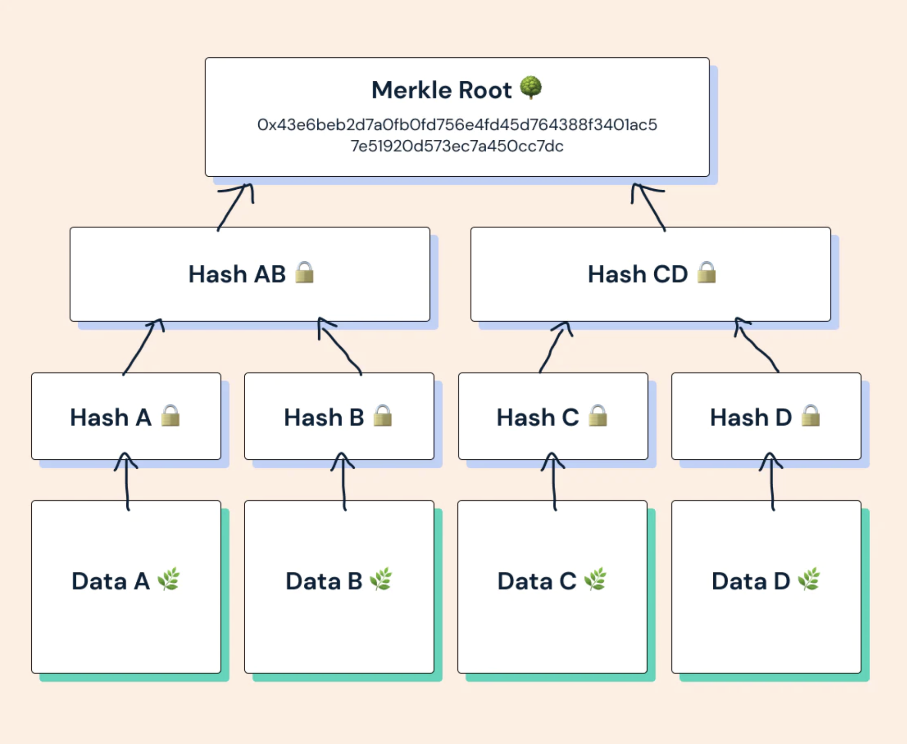
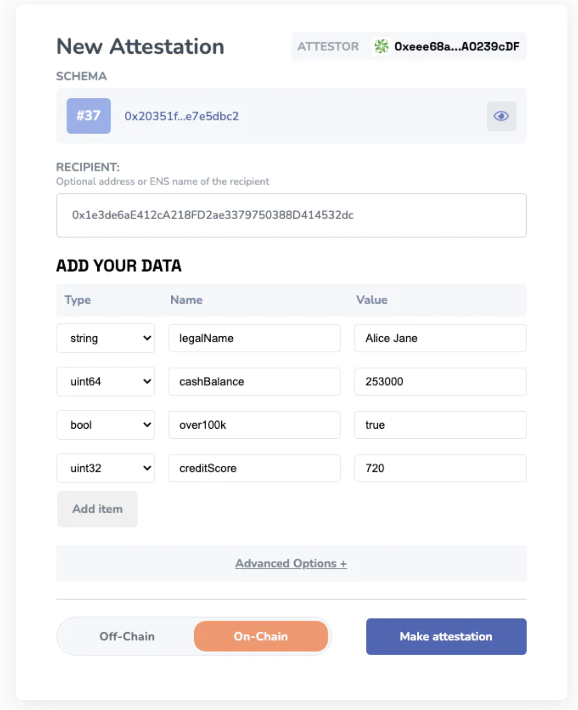
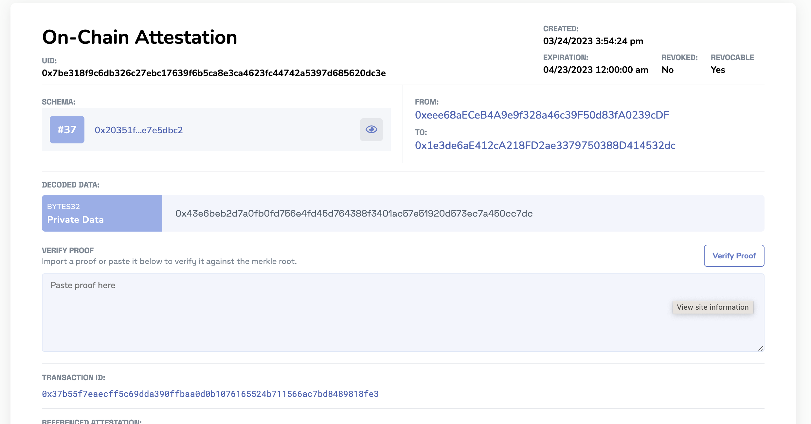
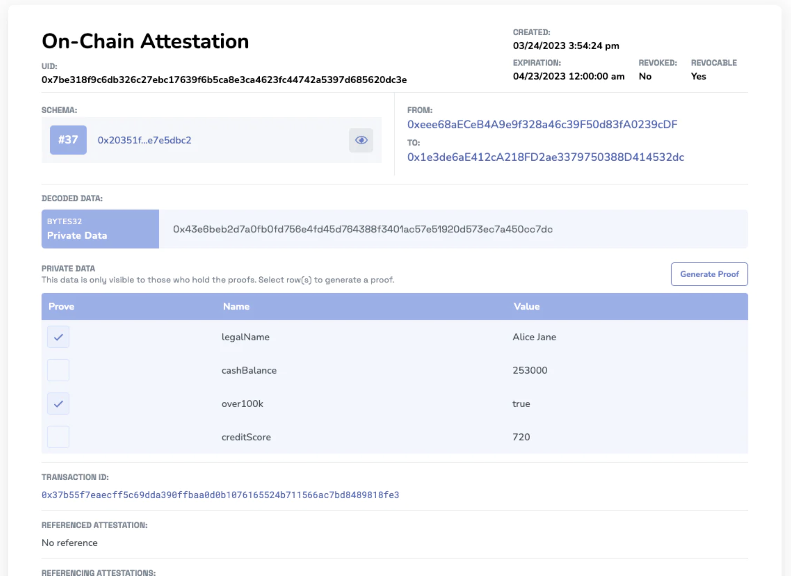

# Private Data Attestations
Discover the power of "Private Data Attestations" using `Merkle Trees`. This is a developer guide for the implementation of private data attestations using Merkle Trees.

### What are private data attestations?
Private Data Attestations leverage Merkle Trees' unique capabilities to selectively disclose specific data fields without compromising overall privacy. This innovative feature allows users to create attestations with a single "private data" field, which contains the hash of a Merkle tree root. As a result, **users can securely store and share particular parts of their attested data** while preserving their privacy.

Attestors can now selectively disclose parts of their attestations without revealing the entire attestation data. This allows for greater control over the information being shared, while still providing the necessary proof or verification for specific use cases. It is beneficial for use cases that require sensitive information to be withheld while still verifying crucial aspects or data.

**A quick example of how it works:**
1. The user or entity **submits data for selective disclosure** on the privateData schema.
2. **Data is encoded**, generating a Merkle root hash.
3. Creator's address **attests to the Merkle root** hash on or off-chain.
4. The **user produces proofs** for specific data fields to disclose.
5. **Verifier checks proofs** against the Merkle root.

Note: EAS utilizes OpenZeppelin's Merkle Tree library and ethers.js for Merkle Tree operations.

### Understanding Merkle Trees
Merkle Trees play a vital role in situations where it's essential to maintain privacy while ensuring the accuracy and reliability of the information.

They are cryptographic data structures designed for secure and efficient data verification. Imagine a tree built from the ground up, with individual pieces of data called leaves at the base. Each leaf is put through a cryptographic process called hashing. Next, pairs of these hashed leaves are combined and hashed again, creating a new level of parent nodes in the tree. This process repeats itself until there's only one hash left at the top, known as the Merkle Root.

What makes Merkle Trees special is their ability to prove that specific data is part of the tree without disclosing the entire dataset. This is done using a Merkle proof, which includes a data element's hash and a series of related hashes. By checking the Merkle proof against the Merkle Root, anyone can confirm the authenticity and inclusion of that data element without accessing the complete dataset.

Merkle Trees are integral to privacy-focused technologies like zero-knowledge proofs and secure data sharing, striking a balance between data integrity and privacy.

## Private Data Attestation Tutorial
The EAS community built a separate utility outside of the EAS contracts to help people make private data attestations using Merkle Trees. 
EAS utilizes OpenZeppelin's Merkle-tree library and ethers.js for Merkle Tree operations. This is a perfect example of how Schemas and their UI's can be extended for really unique and powerful use cases.

:::tip Tip
To make Private Data Attestations use the "privateData" schema UID# 0x20351f973fdec1478924c89dfa533d8f872defa108d9c3c6512267d7e7e5dbc2.
- [Sepolia](https://sepolia.easscan.org/schema/view/0x20351f973fdec1478924c89dfa533d8f872defa108d9c3c6512267d7e7e5dbc2)
- [Mainnet](https://easscan.org/schema/view/0x20351f973fdec1478924c89dfa533d8f872defa108d9c3c6512267d7e7e5dbc2)
- [Arbitrum](https://arbitrum.easscan.org/schema/view/0x20351f973fdec1478924c89dfa533d8f872defa108d9c3c6512267d7e7e5dbc2)
:::

### [1] Add/Import your Data
Now that you're on the privateData schema. Make sure you click `Make Attestation`. It will bring you to the UI where you can easily add your fields or import data. 
1. Define if you want a recipient for this privateData
2. Add your data by picking the data type, name the key, add the value. 

### [2] Encode the Private Data 
When the attester makes the attestation using the `privateData` schema, the private data gets encoded and generates a Merkle tree root hash of all the fields.

The created attestation only contains the "Private Data" bytes32 value representing the Merkle tree root. This "Private Data" is accessible exclusively to the original attestor address or those who have received and verified any proof of the data.

### [3] Generate Proofs of Private Data

Once the attestation is made, the attester can provide anyone with the entire data or parts of the data from the tree which will allow her to generate proofs from it.

### [4] Verify Proofs  
Once your proofs have been generated you can share them with individuals to verify your information. For example, if you want to only selectively disclose the `legalName` and `over100k` values, then you would just generate a proof for those. Anyone with the proof can go to the easscan website and verify the proof against the Merkle Tree root.

## Have additional questions?
Send us a [**DM on Twitter**](https://twitter.com/eas_eth) and we're happy to help you.

