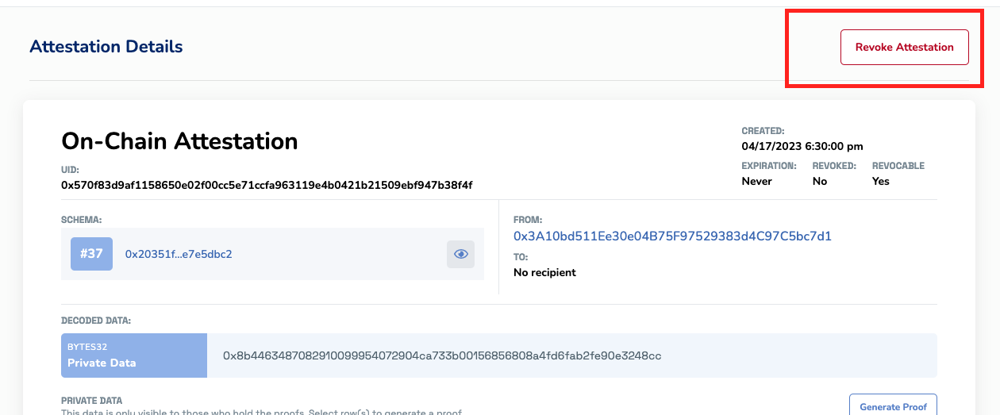

# Revoking Attestations 
Attestations on EAS can be revoked when they are no longer valid or accurate. This can be done both on-chain and off-chain. Revoking an attestation will mark it as invalid. This can be useful in situations where an attestation was made in error, or if the data it represents has changed or become outdated. 

## Concept
Revoking an attestation involves changing its state from "valid" to "revoked". This is achieved by updating the attestation's `revoked` field to `true`. It allows for more control and flexibility over the attestations' lifecycle. 

An attestation may need to be revoked for various reasons, such as:

- The attestation is no longer valid or relevant.
- The attestation was issued in error or based on incorrect information.
- The underlying condition or requirement for the attestation has changed.

Below is an example attestation where a DAO member's role was revoked.


## How to Revoke an Attestation
You can revoke on-chain attestations and off-chain attestations. This can be done directly interacting with the EAS contracts/SDK or manually through the EASSCAN website.


### Revoking On-Chain Attestations
To revoke an on-chain attestation, you can use the revoke function provided by the EAS SDK. Here's an example:

```javascript
const transaction = await eas.revoke({
  uid: "0x6776de8122c352b4d671003e58ca112aedb99f34c629a1d1fe3b332504e2943a"
});

// Optional: Wait for transaction to be validated
await transaction.wait();

```
- The `uid` parameter represents the unique identifier of the attestation you want to revoke. 
- The `revoke` function returns a transaction hash that you can use to check the status of the transaction.


### Revoking Off-Chain Attestations
To revoke an off-chain attestation, you can use the `revokeOffchain` function provided by the EAS SDK. Here's an example:

```javascript
const data = ethers.utils.formatBytes32String('0x6776de8122c352b4d671003e58ca112aedb99f34c629a1d1fe3b332504e2943a');

const transaction = await eas.revokeOffchain(data);

// Optional: Wait for transaction to be validated
await transaction.wait();
```
- The `data` parameter represents the hash of the attestation you want to revoke. 
- The `revokeOffchain` function returns a transaction hash that you can use to check the status of the transaction.

### Manually Revoking an Attestation on easscan.org
If you are the attester and you are on the easscan.org website, you can manually revoke the attestation by clicking the "revoke attestation" button on the unique attestation page. This button is only visible if you are the attester.



## Additional Questions?
DM us on Twitter [@eas_eth](https://twitter.com/eas_eth). We'll setup a telegram chat from there with your team to help out!
