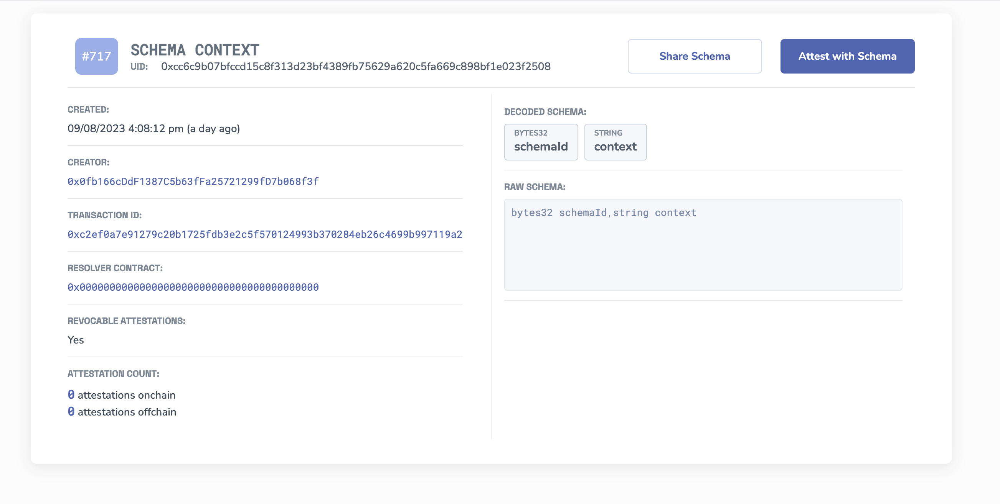

# Schema Context
`Context` provides meaning and clarity, ensuring that data is understood and utilized correctly. With the introduction of "Schema Context" in the Attestation Ecosystem, you can now set a predefined context to your schema, ensuring that it aligns with universal standards and is easily interpretable by various systems and platforms.

The beauty of "Schema Context" is its flexibility. While we support the widely recognized **schema.org** standards, you're not limited to them. You can set any URL where your schema might be standardized, providing a universal way to define the schema data.

## Why Use Schema Context?
- **Interoperability:** Aligning your schema with universal standards ensures that it can be easily understood and integrated by various platforms and systems.
- **Clarity:** A defined context provides clear meaning to the data, reducing ambiguity.
- **Flexibility:** While we support schema.org, you're free to use any URL where your schema might be standardized, allowing for niche or industry-specific standards.

## How to Attest to the Schema Context
To attest to just the source URL of where your context is located, like "schema.org":

1. **Use the "Schema Context" schema** on any chain. Here's an example on Sepolia: [https://sepolia.easscan.org/schema/view/0xcc6c9b07bfccd15c8f313d23bf4389fb75629a620c5fa669c898bf1e023f2508](https://sepolia.easscan.org/schema/view/0xcc6c9b07bfccd15c8f313d23bf4389fb75629a620c5fa669c898bf1e023f2508)
2. **Reference the Schema UID:** Start by referencing the UID of the schema you're working with.
3. **Add the URL:** In this case, you'd add "[https://schema.org/Person](https://schema.org/Person)" as the URL.
4. **Attest:** Make your attestation, linking the schema UID with the context URL.

By doing this, you're essentially saying, "The data in this schema aligns with the standards defined at this URL." This provides a clear, universal reference point for understanding the data in your schema.

## Wrapping Up
Setting context to your schema is a powerful way to enhance its clarity, utility, and interoperability. Whether you're using widely recognized standards like schema.org or your own specialized standards, the "Schema Context" feature ensures that your data is universally interpretable and ready for the future of digital interactions.

