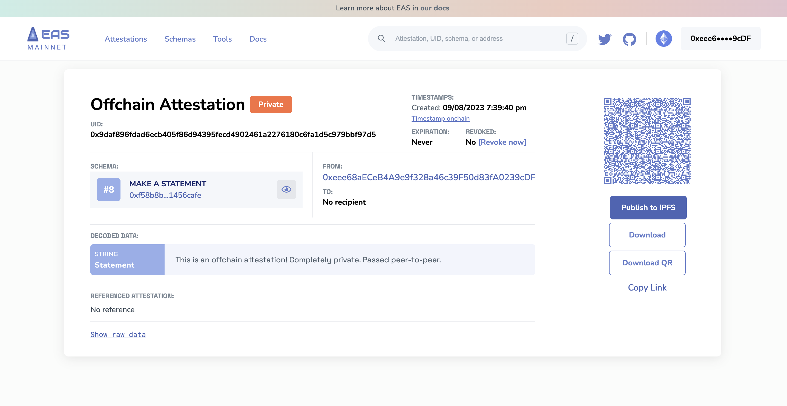
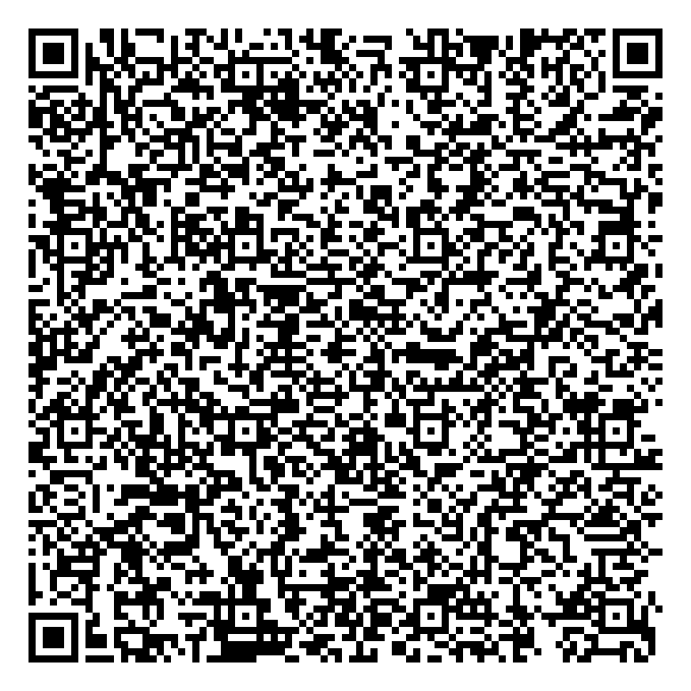

# Storing Offchain Attestations
When making an offchain attestation, you have the choice to decide where that data is stored. EAS does not presuppose where that data should live or how it should be used. Thus, by default, all offchain attestations are made `private`. The EASSCAN server doesn't even know that it exists.

## Undestanding the Data You Get
When an offchain attestation is made on EASSCAN, you have the option to store it's raw data. Here's an example offchain attestation made using the `Make a Statement` schema on `Mainnet`. Remember, offchain attestations don't cost any gas!



### Download the Raw Data
It will create a simple `.txt` file with the raw attestation data. It'll look like an unformatted version of the JSON object below.

```json
{
   "sig":{
      "domain":{
         "name":"EAS Attestation",
         "version":"0.26",
         "chainId":1,
         "verifyingContract":"0xA1207F3BBa224E2c9c3c6D5aF63D0eb1582Ce587"
      },
      "primaryType":"Attest",
      "types":{
         "Attest":[
            {
               "name":"version",
               "type":"uint16"
            },
            {
               "name":"schema",
               "type":"bytes32"
            },
            {
               "name":"recipient",
               "type":"address"
            },
            {
               "name":"time",
               "type":"uint64"
            },
            {
               "name":"expirationTime",
               "type":"uint64"
            },
            {
               "name":"revocable",
               "type":"bool"
            },
            {
               "name":"refUID",
               "type":"bytes32"
            },
            {
               "name":"data",
               "type":"bytes"
            }
         ]
      },
      "signature":{
         "r":"0x948e36add4753524c1ff0224427bc964e1262c5239d73d749d44aaead6ae6320",
         "s":"0x59f7d812eb10323204f115aa18315b238dac4da609b0b5aec4d5892a23d55029",
         "v":27
      },
      "uid":"0x9daf896fdad6ecb405f86d94395fecd4902461a2276180c6fa1d5c979bbf97d5",
      "message":{
         "version":1,
         "schema":"0xf58b8b212ef75ee8cd7e8d803c37c03e0519890502d5e99ee2412aae1456cafe",
         "recipient":"0x0000000000000000000000000000000000000000",
         "time":1694227180,
         "expirationTime":0,
         "refUID":"0x0000000000000000000000000000000000000000000000000000000000000000",
         "revocable":true,
         "data":"0x000000000000000000000000000000000000000000000000000000000000002000000000000000000000000000000000000000000000000000000000000000495468697320697320616e206f6666636861696e206174746573746174696f6e2120436f6d706c6574656c7920707269766174652e2050617373656420706565722d746f2d706565722e0000000000000000000000000000000000000000000000",
         "nonce":0
      }
   },
   "signer":"0xeee68aECeB4A9e9f328a46c39F50d83fA0239cDF"
}
```

### Download the QR
The entire attestation data is compressed into the QR code so you can print it and verify it whenever needed.




## Copy the URL
The offchain attestation is stored locally in your browser when it is first made. The entire attestation data is encoded in the URI fragment of the URL, including the signature. 

[https://easscan.org/offchain/url/#attestation=eNqlUkuOXDEIvMtbtyLM1yy7p6cvEc3CNvgAo0TK8cN7ibKPxgtsClyUMd8P%2BIZ63NrtgF%2F3hmAvejwGIr%2Fj8kVLnzJeSk%2FI2aTjW0q340x27kk6ItiEBHm1vaHuMdpcrpwNFZcgeRiFsQfzGDlCRyohXCTi26I3LHIgLJR3azJG69RkIvUYi2Mo%2BIQpI8uR7jiQQgTQjxvayZOZ2sf7Wz747umbsA%2FWRf4SiE77DqVjPV9%2FlMfY3XVHack1GWR3DWdy2bmCHZC1VQ9MW4ele7SQ5eZzbreQi2RLn31iSd8mmX2FZY8OtMgWUII07w4lMiTdM5Eb1vsbi66x8ySptqtz1akyN7iAH58%2F86SHLy382nVgF9aubvUjf23TLLv1XFSxUn4hzdhYxahsnQvdhdcgMdUpDHRVtDJ0mdd4gWEx6pUrWAxycpBRZfAZr10MsSZGN8Y%2FP%2F%2FvBUf1s338Bv9RrMI%3D](https://easscan.org/offchain/url/#attestation=eNqlUkuOXDEIvMtbtyLM1yy7p6cvEc3CNvgAo0TK8cN7ibKPxgtsClyUMd8P%2BIZ63NrtgF%2F3hmAvejwGIr%2Fj8kVLnzJeSk%2FI2aTjW0q340x27kk6ItiEBHm1vaHuMdpcrpwNFZcgeRiFsQfzGDlCRyohXCTi26I3LHIgLJR3azJG69RkIvUYi2Mo%2BIQpI8uR7jiQQgTQjxvayZOZ2sf7Wz747umbsA%2FWRf4SiE77DqVjPV9%2FlMfY3XVHack1GWR3DWdy2bmCHZC1VQ9MW4ele7SQ5eZzbreQi2RLn31iSd8mmX2FZY8OtMgWUII07w4lMiTdM5Eb1vsbi66x8ySptqtz1akyN7iAH58%2F86SHLy382nVgF9aubvUjf23TLLv1XFSxUn4hzdhYxahsnQvdhdcgMdUpDHRVtDJ0mdd4gWEx6pUrWAxycpBRZfAZr10MsSZGN8Y%2FP%2F%2FvBUf1s338Bv9RrMI%3D)


## Publishing to IPFS
We do have an option for you to make your `private offchain attestation` public by publishing it to IPFS. If you click on `Publish to IPFS` we will pin the attestation to IPFS and then index it for the EASSCAN explorer.

