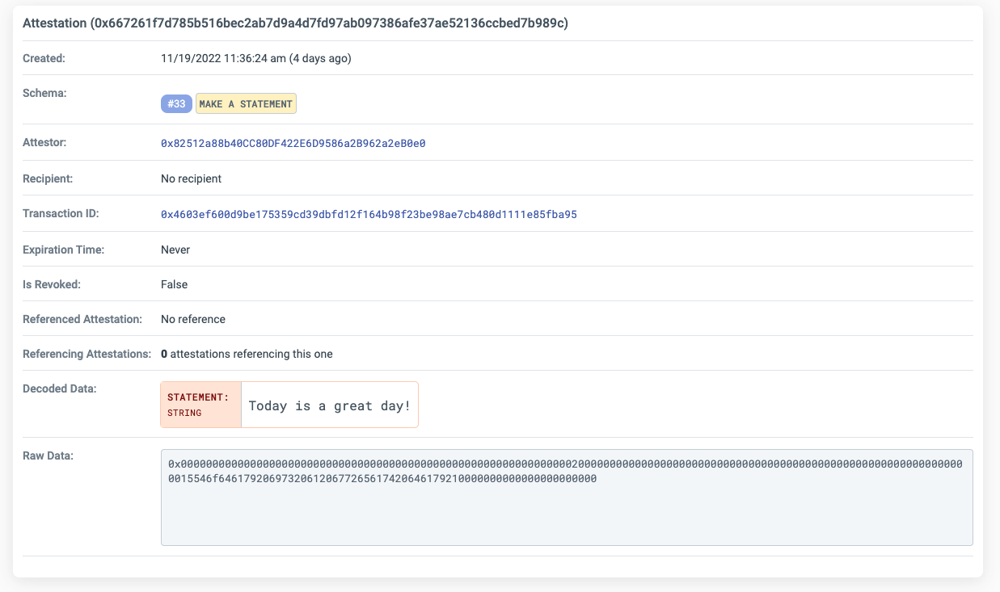

# The Attestation Record

A unique `attestation record` is created each time an attestation is made using EAS and can be verified on
the [EAS explorer](https://easscan.com). The attestation record contains important information about the attestation,
including the schema used, the attestor, the recipient (if specified), the expiration time (if specified), and more.

In this guide, we'll walk through how to read and understand an attestation record and transaction, including the
various fields and data included in an attestation.

## Understanding the Attestation Record

Each attestation record has the following fields:

- `UID` - this is a universal unique identification number for the attestation.
- `Schema` - the UID of the schema used to make the attestation.
- `Attestor` - the address that made the attestation.
- `Recipient` - an **optional** recipient of the attestation that was made.
- `Expiration Time` - an **optional** date that the attestation will expire if provided by the attestor.
- `Recvocation Time` - the time at which the attestation was revoked (if any).
- `refUID` - An attestation that this attestation is referencing (if any).
- `data`- The ABI encoded data for the attestation.

**Example Attestation Record**

