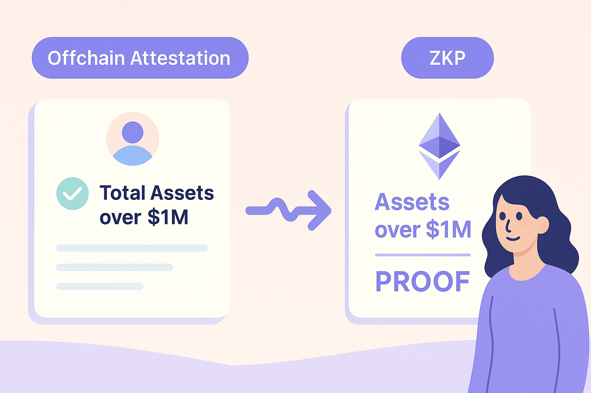

# ZK + Attestations 101
*Skip this if you're a leet dev. Otherwise, read this to get oriented fast.* 

## The Mental Model

At its core, **ZK + attestations** is about combining two powerful primitives:

- **Attestations** → signed, structured data made by someone about something. 
- **Zero-Knowledge Proofs (ZKPs)** → cryptographic proofs that let you prove a claim without revealing the underlying data.

Together, they let you build systems where people can prove *what's true*—without revealing *why it's true* or *who said so*.

## What's an Attestation?

> A signed statement from an entity that says, "This thing is valid."

In practice, an attestation might look like:

- "Acme Bank attests Alice's balance is at least $1M."
- "This GitHub account belongs to this wallet."
- "This person is over 18."

In the EVM world, attestations can be:
- **Onchain** → written to a smart contract or emitted as an event  
- **Offchain** → signed messages (e.g., EIP-712, DID, JWT) that live in a DB, a wallet, or locally on a device (still follows the EAS standard).

They're useful because they let you *package trust* in a portable, verifiable way. This allows others to verify and build upon that data if they trust who signed the attestation.

### Key Concepts
Imagine your bank issues a signed statement saying your balance is over $1m.
Attestations make the signed data portable and verifiable. They're how you anchor who said what.

| Concept Group         | Term                     | What It Is (Plain English)                                     | Bank Balance Analogy                                                |
| --------------------- | ------------------------ | -------------------------------------------------------------- | ------------------------------------------------------------------- |
| **Actors**            | **Attester**               | The entity that creates and signs the attestation.             | Your bank (e.g., Acme Bank)                                         |
|                       | **Recipient**            | The subject of the attestation.                                | You. The customer the claim is about                                 |
|                       | **Verifier**             | The party checking if the attestation is valid (e.g., ZK). | The DeFi protocol or smart contract                                 |
| **Structure**         | **Attestation**          | A signed statement about something.                            | "Acme Bank attests: balance ≥ \$1m for account ending in 3214."    |
|                       | **Schema**               | Defines what fields the attestation includes (the type).                 | `balance: number`, `account_id: string`, `threshold: number`        |
|                       | **Credential**           | A packaged attestation the user holds and can present.         | A signed PDF or structured JSON blob from your bank                 |
| **Storage**           | **Offchain Attestation** | Signed and stored offchain (e.g., EIP-712 or JWT).             | The JSON file in your app wallet, signed by the bank                |
|                       | **Onchain Attestation**  | Written to Ethereum via a contract (e.g., EAS).                | A public record onchain showing your bank issued the attestation    |
| **Trust Handling**    | **Revocation**           | A way to invalidate a previously issued attestation.           | Bank flags the statement as "expired" or "revoked"                  |
|                       | **Expiration**           | A time after which the attestation is no longer valid.         | The attestation auto-expires after 30 days                          |
| **Standards & Infra** | **EAS**                  | A public attestation registry and schema provider.             | Like a public notarization registry for your bank’s statements      |
|                       | **EIP-712**              | A standard for signing structured offchain data.               | Ensures the attestation format is verifiable by any Ethereum wallet |

---

## What's a ZK Proof?

> A way to prove something is true—without showing the data that makes it true.

Think of it like this: you prove your assets are over $1M without showing any accounts. You prove the threshold was met by a repected bank or accounting firm, not the exact amounts or where they’re held, or even who you are.

In Ethereum apps, ZKPs let users assert things like:
- “I own this credential.”
- “My score is above 700.”
- “I'm a part of this group but you don't know which member.”

All without revealing sensitive information. The app (or contract) sees only the proof, not the underlying data.

---

### Key Concepts
You (the prover) want to prove something about private data. The verifier wants to know you're not lying, but doesn't need to see your secrets.

Imagine you’re applying for a DeFi loan. The protocol needs to verify you have at least $1m in a bank account.
But you don’t want to reveal your actual balance, your identity, or your bank. Just: “Yes, I meet the threshold.”

| Concept        | Term                 | What It Is                                  | Bank Balance Analogy                                                                   |
| ------------------- | -------------------- | ----------------------------------------------------------- | -------------------------------------------------------------------------------------- |
| **Actors**          | **Prover**           | The person creating the proof.                              | You, the borrower, proving you meet the loan requirement.                              |
|                     | **Verifier**         | The party checking the proof.                               | The smart contract that checks you qualify without seeing your bank info.              |
| **Building Blocks** | **Circuit**          | A coded set of checks the proof must satisfy.               | A script that checks: *"Is account balance ≥ \$1m?"*                                  |
|                     | **Constraint**       | A specific rule enforced in the circuit.                    | *"balance - threshold must be ≥ 0"*                                                    |
|                     | **Witness**          | The private input used in the proof.                        | Your real bank balance (e.g. \$1,337,420.69)                                              |
|                     | **Public Input**     | The visible claim being proven.                             | The threshold: *"Prove balance ≥ \$1m"*                                               |
| **Proof System**    | **zkSNARK**          | A compact proof system (requires a one-time setup).         | You give the contract a sealed, verifiable envelope that says "yes, I qualify."        |
|                     | **zkSTARK**          | Transparent proof system (no setup, but larger).            | You deliver a slightly bulkier sealed box—but no one had to create special keys.       |
|                     | **coSNARK**          | Collaborative proof system for multi-party computations.    | Multiple parties each contribute a piece of the proof, like a group signing a document. |
| **Keys & Setup**    | **Trusted Setup**    | A ceremony that creates initial keys for SNARKs.            | A group pre-generates secure locks and keys that everyone can reuse.                   |
|                     | **Proving Key**      | Used by the prover to generate a valid proof.               | Your secret key that can seal a proof envelope.                                        |
|                     | **Verification Key** | Used by the verifier to check the proof.                    | The contract's lock that clicks only if your envelope is legit.                        |
| **Advanced Paths**  | **zkVM**             | Lets you write normal code and generate a proof from it.    | Instead of writing a custom circuit, you just write a Python or Rust script to check balances. |
|                     | **ZK Coprocessor**   | A system that proves something about onchain/offchain data. | A 3rd party verifier fetches your bank data, runs the check, and gives you a proof.  |

---

## Why Bring Them Together?

Attestations are about making statements people can decide to **trust**, "this data is legit."  
ZK proofs are about **privacy** and **scalability**, "I can prove this is true, without showing the data."  

When you combine them, you get something special:

> **Trustable claims, proven privately.**

Let's say your bank issues an attestation:  

- "Alice's bank account is bigger than $1m." (go alice go!)

You want to take out a loan from a DeFi app. Instead of revealing the proof of funds (and your identity), you use a ZK proof to show:

✅ "I have an attestation from a trusted bank that my balance > $1m."

The app's smart contract verifies the proof but never sees the actual number, or who the bank is.

That means you can build:
- Identity checks that don't dox the user  
- Token gating without exposing wallets  
- Selective disclosure credentials  
- Reputation systems that resist Sybil attacks  
- Agent workflows that act on trustable signals, not scraped data

All onchain. All verifiable. All private by default.

---

## TLDR

ZK + attestations unlock a powerful new pattern:
- Use **attestations** to anchor *who said what*  
- Use **ZK** to prove *something about that data*, without leaking it

It's how we move from "trust me" → "prove it"—without giving up privacy.

Everything else in this playbook builds on this idea. Let's get into how to actually make it work.