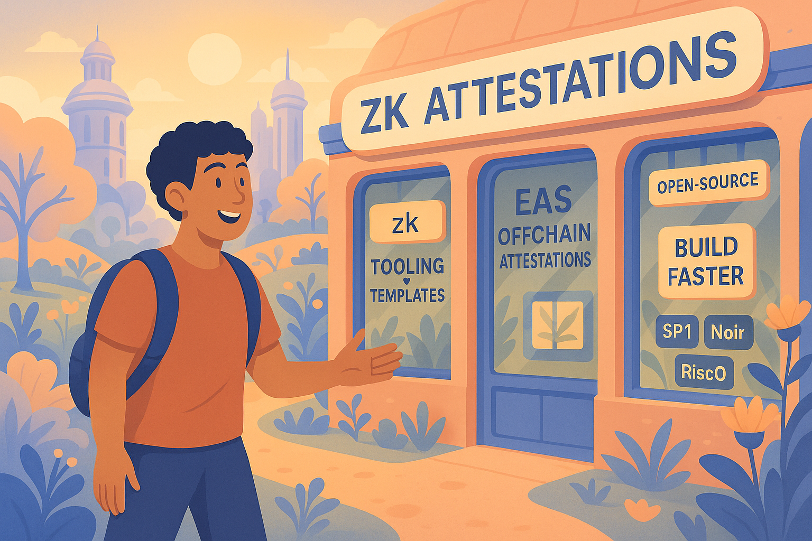

# Recommended Tools
*A current state view of what to pick, why, and when*. 

Below is a curated "builder‑first" toolbox for anyone combining zero‑knowledge proofs (ZK) with Ethereum‑native attestations. The list is deliberately opinionated. This is not meant to be a comprehensive registry, it's a curated list of tooling, resources, and researchers you should follow. Want to get added? Create a PR and make your case.

----

## 1. Picking Your Attestation Type
First decide what kind of signed data you'll consume or create.

| Option | Why use it | Quick stats |
| --- | --- | --- |
| **[Ethereum Attestation Service (EAS)](https://attest.sh)** | General-purpose on/offchain attestations, GraphQL indexer, [EASSCAN](https://easscan.org) explorer. | 7.7 M+ attestations on 15+ networks; 279 ★ [core repo](https://github.com/ethereum-attestation-service/eas-contracts). |
| **[zkTLS](https://tlsnotary.org)** ([TLSNotary](https://tlsnotary.org) / [Reclaim](https://reclaimprotocol.org)) | Prove "I fetched (HTTPS payload)" without trusting the server. Great for offchain evidence. | Production demos live; used in [Reclaim dashboard](https://reclaimprotocol.org) & [TLSNotary](https://tlsnotary.org) beta. |
| **[W3C Verifiable Credentials](https://www.w3.org/TR/vc-data-model/)** | Wallet-portable creds with JSON-LD–based schemas; needs bridges to EAS | Most common in Web2, challenging for blockchain native apps. |
| *Unstructured JSON* | **Avoid.** Hard to index, verify, or interoperate. Use EAS if others will rely-on/build upon your signed data, especially smart contracts.|  |

> **Tip:** Use EAS if your app or builders are going to be interacting with smart contracts. You can also consider generating an attestation from a zkTLS proof and having a verifer contract attest to the result onchain.

---

## 2. Encrypt & Scale Your Payloads (Optional)
ZK inputs often hold secrets and get large fast. Use these layers:

| Option | When to Use It | Details |
| --- | --- | --- |
| **[Lit Protocol](https://litprotocol.com)** | Encrypt sensitive fields before publishing attestation data. | Threshold ECDSA, programmable access-control, WASM signer. |
| **[EigenDA](https://www.eigenlayer.xyz/eigenda)** (EigenLayer AVS) | Cheap, high-bandwidth blobs for witnesses. | 15 MB/s throughput; \$1.6 B restaked security (May 2025). |

---

## 3. Fork a Starter Template (Generate & Verify Fast)

| Template | What you get |
| --- | --- |
| **[Foundry × Risc Zero](https://github.com/risc0/risc0-foundry-template)** | Prove Rust logic and verify in Solidity with Forge tests, out-of-the-box. |
| **[Hardhat-circom plugin](https://www.npmjs.com/package/hardhat-circom)** | Compile Circom circuits, auto-generate Solidity verifiers, test in Hardhat. |
| **[Noir Starter Kit](https://github.com/noir-lang/noir-starter)** | Write proofs in Noir, verify on- or off-chain with Hardhat/Foundry. |
| **[SP1 CLI + Verifier WASM](https://github.com/succinctlabs/sp1)** | End-to-end pipeline: prove off-chain attestations, verify via WASM or Solidity. |
| **[zkAttestify](https://github.com/Shivannsh/ZKAttestify-Sp1-verifier)** | CLI + Rust template turning any EAS off-chain attestation into a proof (SP1 or Risc Zero). |

---

## 4. Choose a zkVM or DSL for Your Logic
*(zkVM = compile real code fast · DSL = custom language)*

| Tool (type) | Edge | Notes |
| --- | --- | --- |
| **[SP1 zkVM](https://succinct.xyz/docs/sp1)** (zkVM) | LLVM compile-target; Rust-first workflow. | STARK-based; 10 – 28× faster on sample workloads. |
| **[Risc Zero zkVM](https://dev.risczero.com)** (zkVM) | Full RISC-V VM, Rust/C support. | SNARK/STARK backends; used in Zeth zkEVM. |
| **[Circom 2 + SnarkJS](https://docs.circom.io)** (DSL) | Widest-used DSL; huge gadget library. | Groth16, PLONK, recursion in v2.2. |
| **[Noir](https://noir-lang.org)** (DSL) | Rust-like syntax compiling to ACIR. | Backend-agnostic with recursive proofs. |
| **[Halo2 / Arkworks](https://github.com/zcash/halo2)** (DSL) | Rust crates for PLONK-ish SNARKs. | Powers Scroll, Taiko, PSE projects. |
| **[Jolt](https://github.com/a16z/jolt)** (zkVM) | Lookup-optimised RISC-V SNARK VM. | Early benches show faster proving per step. |
| **[zkSync Boojum / Airbender](https://github.com/matter-labs/era-boojum)** (zkVM) | STARK prover inside zkSync Era. | Boojum 2.0 ≈ 10× faster (Q1 2025). |

---

## 5. Stay Up to Date — ZK Research Orgs

| Resource | Description |
| --- | --- |
| **[Privacy & Scaling Explorations (PSE)](https://pse.dev)** | EF research & dev lab building widely-used tools like Semaphore, RLN, Circom 2 and publishing practical ZK research. |
| **[0xPARC Foundation](https://0xparc.org)** | Non-profit research hub funding/mentoring open-source programmable-crypto projects, running ZK bootcamps and grant programs. |
| **[StarkWare Research](https://starkware.co/blog)** | Company R&D team that invented STARKs; shares Cairo language updates and performance benchmarks for Starknet/StarkEx. |
| **[Polygon Zero](https://polygon.technology/blog/introducing-plonky2)** | L2 research team behind Plonky2/3 recursive SNARK libraries powering Polygon zkEVM; frequent prover-speed posts. |
| **[Scroll Research](https://scroll.io/blog)** | zkEVM R&D blog with deep dives on zkEVM architecture. |
| **[Aztec Labs](https://aztec.network/research)** | Privacy-rollup research group publishing Turbo-PLONK papers and privacy-first protocol research; pioneers PLONK deployments. |
| **[Espresso Systems](https://espressosys.com)** | Independent ZK R&D team developing Jolt zkVM and Lasso look-up arguments; explores cross-chain privacy sequencing. |
| **[Applied ZKP Workshop](https://github.com/Poseidon-ZKP/Applied-ZKP-Workshop)** | Educational program providing hands-on course that guides devs from Circom circuits to live zkDApps on Ethereum. |

## 5. Early zkApps to Watch
We need more zkApps. Especially ones that use attestations. Until then, here's a curated set of experiments and live apps that are using ZK in useful ways beyond just infra. Missing one? Create a PR to be added.

| Project                                                      | Category        | What It Does                                          | ZK Stack                           |
| ------------------------------------------------------------ | --------------- | ----------------------------------------------------- | ---------------------------------- |
| **[Anon Aadhaar](https://anon-aadhaar.pse.dev)**                 | Identity / KYC  | Private Aadhaar‑based residency proof                 | Circom + Groth16                   |
| **[World ID](https://whitepaper.worldcoin.org)**                 | Identity / KYC  | Orb‑verified proof‑of‑personhood                      | Custom Circom (Semaphore‑inspired) |
| **[Holonym](https://human.tech)**                                | Identity / KYC  | Re‑usable zkKYC "Human Keys"                          | Noir + Halo2 + Circom              |
| **[Icebreaker](https://www.icebreaker.xyz)**                     | Identity / KYC  | Open professional network with user-controlled identity | Circom + EAS                       |
| **[zkPass](https://zkpass.org)**                                 | Identity / KYC  | zkTLS proofs of Web2 identity & assets                | zkTLS + MPC                        |
| **[Reclaim Protocol](https://reclaimprotocol.org)**              | Identity / KYC  | Automated verification of employment, income & academic records | zkTLS + MPC                        |
| **[MACI](https://github.com/privacy-scaling-explorations/maci)** | Governance      | Collusion‑resistant on‑chain voting                   | Circom + SnarkJS                   |
| **[FreedomTool](https://freedomtool.org)**                       | Governance      | Passport‑verified anonymous voting                    | Circom (Rarimo SDK)                |
| **[Semaphore](https://semaphore.pse.dev)**                       | Governance      | Anonymous group membership & signalling               | Circom                             |
| **[0xBow](https://0xbow.io)**                                    | Governance      | "Compliant" privacy pools for DAO subgroups           | Circom                             |
| **[Openion](https://openion.io)**                                | Governance      | Tokenised opinion markets                             | Circom (Rarimo)                    |
| **[zkP2P](https://zkp2p.xyz)**                                   | Payments / DeFi | Trust‑minimised fiat ↔ crypto bulletin board          | Circom                             |
| **[Railgun](https://railgun.org)**                               | Payments / DeFi | Shielded transfers & DeFi on‑chain                    | Circom + Groth16                   |
| **[zkBob](https://zkbob.com)**                                   | Payments / DeFi | Privacy wallet (USDC/ETH) with compliance guard‑rails | Circom                             |
| **[VEIL](https://veil.cash)**                                    | Payments / DeFi | Privacy pools for verified users (Base L2)            | Circom                             |
| **[TLSNotary](https://tlsnotary.org)**                           | Web2 Data       | Verifiable proofs of any HTTPS response               | Custom zkTLS (STARK‑style) + MPC   |
| **[zkEmail](https://zk.email)**                                  | Web2 Data       | Prove you received / signed an email                  | Circom + Noir + SP1                |

---

## 6. ZK People to Follow
| Name | Why follow |
| --- | --- |
| **[Uma Roy](https://x.com/pumatheuma)** (Succinct) | Cofounder posting the latest about zk. |
| **[Jeremy Bruestle](https://x.com/BruestleJeremy)** (Risc Zero) | Cofounder of Risc0. |
| **[Alex Gluchowski](https://x.com/gluk64)** (zkSync) | Invetor of zksync. |
| **[Zac Williamson](https://x.com/Zac_Aztec)** (Aztec) | Privacy rollup design notes. |
| **[Eli Ben-Sasson](https://x.com/EliBenSasson)** (StarkWare) | STARK theory threads. |
| **[Jordi Baylina](https://x.com/jbaylina)** (Polygon zkEVM) | Building polygon's zkevm. |
| **[Ben Fisch](https://x.com/benafisch)** (Espresso) | New zkVM primitives. |
| **[Yi Sun](https://x.com/theyisun)** (Axiom) | All things axiom. |
| **[Anna Rose](https://x.com/AnnaRRose)** (Zero Knowledge Podcast) | Weekly dev interviews. |
| **[Vitalik Buterin](https://x.com/VitalikButerin)** | No reason necessary. |
| **[Subhash Karri](https://x.com/subhash_karri)** (Reclaim) | zkTLS trends and use cases. |
| **[Andy Guzman](https://x.com/AndyGuzmanEth)** (PSE) | Great public goods leader and zk innovator. |
| **[Arun Sajeev](https://x.com/arunsajeev17)** (Holonym) | ZK identity trends. |
| **[Sinu _eth](https://x.com/sinu_eth)** (TLSNotary) | All things zkTLS and TLSNotary. |
| **[Lasha Antadze](https://x.com/LashaAntadze)** (Rarimo) | Real world adoption of zk identity. |

---

