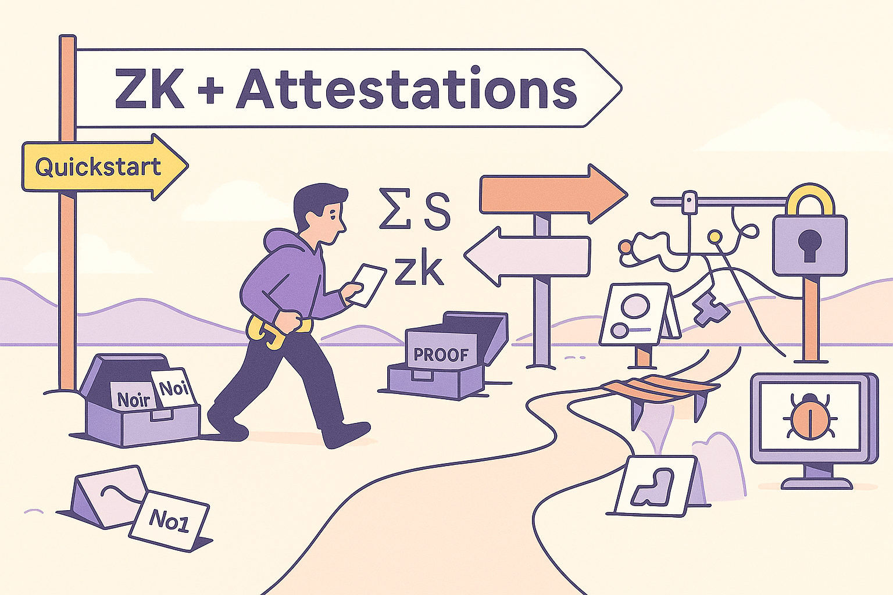

# DevEx Challenges
If building with ZK + attestations was easy, every app would be using them by now.

But most developers hit the same roadblocks. This page lays out the common sticking points so you know you're not alone, and more importantly, where this playbook will help unblock you.

---

## Mental Overhead: ZK ≠ Normal Dev Work

ZK introduces concepts that feel foreign at first: constraint systems, circuits, witnesses, proving and verification keys. They're unfamiliar concepts that take a few reps to understand. It's not as simple as just integrating an API (yet).

Attestations add their own complexity: who’s the issuer? what schema is this? what format? is it still valid?

Trying to reason about both systems at once—*savant-level privacy proofs and trust-level data structures*—is often where devs stall out.

Good news! You don’t need to be a cryptographer to make this work. But you do need a clear starting point, and that’s what the next section gives you.

> **Quick Tip**: Start small. Follow the 15-min demo before diving into custom circuits. Leverage high level DSL's (Noir, SnarkyJS, SP1) to ease in.

---

## Tooling Is Fragmented (Still)

Most developers end up piecing together their ZK + attestation flow with:

- Different proving systems (Groth16, PLONK, STARKs)
- Circuit languages with different levels of ergonomics (Circom, Noir, SnarkyJS, etc.)
- Offchain vs. onchain attestation formats (EIP-712, JWT, EAS)

There’s no standard stack. Everyone is stitching together circuits, verifiers, and custom frontends just to prove basic claims like “age ≥ 18” or “credit score > 700”.

It’s getting better—but we’re still in the early days of shared best practices and reusable modules.

> **Quick Tip:** Pick one ecosystem for your first build (e.g. Succicnt + EAS). Lock it down, ship a prototype, then expand. Don't overcomplicate it. The industry moves quickly. Don't try to future proof. Focus on evolution not perfection.

---

## Performance Isn’t There (Yet)

Generating a ZK proof takes serious compute. Even with faster systems and hardware acceleration on the horizon, builders still hit limits today:

- **Proving times can be slow** — If a proof takes 30+ seconds to generate on mobile, users won’t stick around.
- **Smart contract costs** — Onchain proof verification can cost 200k–500k gas or more, depending on the curve and verifier (not recommended).

This means you have to make design calls early:
- Do you prove everything client-side, or delegate heavy work to a backend?
- Should the contract verify the proof directly, or accept an attested result from a trusted prover?
- Do you really need this proof on every interaction? Or just once, cached and reused?

We’ll show you proven patterns later to make the tradeoffs clear.

---

## Validity vs. Truth

A proof can be **valid** without being **true** in a useful sense. They are not the same, and mistaking one for the other can lead to flawed trust assumptions in your product.

If your attestation is fake (signed by an untrusted issuer) or expired, the ZK proof still verifies, because the math holds up. But the data underneath it is garbage.

This is a subtle but critical point: *ZK proves the computation is correct, not that the inputs are trustworthy.*

As a builder, you still need to:
- Verify the attestation’s issuer
- Check timestamps, revocation flags, and schemas
- Make explicit trust decisions at the application level

ZK doesn’t eliminate trust, it lets you minimize what you have to reveal to establish it. Likewise, a properly formatted attestation shows "someone said X", but it doesn't gaurantee that it happened.

**Quick Fixes**: The goal is *soundness*: ZK attestations that are both valid and true. Here's a few ways you can get closer:
- Whitelist trusted issuers
- Require attestations from multiple parties
- Check freshness and revocation
- Anchor claims to onchain data or trusted oracles.

Just remember... always ask yourself:
> "Is this zk attestation sound, or just valid?"

---

## Interoperability Is a Mess

One of the biggest promises of attestations is composability: one app issues an attestation, another app verifies it and or builds from it.

But that breaks down quickly when everyone:
- Uses different schemas or naming conventions
- Makes attestations in different formats or centralized providers
- Validates signatures differently

You might issue an attestation that says “KYC verified,” but if no one knows your schema, no one can use it.

There’s progress here! EAS is leading the charge to be the universal attestation standard. It's gaining adoption within Ethereum, but offchain standards like W3C (which has its limitations) create an area where devs have uncertainty.

Arbitrary use cases means endless new circuits and formats to verify different types of signed data. This will create a web of confusion for devs to figure out how to generate a proof from an arbitrary attestation (especially if the attestation format is different) and exactly what we want to solve with industry tooling and providers.

**Quick Fix:**
*Push standardization through adoption of useFUL cases*
- Adopt EAS schemas for your first proofs.
- Publish your schema ID and sample verifier code—invite others to integrate.

---

## Offchain Data, Onchain Logic

Most interesting use cases involve offchain data: government IDs, financial accounts, GitHub usernames, et.al.

Without ZK, your only options are:
- Asking users to upload docs (bad UX)
- Trusting a backend or oracle (centralized)
- Avoiding the use case entirely (missed opportunity)

With ZK, you can prove facts *about* offchain data. But that still raises hard questions:
- Where does the offchain attestation live?
- Who issued it, and how do we know it’s real?
- How do you get it into a ZK circuit (EIP-712, JWT, custom formats)?

For example: to prove your bank balance is above $1m, you need a signed message from your bank, a way to parse it inside the circuit, and a verifier who trusts the bank’s key.

This is solvable. But it’s where many great product ideas get stuck in the “wait, how would we actually build that?” phase.

**Quick Fix:** Use zkTLS or a coprocessor (Axiom) to prove offhcain data authenticity. OR you can build a thin oracle service that fetches and signs data into an EAS attestation which can be stored offchain then proven later.

---

## Debugging Circuits ≠ Debugging Code

ZK circuit development isn’t like writing Solidity + Hardhat.

If a proof fails, it won’t throw a helpful stack trace. You might spend hours figuring out whether:
- Your witness input was off by one byte
- You forgot a constraint
- You signed the wrong hash
- Your verifier contract is off by one line of calldata

Similarly, if an attestation isn’t validating, you have to check signatures, schemas, etc. Many devs have felt the pain of “I wrote this circuit/contract, and it compiles, but the proof verification just fails and I have no idea why!” 

This is improving with tools like **Noir**, **Circom**, **SP1** and **Risc0** are making debugging more dev-friendly. But the reality is, you’ll still be operating closer to the cryptographic metal than you're used to.

Expect to burn time here. But also: expect to gain leverage once you push through.

**Quick Fix:**
- Write unit tests for circuits with known inputs/outputs.
- Use circuit-aware REPLs or IDE plugins (Noir VSCode extension, Circom tester).

---

## It Gets Better (And Faster)

Every one of these pain points is real. And every one is being solved by this ecosystem, and by builders like you.

This playbook is here to help:
- Lower the activation energy
- Give you proven examples
- Cut through decision fatigue

### Next up
A hands-on quickstart. Let’s build a working ZK attestation flow in under 15 minutes—so you can go from “I get it” to “I shipped it.”